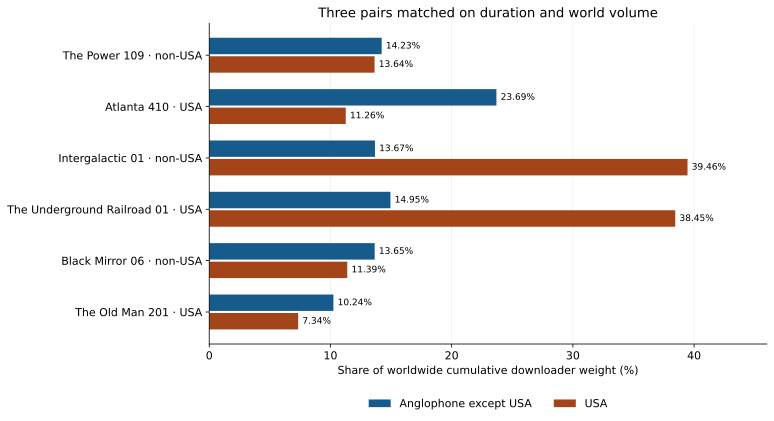

{::nomarkdown}

<link rel="stylesheet" href="../resources/mellon-7.7-analysis.css">
{:/}

[Black-led results](../index.html) · [M1](francophone.html) · [M2](anglophone.html) · [M3](romance-genre.html) · [M4](wakanda-forever.html)

# Anglophone countries and USA production

Mellon 7.7 · Published 2026-09-24 · Round 3 slice definitions

**No consistent USA-production advantage appears in these three matched comparisons.** Atlanta has more non-USA Anglophone share than The Power; The Underground Railroad slightly exceeds Intergalactic; Black Mirror exceeds The Old Man. All three non-USA-produced objects have a higher USA share than their matched USA-produced controls, although hosting exclusion reverses that difference for The Power versus Atlanta.

## Language geography and cohort

The core set contains **86 ISO-3 country/territory codes** from the reference's official or predominant English tables: 57 sovereign states and 29 separately coded territories. USA is reported separately, leaving **85 non-USA Anglophone codes**. Countries listed only under “working language” enter a second, broader sensitivity set. This is a fixed geographic classification, not a measure of individual language use or a retrospective claim about each country's legal status. [Pinned reference revision](https://en.wikipedia.org/w/index.php?title=List_of_countries_and_territories_where_English_is_an_official_language&oldid=1373920470).


<details markdown="1"><summary>Core Anglophone countries and territories, excluding USA</summary>

Anguilla (AIA); American Samoa (ASM); Antigua and Barbuda (ATG); Australia (AUS); Burundi (BDI); Bahamas (BHS); Belize (BLZ); Bermuda (BMU); Barbados (BRB); Botswana (BWA); Canada (CAN); Cocos (Keeling) Islands (CCK); Cameroon (CMR); Cook Islands (COK); Curaçao (CUW); Christmas Island (CXR); Cayman Islands (CYM); Dominica (DMA); Fiji (FJI); Falkland Islands (Malvinas) (FLK); Micronesia, Federated States of (FSM); United Kingdom of Great Britain and Northern Ireland (GBR); Guernsey (GGY); Ghana (GHA); Gibraltar (GIB); Gambia (GMB); Grenada (GRD); Guam (GUM); Guyana (GUY); Hong Kong (HKG); Isle of Man (IMN); India (IND); British Indian Ocean Territory (IOT); Ireland (IRL); Jamaica (JAM); Jersey (JEY); Kenya (KEN); Kiribati (KIR); Saint Kitts and Nevis (KNA); Liberia (LBR); Saint Lucia (LCA); Lesotho (LSO); Marshall Islands (MHL); Malta (MLT); Northern Mariana Islands (MNP); Montserrat (MSR); Malawi (MWI); Namibia (NAM); Norfolk Island (NFK); Nigeria (NGA); Niue (NIU); Nauru (NRU); New Zealand (NZL); Pakistan (PAK); Pitcairn (PCN); Philippines (PHL); Palau (PLW); Papua New Guinea (PNG); Puerto Rico (PRI); Rwanda (RWA); Sudan (SDN); Singapore (SGP); South Georgia and the South Sandwich Islands (SGS); Saint Helena, Ascension and Tristan da Cunha (SHN); Solomon Islands (SLB); Sierra Leone (SLE); South Sudan (SSD); Eswatini (SWZ); Sint Maarten (Dutch part) (SXM); Seychelles (SYC); Turks and Caicos Islands (TCA); Tokelau (TKL); Tonga (TON); Trinidad and Tobago (TTO); Tuvalu (TUV); Tanzania, United Republic of (TZA); Uganda (UGA); Saint Vincent and the Grenadines (VCT); Virgin Islands (British) (VGB); Virgin Islands (U.S.) (VIR); Vanuatu (VUT); Samoa (WSM); South Africa (ZAF); Zambia (ZMB); Zimbabwe (ZWE).


</details>


<details markdown="1"><summary>Anglophone Africa60 intersection and working-language additions</summary>

**24 core Africa60 codes:**

Burundi (BDI); Botswana (BWA); Cameroon (CMR); Ghana (GHA); Gambia (GMB); British Indian Ocean Territory (IOT); Kenya (KEN); Liberia (LBR); Lesotho (LSO); Malawi (MWI); Namibia (NAM); Nigeria (NGA); Rwanda (RWA); Sudan (SDN); Saint Helena, Ascension and Tristan da Cunha (SHN); Sierra Leone (SLE); South Sudan (SSD); Eswatini (SWZ); Seychelles (SYC); Tanzania, United Republic of (TZA); Uganda (UGA); South Africa (ZAF); Zambia (ZMB); Zimbabwe (ZWE).

**Working-language additions (sensitivity only):**

United Arab Emirates (ARE); Burkina Faso (BFA); Bangladesh (BGD); Brunei Darussalam (BRN); Eritrea (ERI); Israel (ISR); Sri Lanka (LKA); Mauritius (MUS); Malaysia (MYS); Timor-Leste (TLS).


</details>

### How the pairs were selected

The non-USA pool is confirmed **African-led-global**, explicit non-USA production, and recorded original English. The control pool is confirmed **Black-led** with explicit USA production. For this Anglophone question, the English-language restriction yields five eligible non-USA objects from four canonical works; objects with missing language metadata are not silently assigned English. Lupin is covered separately in M1.

Match within film/serial class and within two sample-start years; require duration ratio ≤1.25 and worldwide cumulative export-weight ratio ≤1.5. Sort by the sum of absolute log duration and volume ratios, then greedily take three pairs without reusing a canonical work. **Regional shares are not used for selection.** All selected pairs have exactly equal sample lengths and world volumes within 1.56%. The full candidate list and tie-breaking rules are in the ledger. A season versus episode comparison remains possible within the serial class; these are descriptive matches, not causal controls.


{::nomarkdown}
<div class="analysis-table-scroll" role="region" aria-label="Non-USA versus USA production matches" tabindex="0">
<table>
<caption>Non-USA versus USA production matches</caption>
<thead><tr><th scope="col">Non-USA object</th><th scope="col">USA object</th><th scope="col">Sample years</th><th scope="col">Days</th><th scope="col">World export weights</th><th scope="col">Volume difference</th></tr></thead>
<tbody>
<tr><th scope="row"><a href="https://alpha60-devops.github.io/alpha60-results-2023/docs/itemized/power-109-sample-cache-audit.html">The Power 109</a><br><code>power-109</code></th><td><a href="https://alpha60-devops.github.io/alpha60-results-2022/docs/itemized/atlanta-410-sample-cache-audit.html">Atlanta 410</a><br><code>atlanta-410</code></td><td>2023 / 2022</td><td>70 / 70</td><td>740,138 / 741,338</td><td>0.16%</td></tr>
<tr><th scope="row"><a href="https://alpha60-devops.github.io/alpha60-results-2021/docs/itemized/intergalactic-01-sample-cache-audit.html">Intergalactic 01</a><br><code>intergalactic-01</code></th><td><a href="https://alpha60-devops.github.io/alpha60-results-2021/docs/itemized/underground-railroad-01-sample-cache-audit.html">The Underground Railroad 01</a><br><code>underground-railroad-01</code></td><td>2021 / 2021</td><td>70 / 70</td><td>5,235,308 / 5,246,381</td><td>0.21%</td></tr>
<tr><th scope="row"><a href="https://alpha60-devops.github.io/alpha60-results-2023/docs/itemized/black-mirror-06-sample-cache-audit.html">Black Mirror 06</a><br><code>black-mirror-06</code></th><td><a href="https://alpha60-devops.github.io/alpha60-results-2024/docs/itemized/old-man-201-sample-cache-audit.html">The Old Man 201</a><br><code>old-man-201</code></td><td>2023 / 2024</td><td>105 / 105</td><td>8,071,671 / 8,196,835</td><td>1.55%</td></tr>
</tbody></table>
</div>
{:/}

All three selected non-USA works have reviewed UK country-of-origin evidence. The Power's canonical country-name list is empty, but its completed slice decision cites explicit Wikidata P495 = United Kingdom; the missing display list is not the basis of the non-USA decision. [Production evidence](https://www.wikidata.org/wiki/Q108372670).

## Geography of the matched objects


{::nomarkdown}
<div class="analysis-table-scroll" role="region" aria-label="Worldwide cumulative downloader shares" tabindex="0">
<table>
<caption>Worldwide cumulative downloader shares</caption>
<thead><tr><th scope="col">Object</th><th scope="col">Production group</th><th scope="col">Anglophone except USA</th><th scope="col">USA</th><th scope="col">Anglophone Africa60</th><th scope="col">All Africa60</th><th scope="col">Broader English set except USA</th></tr></thead>
<tbody>
<tr><th scope="row"><a href="https://alpha60-devops.github.io/alpha60-results-2023/docs/itemized/power-109-sample-cache-audit.html">The Power 109</a><br><code>power-109</code></th><td>Non-USA</td><td>14.23%</td><td>13.64%</td><td>4.55%</td><td>5.45%</td><td>15.25%</td></tr>
<tr><th scope="row"><a href="https://alpha60-devops.github.io/alpha60-results-2022/docs/itemized/atlanta-410-sample-cache-audit.html">Atlanta 410</a><br><code>atlanta-410</code></th><td>USA</td><td>23.69%</td><td>11.26%</td><td>10.43%</td><td>11.88%</td><td>25.37%</td></tr>
<tr><th scope="row"><a href="https://alpha60-devops.github.io/alpha60-results-2021/docs/itemized/intergalactic-01-sample-cache-audit.html">Intergalactic 01</a><br><code>intergalactic-01</code></th><td>Non-USA</td><td>13.67%</td><td>39.46%</td><td>1.60%</td><td>2.86%</td><td>14.62%</td></tr>
<tr><th scope="row"><a href="https://alpha60-devops.github.io/alpha60-results-2021/docs/itemized/underground-railroad-01-sample-cache-audit.html">The Underground Railroad 01</a><br><code>underground-railroad-01</code></th><td>USA</td><td>14.95%</td><td>38.45%</td><td>3.54%</td><td>4.73%</td><td>15.87%</td></tr>
<tr><th scope="row"><a href="https://alpha60-devops.github.io/alpha60-results-2023/docs/itemized/black-mirror-06-sample-cache-audit.html">Black Mirror 06</a><br><code>black-mirror-06</code></th><td>Non-USA</td><td>13.65%</td><td>11.39%</td><td>1.74%</td><td>3.26%</td><td>15.22%</td></tr>
<tr><th scope="row"><a href="https://alpha60-devops.github.io/alpha60-results-2024/docs/itemized/old-man-201-sample-cache-audit.html">The Old Man 201</a><br><code>old-man-201</code></th><td>USA</td><td>10.24%</td><td>7.34%</td><td>1.49%</td><td>2.21%</td><td>11.10%</td></tr>
</tbody></table>
</div>
{:/}


{::nomarkdown}
<figure class="analysis-figure">
<div class="analysis-chart-scroll" role="region" aria-label="Non-USA Anglophone and USA shares vary across the three matched production pairs." tabindex="0"></div>
<figcaption>Full cumulative export shares. The two bars for each object are disjoint country groups; they do not exhaust the world. <a href="../resources/mellon-7.7-anglophone.svg">Download SVG</a>.</figcaption>
</figure>
{:/}


<details markdown="1"><summary>Country distributions for all six objects</summary>


{::nomarkdown}
<div class="analysis-table-scroll" role="region" aria-label="Selected country shares of worldwide downloader weight" tabindex="0">
<table>
<caption>Selected country shares of worldwide downloader weight</caption>
<thead><tr><th scope="col">Country</th><th scope="col">The Power 109</th><th scope="col">Atlanta 410</th><th scope="col">Intergalactic 01</th><th scope="col">The Underground Railroad 01</th><th scope="col">Black Mirror 06</th><th scope="col">The Old Man 201</th></tr></thead>
<tbody>
<tr><th scope="row">United Kingdom of Great Britain and Northern Ireland (GBR)</th><td>2.74%</td><td>3.56%</td><td>3.70%</td><td>3.27%</td><td>3.42%</td><td>2.57%</td></tr>
<tr><th scope="row">Canada (CAN)</th><td>2.26%</td><td>3.57%</td><td>2.93%</td><td>2.86%</td><td>2.42%</td><td>2.30%</td></tr>
<tr><th scope="row">Australia (AUS)</th><td>1.51%</td><td>1.62%</td><td>1.70%</td><td>1.53%</td><td>1.66%</td><td>1.27%</td></tr>
<tr><th scope="row">India (IND)</th><td>0.99%</td><td>1.58%</td><td>1.06%</td><td>1.08%</td><td>1.94%</td><td>0.83%</td></tr>
<tr><th scope="row">Philippines (PHL)</th><td>0.23%</td><td>0.30%</td><td>0.24%</td><td>0.23%</td><td>0.40%</td><td>0.20%</td></tr>
<tr><th scope="row">South Africa (ZAF)</th><td>2.24%</td><td>4.40%</td><td>0.95%</td><td>2.41%</td><td>0.83%</td><td>0.57%</td></tr>
<tr><th scope="row">Nigeria (NGA)</th><td>0.60%</td><td>2.06%</td><td>0.09%</td><td>0.14%</td><td>0.24%</td><td>0.08%</td></tr>
<tr><th scope="row">Kenya (KEN)</th><td>0.64%</td><td>1.08%</td><td>0.24%</td><td>0.34%</td><td>0.23%</td><td>0.27%</td></tr>
<tr><th scope="row">United States of America (USA)</th><td>13.64%</td><td>11.26%</td><td>39.46%</td><td>38.45%</td><td>11.39%</td><td>7.34%</td></tr>
</tbody></table>
</div>
{:/}


</details>

The 2021 pair is strikingly similar in USA share: **39.46% Intergalactic and 38.45% Underground Railroad**. Their difference in Africa60 is larger, at 2.86% versus 4.73%. Conversely, Black Mirror exceeds The Old Man in both USA and non-USA Anglophone share. These patterns cross the production boundary.

## Sensitivity to hosting and coverage


{::nomarkdown}
<div class="analysis-table-scroll" role="region" aria-label="Full-window network sensitivity" tabindex="0">
<table>
<caption>Full-window network sensitivity</caption>
<thead><tr><th scope="col">Object</th><th scope="col">Anglophone except USA, excluding hosting</th><th scope="col">USA, excluding hosting</th><th scope="col">USA hosting / USA downloader weight</th><th scope="col">Anglophone except USA uploader share</th><th scope="col">USA uploader share</th></tr></thead>
<tbody>
<tr><th scope="row"><a href="https://alpha60-devops.github.io/alpha60-results-2023/docs/itemized/power-109-sample-cache-audit.html">The Power 109</a><br><code>power-109</code></th><td>14.52%</td><td>6.08%</td><td>65.57%</td><td>29.10%</td><td>24.87%</td></tr>
<tr><th scope="row"><a href="https://alpha60-devops.github.io/alpha60-results-2022/docs/itemized/atlanta-410-sample-cache-audit.html">Atlanta 410</a><br><code>atlanta-410</code></th><td>24.73%</td><td>6.63%</td><td>52.88%</td><td>36.16%</td><td>13.94%</td></tr>
<tr><th scope="row"><a href="https://alpha60-devops.github.io/alpha60-results-2021/docs/itemized/intergalactic-01-sample-cache-audit.html">Intergalactic 01</a><br><code>intergalactic-01</code></th><td>12.80%</td><td>37.96%</td><td>19.89%</td><td>27.90%</td><td>40.86%</td></tr>
<tr><th scope="row"><a href="https://alpha60-devops.github.io/alpha60-results-2021/docs/itemized/underground-railroad-01-sample-cache-audit.html">The Underground Railroad 01</a><br><code>underground-railroad-01</code></th><td>14.48%</td><td>36.80%</td><td>19.99%</td><td>34.61%</td><td>34.43%</td></tr>
<tr><th scope="row"><a href="https://alpha60-devops.github.io/alpha60-results-2023/docs/itemized/black-mirror-06-sample-cache-audit.html">Black Mirror 06</a><br><code>black-mirror-06</code></th><td>12.84%</td><td>5.06%</td><td>63.62%</td><td>19.00%</td><td>13.80%</td></tr>
<tr><th scope="row"><a href="https://alpha60-devops.github.io/alpha60-results-2024/docs/itemized/old-man-201-sample-cache-audit.html">The Old Man 201</a><br><code>old-man-201</code></th><td>9.40%</td><td>4.17%</td><td>50.92%</td><td>31.05%</td><td>18.92%</td></tr>
</tbody></table>
</div>
{:/}

The Power's USA share falls from 13.64% to **6.08%** after excluding hosting, below Atlanta's **6.63%**. In contrast, the two 2021 objects retain USA shares around 37–38%. Hosting sensitivity therefore changes a specific pairwise interpretation, rather than supporting a universal correction.

The direction of each pair's non-USA Anglophone difference survives weeks 1–7 and a per-pair check removing partial or gap-affected weeks. Underground Railroad is missing eight Day products, including a day in week 7, so its equal nominal duration does not mean equal observed coverage. No replacement counts are invented.


<details markdown="1"><summary>Matched elapsed-window counts and shares</summary>


{::nomarkdown}
<div class="analysis-table-scroll" role="region" aria-label="Per-pair elapsed-window checks" tabindex="0">
<table>
<caption>Per-pair elapsed-window checks</caption>
<thead><tr><th scope="col">Object</th><th scope="col">Window</th><th scope="col">World interval weight</th><th scope="col">Anglophone except USA</th><th scope="col">USA</th><th scope="col">Africa60</th></tr></thead>
<tbody>
<tr><th scope="row"><a href="https://alpha60-devops.github.io/alpha60-results-2023/docs/itemized/power-109-sample-cache-audit.html">The Power 109</a><br><code>power-109</code></th><td>Weeks 1–7</td><td>557,257</td><td>16.97%</td><td>15.85%</td><td>7.04%</td></tr>
<tr><th scope="row"><a href="https://alpha60-devops.github.io/alpha60-results-2023/docs/itemized/power-109-sample-cache-audit.html">The Power 109</a><br><code>power-109</code></th><td>Common weeks 3, 4, 5, 6, 7</td><td>398,211</td><td>13.06%</td><td>16.31%</td><td>5.21%</td></tr>
<tr><th scope="row"><a href="https://alpha60-devops.github.io/alpha60-results-2022/docs/itemized/atlanta-410-sample-cache-audit.html">Atlanta 410</a><br><code>atlanta-410</code></th><td>Weeks 1–7</td><td>641,619</td><td>26.19%</td><td>13.75%</td><td>13.27%</td></tr>
<tr><th scope="row"><a href="https://alpha60-devops.github.io/alpha60-results-2022/docs/itemized/atlanta-410-sample-cache-audit.html">Atlanta 410</a><br><code>atlanta-410</code></th><td>Common weeks 3, 4, 5, 6, 7</td><td>410,402</td><td>23.57%</td><td>12.58%</td><td>12.79%</td></tr>
<tr><th scope="row"><a href="https://alpha60-devops.github.io/alpha60-results-2021/docs/itemized/intergalactic-01-sample-cache-audit.html">Intergalactic 01</a><br><code>intergalactic-01</code></th><td>Weeks 1–7</td><td>5,652,085</td><td>13.70%</td><td>39.67%</td><td>2.95%</td></tr>
<tr><th scope="row"><a href="https://alpha60-devops.github.io/alpha60-results-2021/docs/itemized/intergalactic-01-sample-cache-audit.html">Intergalactic 01</a><br><code>intergalactic-01</code></th><td>Common weeks 1, 2, 3, 4, 6</td><td>4,096,880</td><td>14.16%</td><td>39.70%</td><td>3.01%</td></tr>
<tr><th scope="row"><a href="https://alpha60-devops.github.io/alpha60-results-2021/docs/itemized/underground-railroad-01-sample-cache-audit.html">The Underground Railroad 01</a><br><code>underground-railroad-01</code></th><td>Weeks 1–7</td><td>5,850,164</td><td>14.89%</td><td>38.64%</td><td>4.70%</td></tr>
<tr><th scope="row"><a href="https://alpha60-devops.github.io/alpha60-results-2021/docs/itemized/underground-railroad-01-sample-cache-audit.html">The Underground Railroad 01</a><br><code>underground-railroad-01</code></th><td>Common weeks 1, 2, 3, 4, 6</td><td>4,025,728</td><td>15.42%</td><td>38.39%</td><td>4.97%</td></tr>
<tr><th scope="row"><a href="https://alpha60-devops.github.io/alpha60-results-2023/docs/itemized/black-mirror-06-sample-cache-audit.html">Black Mirror 06</a><br><code>black-mirror-06</code></th><td>Weeks 1–7</td><td>5,599,550</td><td>16.81%</td><td>11.74%</td><td>3.83%</td></tr>
<tr><th scope="row"><a href="https://alpha60-devops.github.io/alpha60-results-2023/docs/itemized/black-mirror-06-sample-cache-audit.html">Black Mirror 06</a><br><code>black-mirror-06</code></th><td>Common weeks 3, 5, 6</td><td>2,076,549</td><td>14.68%</td><td>12.14%</td><td>3.39%</td></tr>
<tr><th scope="row"><a href="https://alpha60-devops.github.io/alpha60-results-2024/docs/itemized/old-man-201-sample-cache-audit.html">The Old Man 201</a><br><code>old-man-201</code></th><td>Weeks 1–7</td><td>4,331,443</td><td>14.63%</td><td>9.19%</td><td>3.43%</td></tr>
<tr><th scope="row"><a href="https://alpha60-devops.github.io/alpha60-results-2024/docs/itemized/old-man-201-sample-cache-audit.html">The Old Man 201</a><br><code>old-man-201</code></th><td>Common weeks 3, 5, 6</td><td>2,011,204</td><td>12.31%</td><td>8.34%</td><td>2.82%</td></tr>
</tbody></table>
</div>
{:/}


</details>


<details markdown="1"><summary>Coverage flags and source-audit limits</summary>


{::nomarkdown}
<div class="analysis-table-scroll" role="region" aria-label="Coverage relevant to window checks" tabindex="0">
<table>
<caption>Coverage relevant to window checks</caption>
<thead><tr><th scope="col">Object</th><th scope="col">Partial week flags in 1–7</th><th scope="col">Audit evidence</th></tr></thead>
<tbody>
<tr><th scope="row"><a href="https://alpha60-devops.github.io/alpha60-results-2023/docs/itemized/power-109-sample-cache-audit.html">The Power 109</a><br><code>power-109</code></th><td>1</td><td>hourly gap: last `2023-05-23 09:06`, resumed `2023-05-23 14:06` — missing 4 hour(s)</td></tr>
<tr><th scope="row"><a href="https://alpha60-devops.github.io/alpha60-results-2022/docs/itemized/atlanta-410-sample-cache-audit.html">Atlanta 410</a><br><code>atlanta-410</code></th><td>1, 2</td><td>No hourly discontinuity reported in source audit</td></tr>
<tr><th scope="row"><a href="https://alpha60-devops.github.io/alpha60-results-2021/docs/itemized/intergalactic-01-sample-cache-audit.html">Intergalactic 01</a><br><code>intergalactic-01</code></th><td>5</td><td>Day-product or release evidence; no separate hourly completeness claim</td></tr>
<tr><th scope="row"><a href="https://alpha60-devops.github.io/alpha60-results-2021/docs/itemized/underground-railroad-01-sample-cache-audit.html">The Underground Railroad 01</a><br><code>underground-railroad-01</code></th><td>7</td><td>missing Day index 49: `2021-07-01`; missing Day index 50: `2021-07-02`; missing Day index 51: `2021-07-03`; missing Day index 52: `2021-07-04`; missing Day index 53: `2021-07-05`; missing Day index 54: `2021-07-06`; missing Day index 55: `2021-07-07`; missing Day index 56: `2021-07-08`</td></tr>
<tr><th scope="row"><a href="https://alpha60-devops.github.io/alpha60-results-2023/docs/itemized/black-mirror-06-sample-cache-audit.html">Black Mirror 06</a><br><code>black-mirror-06</code></th><td>1</td><td>No hourly discontinuity reported in source audit</td></tr>
<tr><th scope="row"><a href="https://alpha60-devops.github.io/alpha60-results-2024/docs/itemized/old-man-201-sample-cache-audit.html">The Old Man 201</a><br><code>old-man-201</code></th><td>2, 4, 7</td><td>hourly gap: last `2024-12-07 22:00`, resumed `2024-12-08 06:00` — missing 7 hour(s)</td></tr>
</tbody></table>
</div>
{:/}


</details>

## Observations and next questions

1. Production origin alone does not order the matched distributions. Repeating the match on a larger non-USA pool, with complete original-language metadata, would test whether these three pairs generalize.
2. Atlanta's Africa60 concentration is higher than The Power's despite almost identical world volume. Genre, release schedule and torrent availability remain plausible alternative explanations.
3. Investigate the common high USA concentration of the 2021 pair using torrent and network inventories. It persists after hosting exclusion and should not be dismissed as hosting alone.


{::nomarkdown}
<div class="analysis-table-scroll" role="region" aria-label="Full cumulative samples and export coverage" tabindex="0">
<table>
<caption>Full cumulative samples and export coverage</caption>
<thead><tr><th scope="col">Object / audit</th><th scope="col">Sample dates</th><th scope="col">Days</th><th scope="col">World export weight</th><th scope="col">World source total</th><th scope="col">Export / source</th></tr></thead>
<tbody>
<tr><th scope="row"><a href="https://alpha60-devops.github.io/alpha60-results-2023/docs/itemized/power-109-sample-cache-audit.html">The Power 109</a><br><code>power-109</code></th><td>2023-05-12 to 2023-07-20</td><td>70</td><td>740,138</td><td>748,840</td><td>98.84%</td></tr>
<tr><th scope="row"><a href="https://alpha60-devops.github.io/alpha60-results-2022/docs/itemized/atlanta-410-sample-cache-audit.html">Atlanta 410</a><br><code>atlanta-410</code></th><td>2022-11-11 to 2023-01-19</td><td>70</td><td>741,338</td><td>755,125</td><td>98.17%</td></tr>
<tr><th scope="row"><a href="https://alpha60-devops.github.io/alpha60-results-2021/docs/itemized/intergalactic-01-sample-cache-audit.html">Intergalactic 01</a><br><code>intergalactic-01</code></th><td>2021-05-01 to 2021-07-09</td><td>70</td><td>5,235,308</td><td>5,903,851</td><td>88.68%</td></tr>
<tr><th scope="row"><a href="https://alpha60-devops.github.io/alpha60-results-2021/docs/itemized/underground-railroad-01-sample-cache-audit.html">The Underground Railroad 01</a><br><code>underground-railroad-01</code></th><td>2021-05-14 to 2021-07-22</td><td>70</td><td>5,246,381</td><td>5,893,396</td><td>89.02%</td></tr>
<tr><th scope="row"><a href="https://alpha60-devops.github.io/alpha60-results-2023/docs/itemized/black-mirror-06-sample-cache-audit.html">Black Mirror 06</a><br><code>black-mirror-06</code></th><td>2023-06-15 to 2023-09-27</td><td>105</td><td>8,071,671</td><td>8,095,458</td><td>99.71%</td></tr>
<tr><th scope="row"><a href="https://alpha60-devops.github.io/alpha60-results-2024/docs/itemized/old-man-201-sample-cache-audit.html">The Old Man 201</a><br><code>old-man-201</code></th><td>2024-09-14 to 2024-12-27</td><td>105</td><td>8,196,835</td><td>8,215,099</td><td>99.78%</td></tr>
</tbody></table>
</div>
{:/}


## Methods and reproducibility

**Cohort.** These studies use the [published Round 3 slices](https://alpha60-devops.github.io/alpha60-results/docs/slices.html), definition `h15-round3-20260923-v3`: 382 confirmed Black-led media objects and its 216-object African-led-global subset. African-led-global uses reviewed African identity or named African origin/descent; Black-led also includes reviewed Black/African-American/diaspora evidence. The geographic qualification branch does not assert that every qualifying person identifies as Black. Candidate-only rows are excluded. These analyses use the annual exports for that cohort; the site's earlier curated roster has a different scope.

**Measurement.** “Downloader weight” is the sum of published geographic swarm weights. It is not a count of viewers, completed downloads, citizens, or distinct people. Regional share = 100 × regional downloader weight / worldwide downloader weight **from the same export and window**. Unknown-country weights stay in the denominator. Uploaders have their own denominator. Percentages are not population or Internet-penetration adjusted. Hosting exclusion subtracts the hosting field from numerator and denominator only; overlapping network flags are never summed, and this does not identify residential people or remove all VPNs.

**Source boundary.** Read top-level features from the annual cumulative aggregate GeoJSON once. Do not add its nested torrent features again. Exports use H3 resolution 5, publication minimum 3, and data version `20260701`. Values omitted by publication filtering are not imputed; a missing country is shown as “not reported” in country tables. This analysis uses published GeoJSON, not newly regenerated raw sample-cache counts. The source total and export coverage are recorded separately. All ten fields for both downloader/uploader roles are retained in the ledger.

**Time checks.** Numbered weekly GeoJSON top-level features are interval observations. Weeks 1–7 are the first seven bins from each sample's start, not necessarily from its release date. Their sums can exceed the full cumulative weight because observations recur across weeks. Never compare a weekly sum with a cumulative count as if both were unique totals. The “common unflagged” check removes a week from all compared objects when any has a partial flag, a short bin, or an overlapping dated audit gap. Unflagged bins do not certify complete raw hourly sampling. No missing hours or days are rescaled.

[Pinned slice evidence](https://github.com/alpha60-devops/alpha60-results/blob/07a65daadeac05aecfb46282094617a2f958f8cf/resources/h15-v3/h15-v3.generated.json); SHA-256 `234a8dc91edf4c61948ebd4702061b12680639f95622febd32a4af76a1a64ef3`. Each object and weekly file has its own repository revision, hash and source link in the ledger.

- [Full calculation ledger, compressed JSON](../data/mellon-7.7-analysis.json.gz).
- [Compact object metrics and all 382 ranks, JSON](../data/mellon-7.7-summary.json).
- [Language sets and references](../data/black-led-7.7-language-groups.json); [genre annotations and evidence](../data/black-led-7.7-genres.json).
- Download the [collector](../resources/analyze-mellon-7-7-black.py), [calculator](../resources/calculate-mellon-7-7-black.py), [report/figure renderer](../resources/render-mellon-7-7-black.py) and [validation script](../resources/check-mellon-7-7-black.py) into one directory. The collector and calculator use Python's standard library; the renderer also requires matplotlib.

With the source repositories checked out at the ledger's recorded commits:

```sh
python3 analyze-mellon-7-7-black.py --source-root /path/to/checkouts --output calculations
python3 calculate-mellon-7-7-black.py --input calculations/cumulative.json --source-root /path/to/checkouts --language-config black-led-7.7-language-groups.json --genre-config black-led-7.7-genres.json --output calculations/analysis.json
```


<details markdown="1"><summary>Pinned measurement sources</summary>

- [power-109: cumulative aggregate GeoJSON](https://github.com/alpha60-devops/alpha60-results-2023/blob/188eac9b11645cc48caa174c7785c554bf972402/data/geojson.cumulative/power-109-cumulative-aggregate.geojson.gz); [sample audit](https://alpha60-devops.github.io/alpha60-results-2023/docs/itemized/power-109-sample-cache-audit.html).
- [atlanta-410: cumulative aggregate GeoJSON](https://github.com/alpha60-devops/alpha60-results-2022/blob/56d118e937e9845c9fdf079af416f1436ff677ad/data/geojson.cumulative/atlanta-410-cumulative-aggregate.geojson.gz); [sample audit](https://alpha60-devops.github.io/alpha60-results-2022/docs/itemized/atlanta-410-sample-cache-audit.html).
- [intergalactic-01: cumulative aggregate GeoJSON](https://github.com/alpha60-devops/alpha60-results-2021/blob/95af5fee975b04b25bad7f03aa5e1d571a939437/data/geojson.cumulative/intergalactic-01-cumulative-aggregate.geojson.gz); [sample audit](https://alpha60-devops.github.io/alpha60-results-2021/docs/itemized/intergalactic-01-sample-cache-audit.html).
- [underground-railroad-01: cumulative aggregate GeoJSON](https://github.com/alpha60-devops/alpha60-results-2021/blob/95af5fee975b04b25bad7f03aa5e1d571a939437/data/geojson.cumulative/underground-railroad-01-cumulative-aggregate.geojson.gz); [sample audit](https://alpha60-devops.github.io/alpha60-results-2021/docs/itemized/underground-railroad-01-sample-cache-audit.html).
- [black-mirror-06: cumulative aggregate GeoJSON](https://github.com/alpha60-devops/alpha60-results-2023/blob/188eac9b11645cc48caa174c7785c554bf972402/data/geojson.cumulative/black-mirror-06-cumulative-aggregate.geojson.gz); [sample audit](https://alpha60-devops.github.io/alpha60-results-2023/docs/itemized/black-mirror-06-sample-cache-audit.html).
- [old-man-201: cumulative aggregate GeoJSON](https://github.com/alpha60-devops/alpha60-results-2024/blob/92a3c99741588412cbc26644d1e3879b1d97740f/data/geojson.cumulative/old-man-201-cumulative-aggregate.geojson.gz); [sample audit](https://alpha60-devops.github.io/alpha60-results-2024/docs/itemized/old-man-201-sample-cache-audit.html).

</details>

