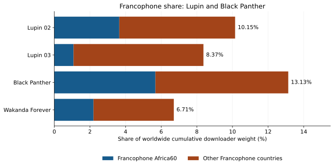

{::nomarkdown}

<link rel="stylesheet" href="../resources/mellon-7.7-analysis.css">
{:/}

[Black-led results](../index.html) · [M1](francophone.html) · [M2](anglophone.html) · [M3](romance-genre.html) · [M4](wakanda-forever.html)

# Francophone countries: Lupin and Black Panther

Mellon 7.7 · Published 2026-09-24 · Round 3 slice definitions

**Lupin does not uniformly lead.** Its two samples have Francophone world shares of **10.15% and 8.37%**, above *Wakanda Forever* (**6.71%**) but below the original *Black Panther* (**13.13%**). Within Francophone Africa60, only Lupin 02 exceeds Wakanda Forever. These four observations do not establish a general advantage for French or non-USA production.

## Which countries count?

The operational Francophone set follows the **OIF 2022 “everyday French” country list, footnote 4**, including France's separately coded overseas territories: 36 sovereign country codes plus 12 territory codes. It is broader than countries with French as a sole official language. Canada, Belgium and Switzerland are represented by whole-country codes because this comparison does not have language-region boundaries. The fixed set is applied to every sample year; it does not assert that each observed peer speaks French. [OIF source](https://www.francophonie.org/sites/default/files/2022-03/Synthese_La_langue_francaise_dans_le_monde_2022.pdf).


<details markdown="1"><summary>All 48 Francophone country and territory codes</summary>

Andorra (AND); French Southern Territories (ATF); Burundi (BDI); Belgium (BEL); Benin (BEN); Burkina Faso (BFA); Saint Barthélemy (BLM); Central African Republic (CAF); Canada (CAN); Switzerland (CHE); Côte d'Ivoire (CIV); Cameroon (CMR); Congo, Democratic Republic of the (COD); Congo (COG); Comoros (COM); Djibouti (DJI); Algeria (DZA); France (FRA); Gabon (GAB); Guinea (GIN); Guadeloupe (GLP); Equatorial Guinea (GNQ); French Guiana (GUF); Haiti (HTI); Lebanon (LBN); Luxembourg (LUX); Saint Martin (French part) (MAF); Morocco (MAR); Monaco (MCO); Madagascar (MDG); Mali (MLI); Mauritania (MRT); Martinique (MTQ); Mauritius (MUS); Mayotte (MYT); New Caledonia (NCL); Niger (NER); French Polynesia (PYF); Réunion (REU); Rwanda (RWA); Senegal (SEN); Saint Pierre and Miquelon (SPM); Seychelles (SYC); Chad (TCD); Togo (TGO); Tunisia (TUN); Vanuatu (VUT); Wallis and Futuna (WLF).


</details>

The intersection with Alpha60's exact Africa60 contains **29 codes**:

French Southern Territories (ATF); Burundi (BDI); Benin (BEN); Burkina Faso (BFA); Central African Republic (CAF); Côte d'Ivoire (CIV); Cameroon (CMR); Congo, Democratic Republic of the (COD); Congo (COG); Comoros (COM); Djibouti (DJI); Algeria (DZA); Gabon (GAB); Guinea (GIN); Equatorial Guinea (GNQ); Morocco (MAR); Madagascar (MDG); Mali (MLI); Mauritania (MRT); Mauritius (MUS); Mayotte (MYT); Niger (NER); Réunion (REU); Rwanda (RWA); Senegal (SEN); Seychelles (SYC); Chad (TCD); Togo (TGO); Tunisia (TUN).

## Cumulative comparison

Lupin 02 and 03 are recorded as French productions with explicit non-USA production. Both Black Panther films have explicit USA production. Production classification comes from the reviewed slice evidence, not from inferred citizenship.


{::nomarkdown}
<div class="analysis-table-scroll" role="region" aria-label="Full cumulative samples and export coverage" tabindex="0">
<table>
<caption>Full cumulative samples and export coverage</caption>
<thead><tr><th scope="col">Object / audit</th><th scope="col">Sample dates</th><th scope="col">Days</th><th scope="col">World export weight</th><th scope="col">World source total</th><th scope="col">Export / source</th></tr></thead>
<tbody>
<tr><th scope="row"><a href="https://alpha60-devops.github.io/alpha60-results-2021/docs/itemized/lupin-02-sample-cache-audit.html">Lupin 02</a><br><code>lupin-02</code></th><td>2021-06-11 to 2021-09-23</td><td>105</td><td>10,625,694</td><td>11,740,704</td><td>90.50%</td></tr>
<tr><th scope="row"><a href="https://alpha60-devops.github.io/alpha60-results-2023/docs/itemized/lupin-03-sample-cache-audit.html">Lupin 03</a><br><code>lupin-03</code></th><td>2023-10-05 to 2024-01-17</td><td>105</td><td>12,260,778</td><td>12,278,939</td><td>99.85%</td></tr>
<tr><th scope="row"><a href="https://alpha60-devops.github.io/alpha60-results-2018/docs/itemized/black-panther-sample-cache-audit.html">Black Panther</a><br><code>black-panther</code></th><td>2018-05-02 to 2018-06-22</td><td>52</td><td>13,639,096</td><td>13,948,331</td><td>97.78%</td></tr>
<tr><th scope="row"><a href="https://alpha60-devops.github.io/alpha60-results-2023/docs/itemized/black-panther-wakanda-forever-sample-cache-audit.html">Wakanda Forever</a><br><code>black-panther-wakanda-forever</code></th><td>2023-01-31 to 2023-07-31</td><td>182</td><td>30,413,565</td><td>30,455,955</td><td>99.86%</td></tr>
</tbody></table>
</div>
{:/}


{::nomarkdown}
<div class="analysis-table-scroll" role="region" aria-label="Regional weight and share of the worldwide export" tabindex="0">
<table>
<caption>Regional weight and share of the worldwide export</caption>
<thead><tr><th scope="col">Object</th><th scope="col">Francophone weight</th><th scope="col">Francophone share</th><th scope="col">Francophone Africa60 share</th><th scope="col">Francophone outside Africa60 share</th><th scope="col">All Africa60 share</th></tr></thead>
<tbody>
<tr><th scope="row"><a href="https://alpha60-devops.github.io/alpha60-results-2021/docs/itemized/lupin-02-sample-cache-audit.html">Lupin 02</a><br><code>lupin-02</code></th><td>1,078,396</td><td>10.15%</td><td>3.65%</td><td>6.50%</td><td>7.14%</td></tr>
<tr><th scope="row"><a href="https://alpha60-devops.github.io/alpha60-results-2023/docs/itemized/lupin-03-sample-cache-audit.html">Lupin 03</a><br><code>lupin-03</code></th><td>1,026,373</td><td>8.37%</td><td>1.08%</td><td>7.29%</td><td>3.54%</td></tr>
<tr><th scope="row"><a href="https://alpha60-devops.github.io/alpha60-results-2018/docs/itemized/black-panther-sample-cache-audit.html">Black Panther</a><br><code>black-panther</code></th><td>1,791,151</td><td>13.13%</td><td>5.68%</td><td>7.46%</td><td>9.72%</td></tr>
<tr><th scope="row"><a href="https://alpha60-devops.github.io/alpha60-results-2023/docs/itemized/black-panther-wakanda-forever-sample-cache-audit.html">Wakanda Forever</a><br><code>black-panther-wakanda-forever</code></th><td>2,040,206</td><td>6.71%</td><td>2.20%</td><td>4.51%</td><td>11.20%</td></tr>
</tbody></table>
</div>
{:/}


{::nomarkdown}
<figure class="analysis-figure">
<div class="analysis-chart-scroll" role="region" aria-label="Black Panther has the highest full-window Francophone share; Lupin 02 and 03 exceed Wakanda Forever." tabindex="0"></div>
<figcaption>Stacked components are Francophone Africa60 and the rest of the Francophone set; denominator is each worldwide cumulative export. <a href="../resources/mellon-7.7-francophone.svg">Download SVG</a>.</figcaption>
</figure>
{:/}


{::nomarkdown}
<div class="analysis-table-scroll" role="region" aria-label="Selected Francophone country shares of worldwide downloader weight" tabindex="0">
<table>
<caption>Selected Francophone country shares of worldwide downloader weight</caption>
<thead><tr><th scope="col">Country</th><th scope="col">Lupin 02</th><th scope="col">Lupin 03</th><th scope="col">Black Panther</th><th scope="col">Wakanda Forever</th></tr></thead>
<tbody>
<tr><th scope="row">France (FRA)</th><td>2.81%</td><td>4.19%</td><td>3.30%</td><td>2.07%</td></tr>
<tr><th scope="row">Canada (CAN)</th><td>2.30%</td><td>1.83%</td><td>2.25%</td><td>1.44%</td></tr>
<tr><th scope="row">Belgium (BEL)</th><td>0.53%</td><td>0.79%</td><td>0.95%</td><td>0.48%</td></tr>
<tr><th scope="row">Switzerland (CHE)</th><td>0.57%</td><td>0.36%</td><td>0.33%</td><td>0.28%</td></tr>
<tr><th scope="row">Algeria (DZA)</th><td>0.94%</td><td>0.31%</td><td>1.42%</td><td>0.39%</td></tr>
<tr><th scope="row">Morocco (MAR)</th><td>0.62%</td><td>0.32%</td><td>0.91%</td><td>0.29%</td></tr>
<tr><th scope="row">Côte d&#x27;Ivoire (CIV)</th><td>0.13%</td><td>0.03%</td><td>0.73%</td><td>0.14%</td></tr>
<tr><th scope="row">Senegal (SEN)</th><td>0.50%</td><td>0.04%</td><td>0.72%</td><td>0.14%</td></tr>
<tr><th scope="row">Tunisia (TUN)</th><td>0.23%</td><td>0.08%</td><td>0.34%</td><td>0.09%</td></tr>
<tr><th scope="row">Mauritius (MUS)</th><td>0.18%</td><td>0.02%</td><td>0.46%</td><td>0.20%</td></tr>
</tbody></table>
</div>
{:/}

Lupin 03 has the largest **France** share (4.19%), yet only 1.08% in Francophone Africa60. The original Black Panther is stronger in Algeria, Morocco, Côte d'Ivoire and Senegal than either Lupin sample. Grouping France and Francophone African countries into one number conceals this difference. Wakanda Forever's higher **all-Africa60** share is driven mainly outside the Francophone subset.

## Window and network checks

The ordering of all-Francophone shares survives both weeks 1–7 and the common unflagged weeks **4, 6 and 7**. For Francophone Africa60, the order is Black Panther, Lupin 02, Wakanda Forever, Lupin 03 in all three windows. Lupin 03's reported 23-hour gap is in December, beyond its first seven weeks; its full-window figure remains unadjusted.


{::nomarkdown}
<div class="analysis-table-scroll" role="region" aria-label="Matched elapsed-window sensitivity" tabindex="0">
<table>
<caption>Matched elapsed-window sensitivity</caption>
<thead><tr><th scope="col">Object</th><th scope="col">Window</th><th scope="col">World interval weight</th><th scope="col">francophone share</th><th scope="col">francophone africa60 share</th></tr></thead>
<tbody>
<tr><th scope="row"><a href="https://alpha60-devops.github.io/alpha60-results-2021/docs/itemized/lupin-02-sample-cache-audit.html">Lupin 02</a><br><code>lupin-02</code></th><td>Weeks 1–7</td><td>8,357,792</td><td>10.47%</td><td>3.74%</td></tr>
<tr><th scope="row"><a href="https://alpha60-devops.github.io/alpha60-results-2021/docs/itemized/lupin-02-sample-cache-audit.html">Lupin 02</a><br><code>lupin-02</code></th><td>Common unflagged weeks</td><td>3,803,111</td><td>9.77%</td><td>3.35%</td></tr>
<tr><th scope="row"><a href="https://alpha60-devops.github.io/alpha60-results-2023/docs/itemized/lupin-03-sample-cache-audit.html">Lupin 03</a><br><code>lupin-03</code></th><td>Weeks 1–7</td><td>6,049,058</td><td>9.74%</td><td>1.56%</td></tr>
<tr><th scope="row"><a href="https://alpha60-devops.github.io/alpha60-results-2023/docs/itemized/lupin-03-sample-cache-audit.html">Lupin 03</a><br><code>lupin-03</code></th><td>Common unflagged weeks</td><td>2,844,864</td><td>8.86%</td><td>1.01%</td></tr>
<tr><th scope="row"><a href="https://alpha60-devops.github.io/alpha60-results-2018/docs/itemized/black-panther-sample-cache-audit.html">Black Panther</a><br><code>black-panther</code></th><td>Weeks 1–7</td><td>15,458,362</td><td>14.53%</td><td>6.26%</td></tr>
<tr><th scope="row"><a href="https://alpha60-devops.github.io/alpha60-results-2018/docs/itemized/black-panther-sample-cache-audit.html">Black Panther</a><br><code>black-panther</code></th><td>Common unflagged weeks</td><td>5,319,848</td><td>13.74%</td><td>6.35%</td></tr>
<tr><th scope="row"><a href="https://alpha60-devops.github.io/alpha60-results-2023/docs/itemized/black-panther-wakanda-forever-sample-cache-audit.html">Wakanda Forever</a><br><code>black-panther-wakanda-forever</code></th><td>Weeks 1–7</td><td>20,279,733</td><td>7.05%</td><td>2.25%</td></tr>
<tr><th scope="row"><a href="https://alpha60-devops.github.io/alpha60-results-2023/docs/itemized/black-panther-wakanda-forever-sample-cache-audit.html">Wakanda Forever</a><br><code>black-panther-wakanda-forever</code></th><td>Common unflagged weeks</td><td>6,266,191</td><td>7.22%</td><td>2.47%</td></tr>
</tbody></table>
</div>
{:/}


{::nomarkdown}
<div class="analysis-table-scroll" role="region" aria-label="Full-window network and uploader sensitivity" tabindex="0">
<table>
<caption>Full-window network and uploader sensitivity</caption>
<thead><tr><th scope="col">Object</th><th scope="col">Francophone share excluding hosting</th><th scope="col">Francophone Africa60 excluding hosting</th><th scope="col">Francophone uploader share</th></tr></thead>
<tbody>
<tr><th scope="row"><a href="https://alpha60-devops.github.io/alpha60-results-2021/docs/itemized/lupin-02-sample-cache-audit.html">Lupin 02</a><br><code>lupin-02</code></th><td>10.42%</td><td>4.17%</td><td>21.70%</td></tr>
<tr><th scope="row"><a href="https://alpha60-devops.github.io/alpha60-results-2023/docs/itemized/lupin-03-sample-cache-audit.html">Lupin 03</a><br><code>lupin-03</code></th><td>7.65%</td><td>1.20%</td><td>13.55%</td></tr>
<tr><th scope="row"><a href="https://alpha60-devops.github.io/alpha60-results-2018/docs/itemized/black-panther-sample-cache-audit.html">Black Panther</a><br><code>black-panther</code></th><td>13.54%</td><td>6.06%</td><td>20.98%</td></tr>
<tr><th scope="row"><a href="https://alpha60-devops.github.io/alpha60-results-2023/docs/itemized/black-panther-wakanda-forever-sample-cache-audit.html">Wakanda Forever</a><br><code>black-panther-wakanda-forever</code></th><td>6.31%</td><td>2.50%</td><td>6.85%</td></tr>
</tbody></table>
</div>
{:/}


<details markdown="1"><summary>Coverage flags and source-audit limits</summary>


{::nomarkdown}
<div class="analysis-table-scroll" role="region" aria-label="Coverage relevant to window checks" tabindex="0">
<table>
<caption>Coverage relevant to window checks</caption>
<thead><tr><th scope="col">Object</th><th scope="col">Partial week flags in 1–7</th><th scope="col">Audit evidence</th></tr></thead>
<tbody>
<tr><th scope="row"><a href="https://alpha60-devops.github.io/alpha60-results-2021/docs/itemized/lupin-02-sample-cache-audit.html">Lupin 02</a><br><code>lupin-02</code></th><td>1, 2</td><td>Day-product or release evidence; no separate hourly completeness claim</td></tr>
<tr><th scope="row"><a href="https://alpha60-devops.github.io/alpha60-results-2023/docs/itemized/lupin-03-sample-cache-audit.html">Lupin 03</a><br><code>lupin-03</code></th><td>3</td><td>hourly gap: last `2023-12-01 22:03`, resumed `2023-12-02 22:30` — missing 23 hour(s)</td></tr>
<tr><th scope="row"><a href="https://alpha60-devops.github.io/alpha60-results-2018/docs/itemized/black-panther-sample-cache-audit.html">Black Panther</a><br><code>black-panther</code></th><td>None</td><td>Day-product or release evidence; no separate hourly completeness claim</td></tr>
<tr><th scope="row"><a href="https://alpha60-devops.github.io/alpha60-results-2023/docs/itemized/black-panther-wakanda-forever-sample-cache-audit.html">Wakanda Forever</a><br><code>black-panther-wakanda-forever</code></th><td>5</td><td>No hourly discontinuity reported in source audit</td></tr>
</tbody></table>
</div>
{:/}


</details>

## Observations and next questions

1. Separate France and other non-African Francophone countries from Francophone Africa60 when testing a French-language association. Neither geography nor production origin identifies the language of a downloaded edition.
2. Lupin 03 shifts toward France while losing Francophone Africa60 share relative to Lupin 02. Compare language tracks, subtitle editions and torrent availability before attributing that shift to audience preference.
3. Black Panther's 2018 sample and the later samples cover different release stages and years. More films and serials with matched observation windows are needed to estimate a production-country effect.


## Methods and reproducibility

**Cohort.** These studies use the [published Round 3 slices](https://alpha60-devops.github.io/alpha60-results/docs/slices.html), definition `h15-round3-20260923-v3`: 382 confirmed Black-led media objects and its 216-object African-led-global subset. African-led-global uses reviewed African identity or named African origin/descent; Black-led also includes reviewed Black/African-American/diaspora evidence. The geographic qualification branch does not assert that every qualifying person identifies as Black. Candidate-only rows are excluded. These analyses use the annual exports for that cohort; the site's earlier curated roster has a different scope.

**Measurement.** “Downloader weight” is the sum of published geographic swarm weights. It is not a count of viewers, completed downloads, citizens, or distinct people. Regional share = 100 × regional downloader weight / worldwide downloader weight **from the same export and window**. Unknown-country weights stay in the denominator. Uploaders have their own denominator. Percentages are not population or Internet-penetration adjusted. Hosting exclusion subtracts the hosting field from numerator and denominator only; overlapping network flags are never summed, and this does not identify residential people or remove all VPNs.

**Source boundary.** Read top-level features from the annual cumulative aggregate GeoJSON once. Do not add its nested torrent features again. Exports use H3 resolution 5, publication minimum 3, and data version `20260701`. Values omitted by publication filtering are not imputed; a missing country is shown as “not reported” in country tables. This analysis uses published GeoJSON, not newly regenerated raw sample-cache counts. The source total and export coverage are recorded separately. All ten fields for both downloader/uploader roles are retained in the ledger.

**Time checks.** Numbered weekly GeoJSON top-level features are interval observations. Weeks 1–7 are the first seven bins from each sample's start, not necessarily from its release date. Their sums can exceed the full cumulative weight because observations recur across weeks. Never compare a weekly sum with a cumulative count as if both were unique totals. The “common unflagged” check removes a week from all compared objects when any has a partial flag, a short bin, or an overlapping dated audit gap. Unflagged bins do not certify complete raw hourly sampling. No missing hours or days are rescaled.

[Pinned slice evidence](https://github.com/alpha60-devops/alpha60-results/blob/07a65daadeac05aecfb46282094617a2f958f8cf/resources/h15-v3/h15-v3.generated.json); SHA-256 `234a8dc91edf4c61948ebd4702061b12680639f95622febd32a4af76a1a64ef3`. Each object and weekly file has its own repository revision, hash and source link in the ledger.

- [Full calculation ledger, compressed JSON](../data/mellon-7.7-analysis.json.gz).
- [Compact object metrics and all 382 ranks, JSON](../data/mellon-7.7-summary.json).
- [Language sets and references](../data/black-led-7.7-language-groups.json); [genre annotations and evidence](../data/black-led-7.7-genres.json).
- Download the [collector](../resources/analyze-mellon-7-7-black.py), [calculator](../resources/calculate-mellon-7-7-black.py), [report/figure renderer](../resources/render-mellon-7-7-black.py) and [validation script](../resources/check-mellon-7-7-black.py) into one directory. The collector and calculator use Python's standard library; the renderer also requires matplotlib.

With the source repositories checked out at the ledger's recorded commits:

```sh
python3 analyze-mellon-7-7-black.py --source-root /path/to/checkouts --output calculations
python3 calculate-mellon-7-7-black.py --input calculations/cumulative.json --source-root /path/to/checkouts --language-config black-led-7.7-language-groups.json --genre-config black-led-7.7-genres.json --output calculations/analysis.json
```


<details markdown="1"><summary>Pinned measurement sources</summary>

- [lupin-02: cumulative aggregate GeoJSON](https://github.com/alpha60-devops/alpha60-results-2021/blob/95af5fee975b04b25bad7f03aa5e1d571a939437/data/geojson.cumulative/lupin-02-cumulative-aggregate.geojson.gz); [sample audit](https://alpha60-devops.github.io/alpha60-results-2021/docs/itemized/lupin-02-sample-cache-audit.html).
- [lupin-03: cumulative aggregate GeoJSON](https://github.com/alpha60-devops/alpha60-results-2023/blob/188eac9b11645cc48caa174c7785c554bf972402/data/geojson.cumulative/lupin-03-cumulative-aggregate.geojson.gz); [sample audit](https://alpha60-devops.github.io/alpha60-results-2023/docs/itemized/lupin-03-sample-cache-audit.html).
- [black-panther: cumulative aggregate GeoJSON](https://github.com/alpha60-devops/alpha60-results-2018/blob/21b1d77fd7367f5ef6df7d4088632c0b837063a2/data/geojson.cumulative/black-panther-cumulative-aggregate.geojson.gz); [sample audit](https://alpha60-devops.github.io/alpha60-results-2018/docs/itemized/black-panther-sample-cache-audit.html).
- [black-panther-wakanda-forever: cumulative aggregate GeoJSON](https://github.com/alpha60-devops/alpha60-results-2023/blob/188eac9b11645cc48caa174c7785c554bf972402/data/geojson.cumulative/black-panther-wakanda-forever-cumulative-aggregate.geojson.gz); [sample audit](https://alpha60-devops.github.io/alpha60-results-2023/docs/itemized/black-panther-wakanda-forever-sample-cache-audit.html).

</details>
