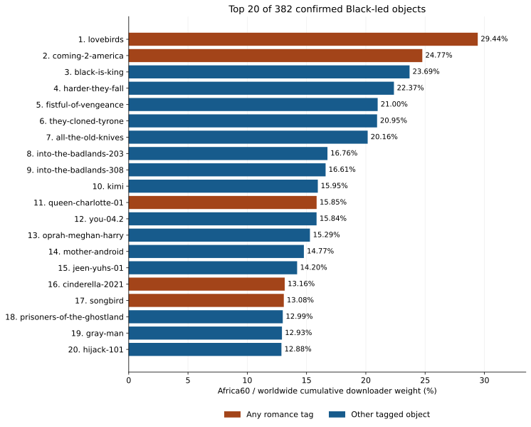

{::nomarkdown}

<link rel="stylesheet" href="../resources/mellon-7.7-analysis.css">
{:/}

[Black-led results](../index.html) · [M1](francophone.html) · [M2](anglophone.html) · [M3](romance-genre.html) · [M4](wakanda-forever.html)

# Romance and Africa60: the full Black-led cohort

Mellon 7.7 · Published 2026-09-24 · Round 3 slice definitions

**Romance has exceptional leaders, but a modest overall advantage.** The Lovebirds ranks **1st of 382** at **29.44% Africa60 share**; Queen Charlotte ranks **11th** at **15.85%**. Across all 17 romance-tagged objects, the median is **4.28%**, versus **3.77%** for the other 365. The romance median is lower within television/serial objects and almost equal to the rest when South Africa is excluded.

## Cohort, genre definition and ranking

M3 ranks **all 382 confirmed Round 3 Black-led media objects**, representing **217 canonical works**, by their own full cumulative Africa60 downloader weight divided by their own worldwide export weight. It uses neither a USA-production filter nor the older 88-object site roster. The numerator uses the exact Africa60 set supplied with the authoritative slices.

Genre annotations combine canonical metadata, non-deprecated Wikidata P136 claims, and genre descriptors from cached Wikipedia lead definitions. The same enrichment rule is applied across the whole cohort, not only to top-ranked objects. All 382 now have at least one source tag; annotations and revision/hash evidence are downloadable below. Broad genre families overlap: a romantic comedy counts under both romance and comedy. The romance rule matches “romance” or “romantic”; genre labels are not inferred from swarm performance. Film/serial strata follow the metadata type, which can classify documentary and interview objects coarsely.

The 217-work check groups repeated episodes/seasons by canonical work and first takes each work's median object share. A work is romance-tagged if any sampled object carries a romance tag. This reduces repeated-franchise weighting without claiming independent or randomly sampled works.


<details markdown="1"><summary>Exact Africa60 country and territory set</summary>

Angola (AGO); French Southern Territories (ATF); Burundi (BDI); Benin (BEN); Burkina Faso (BFA); Botswana (BWA); Central African Republic (CAF); Côte d'Ivoire (CIV); Cameroon (CMR); Congo, Democratic Republic of the (COD); Congo (COG); Comoros (COM); Cabo Verde (CPV); Djibouti (DJI); Algeria (DZA); Egypt (EGY); Eritrea (ERI); Western Sahara (ESH); Ethiopia (ETH); Gabon (GAB); Ghana (GHA); Guinea (GIN); Gambia (GMB); Guinea-Bissau (GNB); Equatorial Guinea (GNQ); British Indian Ocean Territory (IOT); Kenya (KEN); Liberia (LBR); Libya (LBY); Lesotho (LSO); Morocco (MAR); Madagascar (MDG); Mali (MLI); Mozambique (MOZ); Mauritania (MRT); Mauritius (MUS); Malawi (MWI); Mayotte (MYT); Namibia (NAM); Niger (NER); Nigeria (NGA); Réunion (REU); Rwanda (RWA); Sudan (SDN); Senegal (SEN); Saint Helena, Ascension and Tristan da Cunha (SHN); Sierra Leone (SLE); Somalia (SOM); South Sudan (SSD); Sao Tome and Principe (STP); Eswatini (SWZ); Seychelles (SYC); Chad (TCD); Togo (TGO); Tunisia (TUN); Tanzania, United Republic of (TZA); Uganda (UGA); South Africa (ZAF); Zambia (ZMB); Zimbabwe (ZWE).


</details>

## Top 20 by Africa60 share


{::nomarkdown}
<figure class="analysis-figure">
<div class="analysis-chart-scroll" role="region" aria-label="The Lovebirds leads the top 20 at 29.44%; five top-20 objects carry a romance tag." tabindex="0"></div>
<figcaption>Each bar is a full cumulative export share. Orange marks any romance tag; blue marks other tagged objects. Sample lengths differ and are listed below. <a href="../resources/mellon-7.7-romance-genre.svg">Download SVG</a>.</figcaption>
</figure>
{:/}


{::nomarkdown}
<div class="analysis-table-scroll" role="region" aria-label="The full-cohort Africa60 top 20" tabindex="0">
<table>
<caption>The full-cohort Africa60 top 20</caption>
<thead><tr><th scope="col">Rank</th><th scope="col">Object / audit</th><th scope="col">Days</th><th scope="col">Africa60 weight</th><th scope="col">World export weight</th><th scope="col">Africa60 share</th><th scope="col">Genre families / evidence</th></tr></thead>
<tbody>
<tr><th scope="row">1</th><td><a href="https://alpha60-devops.github.io/alpha60-results-2020/docs/itemized/lovebirds-sample-cache-audit.html">lovebirds</a><br><code>lovebirds</code></td><td>70</td><td>689,610</td><td>2,342,340</td><td>29.44%</td><td><a href="https://en.wikipedia.org/w/index.php?title=The_Lovebirds_%282020_film%29&amp;oldid=1368446042">Romance; Comedy</a></td></tr>
<tr><th scope="row">2</th><td><a href="https://alpha60-devops.github.io/alpha60-results-2021/docs/itemized/coming-2-america-sample-cache-audit.html">coming-2-america</a><br><code>coming-2-america</code></td><td>23</td><td>1,190,312</td><td>4,806,387</td><td>24.77%</td><td><a href="https://en.wikipedia.org/w/index.php?title=Coming_2_America&amp;oldid=1362955889">Romance; Comedy</a></td></tr>
<tr><th scope="row">3</th><td><a href="https://alpha60-devops.github.io/alpha60-results-2020/docs/itemized/black-is-king-sample-cache-audit.html">black-is-king</a><br><code>black-is-king</code></td><td>182</td><td>632,295</td><td>2,669,104</td><td>23.69%</td><td><a href="https://en.wikipedia.org/w/index.php?title=Black_Is_King&amp;oldid=1360308661">Music/musical</a></td></tr>
<tr><th scope="row">4</th><td><a href="https://alpha60-devops.github.io/alpha60-results-2021/docs/itemized/harder-they-fall-sample-cache-audit.html">harder-they-fall</a><br><code>harder-they-fall</code></td><td>70</td><td>771,674</td><td>3,449,415</td><td>22.37%</td><td><a href="https://en.wikipedia.org/w/index.php?title=The_Harder_They_Fall_%282021_film%29&amp;oldid=1356525252">Western</a></td></tr>
<tr><th scope="row">5</th><td><a href="https://alpha60-devops.github.io/alpha60-results-2022/docs/itemized/fistful-of-vengeance-sample-cache-audit.html">fistful-of-vengeance</a><br><code>fistful-of-vengeance</code></td><td>70</td><td>824,255</td><td>3,925,324</td><td>21.00%</td><td><a href="https://en.wikipedia.org/w/index.php?title=Fistful_of_Vengeance&amp;oldid=1359463110">Action/adventure; Thriller/crime/mystery</a></td></tr>
<tr><th scope="row">6</th><td><a href="https://alpha60-devops.github.io/alpha60-results-2023/docs/itemized/they-cloned-tyrone-sample-cache-audit.html">they-cloned-tyrone</a><br><code>they-cloned-tyrone</code></td><td>70</td><td>622,487</td><td>2,971,435</td><td>20.95%</td><td><a href="https://en.wikipedia.org/w/index.php?title=They_Cloned_Tyrone&amp;oldid=1365613191">Thriller/crime/mystery; Comedy; Science fiction/fantasy</a></td></tr>
<tr><th scope="row">7</th><td><a href="https://alpha60-devops.github.io/alpha60-results-2022/docs/itemized/all-the-old-knives-sample-cache-audit.html">all-the-old-knives</a><br><code>all-the-old-knives</code></td><td>77</td><td>897,356</td><td>4,452,106</td><td>20.16%</td><td><a href="https://en.wikipedia.org/w/index.php?title=All_the_Old_Knives&amp;oldid=1355999192">Thriller/crime/mystery</a></td></tr>
<tr><th scope="row">8</th><td><a href="https://alpha60-devops.github.io/alpha60-results-2017/docs/itemized/into-the-badlands-203-sample-cache-audit.html">into-the-badlands-203</a><br><code>into-the-badlands-203</code></td><td>21</td><td>41,458</td><td>247,309</td><td>16.76%</td><td><a href="https://en.wikipedia.org/w/index.php?title=Into_the_Badlands_%28TV_series%29&amp;oldid=1364969993">Action/adventure; Science fiction/fantasy; Drama</a></td></tr>
<tr><th scope="row">9</th><td><a href="https://alpha60-devops.github.io/alpha60-results-2018/docs/itemized/into-the-badlands-308-sample-cache-audit.html">into-the-badlands-308</a><br><code>into-the-badlands-308</code></td><td>8</td><td>53,324</td><td>321,094</td><td>16.61%</td><td><a href="https://en.wikipedia.org/w/index.php?title=Into_the_Badlands_%28TV_series%29&amp;oldid=1364969993">Action/adventure; Science fiction/fantasy; Drama</a></td></tr>
<tr><th scope="row">10</th><td><a href="https://alpha60-devops.github.io/alpha60-results-2022/docs/itemized/kimi-sample-cache-audit.html">kimi</a><br><code>kimi</code></td><td>112</td><td>818,169</td><td>5,129,407</td><td>15.95%</td><td><a href="https://en.wikipedia.org/w/index.php?title=Kimi_%28film%29&amp;oldid=1358660184">Thriller/crime/mystery</a></td></tr>
<tr><th scope="row">11</th><td><a href="https://alpha60-devops.github.io/alpha60-results-2023/docs/itemized/queen-charlotte-01-sample-cache-audit.html">queen-charlotte-01</a><br><code>queen-charlotte-01</code></td><td>105</td><td>365,155</td><td>2,303,823</td><td>15.85%</td><td><a href="https://www.wikidata.org/wiki/Q111360692">Romance; Science fiction/fantasy</a></td></tr>
<tr><th scope="row">12</th><td><a href="https://alpha60-devops.github.io/alpha60-results-2023/docs/itemized/you-04.2-sample-cache-audit.html">you-04.2</a><br><code>you-04.2</code></td><td>70</td><td>256,531</td><td>1,619,008</td><td>15.84%</td><td><a href="https://en.wikipedia.org/w/index.php?title=You_%28TV_series%29&amp;oldid=1365734827">Thriller/crime/mystery</a></td></tr>
<tr><th scope="row">13</th><td><a href="https://alpha60-devops.github.io/alpha60-results-2021/docs/itemized/oprah-meghan-harry-sample-cache-audit.html">oprah-meghan-harry</a><br><code>oprah-meghan-harry</code></td><td>70</td><td>116,737</td><td>763,672</td><td>15.29%</td><td><a href="https://en.wikipedia.org/w/index.php?title=Oprah_with_Meghan_and_Harry&amp;oldid=1365670844">Documentary/interview</a></td></tr>
<tr><th scope="row">14</th><td><a href="https://alpha60-devops.github.io/alpha60-results-2021/docs/itemized/mother-android-sample-cache-audit.html">mother-android</a><br><code>mother-android</code></td><td>71</td><td>368,974</td><td>2,497,424</td><td>14.77%</td><td><a href="https://en.wikipedia.org/w/index.php?title=Mother/Android&amp;oldid=1359614495">Thriller/crime/mystery; Science fiction/fantasy</a></td></tr>
<tr><th scope="row">15</th><td><a href="https://alpha60-devops.github.io/alpha60-results-2022/docs/itemized/jeen-yuhs-01-sample-cache-audit.html">jeen-yuhs-01</a><br><code>jeen-yuhs-01</code></td><td>77</td><td>112,618</td><td>792,817</td><td>14.20%</td><td><a href="https://en.wikipedia.org/w/index.php?title=Jeen-Yuhs&amp;oldid=1365011445">Documentary/interview</a></td></tr>
<tr><th scope="row">16</th><td><a href="https://alpha60-devops.github.io/alpha60-results-2021/docs/itemized/cinderella-2021-sample-cache-audit.html">cinderella-2021</a><br><code>cinderella-2021</code></td><td>70</td><td>672,495</td><td>5,111,024</td><td>13.16%</td><td><a href="https://en.wikipedia.org/w/index.php?title=Cinderella_%282021_American_film%29&amp;oldid=1353289078">Romance; Comedy; Science fiction/fantasy; Music/musical</a></td></tr>
<tr><th scope="row">17</th><td><a href="https://alpha60-devops.github.io/alpha60-results-2020/docs/itemized/songbird-sample-cache-audit.html">songbird</a><br><code>songbird</code></td><td>56</td><td>206,040</td><td>1,574,968</td><td>13.08%</td><td><a href="https://en.wikipedia.org/w/index.php?title=Songbird_%282020_film%29&amp;oldid=1359966106">Romance; Thriller/crime/mystery; Science fiction/fantasy</a></td></tr>
<tr><th scope="row">18</th><td><a href="https://alpha60-devops.github.io/alpha60-results-2021/docs/itemized/prisoners-of-the-ghostland-sample-cache-audit.html">prisoners-of-the-ghostland</a><br><code>prisoners-of-the-ghostland</code></td><td>70</td><td>447,838</td><td>3,446,241</td><td>12.99%</td><td><a href="https://en.wikipedia.org/w/index.php?title=Prisoners_of_the_Ghostland&amp;oldid=1346095420">Action/adventure; Thriller/crime/mystery; Science fiction/fantasy; Horror; Western</a></td></tr>
<tr><th scope="row">19</th><td><a href="https://alpha60-devops.github.io/alpha60-results-2022/docs/itemized/gray-man-sample-cache-audit.html">gray-man</a><br><code>gray-man</code></td><td>105</td><td>1,409,631</td><td>10,905,940</td><td>12.93%</td><td><a href="https://en.wikipedia.org/w/index.php?title=The_Gray_Man_%282022_film%29&amp;oldid=1359118889">Action/adventure; Thriller/crime/mystery</a></td></tr>
<tr><th scope="row">20</th><td><a href="https://alpha60-devops.github.io/alpha60-results-2023/docs/itemized/hijack-101-sample-cache-audit.html">hijack-101</a><br><code>hijack-101</code></td><td>112</td><td>718,474</td><td>5,577,511</td><td>12.88%</td><td><a href="https://en.wikipedia.org/w/index.php?title=Hijack_%28TV_series%29&amp;oldid=1362902931">Thriller/crime/mystery</a></td></tr>
</tbody></table>
</div>
{:/}

Five of the top 20 have a romance tag: Lovebirds, Coming 2 America, Queen Charlotte, Cinderella and Songbird. That is **25% of the top 20**, versus **4.45% of the cohort**. The leading group is nevertheless diverse: ten thriller/crime/mystery objects, eight science-fiction/fantasy, five action/adventure, four comedy, two music/musical, two documentary/interview and two Western objects. These counts overlap and must not be added as exclusive categories. Short samples include Coming 2 America (23 days) and two Into the Badlands episodes (21 and 8 days).


{::nomarkdown}
<div class="analysis-table-scroll" role="region" aria-label="Overlapping genre families across all 382 objects" tabindex="0">
<table>
<caption>Overlapping genre families across all 382 objects</caption>
<thead><tr><th scope="col">Genre family</th><th scope="col">Objects</th><th scope="col">Top-20 objects</th><th scope="col">Median Africa60 share</th><th scope="col">Pooled Africa60 share</th><th scope="col">Median excluding hosting</th><th scope="col">Median uploader share</th></tr></thead>
<tbody>
<tr><th scope="row">Romance</th><td>17</td><td>5</td><td>4.28%</td><td>4.07%</td><td>4.86%</td><td>9.08%</td></tr>
<tr><th scope="row">Action/adventure</th><td>160</td><td>5</td><td>3.97%</td><td>3.71%</td><td>4.40%</td><td>8.85%</td></tr>
<tr><th scope="row">Thriller/crime/mystery</th><td>135</td><td>10</td><td>4.19%</td><td>3.37%</td><td>4.57%</td><td>9.19%</td></tr>
<tr><th scope="row">Comedy</th><td>109</td><td>4</td><td>3.34%</td><td>3.16%</td><td>3.86%</td><td>7.37%</td></tr>
<tr><th scope="row">Science fiction/fantasy</th><td>226</td><td>8</td><td>3.83%</td><td>3.37%</td><td>4.25%</td><td>7.00%</td></tr>
<tr><th scope="row">Drama</th><td>264</td><td>2</td><td>3.83%</td><td>2.94%</td><td>4.23%</td><td>7.04%</td></tr>
<tr><th scope="row">Horror</th><td>33</td><td>1</td><td>4.34%</td><td>2.80%</td><td>4.48%</td><td>5.99%</td></tr>
<tr><th scope="row">Music/musical</th><td>8</td><td>2</td><td>3.48%</td><td>3.49%</td><td>3.74%</td><td>9.41%</td></tr>
<tr><th scope="row">Documentary/interview</th><td>7</td><td>2</td><td>2.71%</td><td>2.41%</td><td>2.98%</td><td>4.67%</td></tr>
<tr><th scope="row">Western</th><td>36</td><td>2</td><td>4.12%</td><td>4.35%</td><td>4.38%</td><td>5.03%</td></tr>
<tr><th scope="row">Animation</th><td>28</td><td>0</td><td>2.23%</td><td>2.32%</td><td>2.37%</td><td>8.21%</td></tr>
<tr><th scope="row">Other</th><td>5</td><td>0</td><td>2.82%</td><td>2.47%</td><td>3.08%</td><td>2.78%</td></tr>
</tbody></table>
</div>
{:/}

A median gives each sampled object equal weight; a pooled share divides summed Africa60 weights by summed world weights and gives large swarms more influence. Neither is a deduplicated audience across titles. Genre tags are descriptive, non-exclusive and source-dependent; a large family count does not establish its causal effect.

## The named romance examples


{::nomarkdown}
<div class="analysis-table-scroll" role="region" aria-label="Lovebirds, Queen Charlotte and every sampled Bridgerton object" tabindex="0">
<table>
<caption>Lovebirds, Queen Charlotte and every sampled Bridgerton object</caption>
<thead><tr><th scope="col">Object</th><th scope="col">Rank / 382</th><th scope="col">Days</th><th scope="col">Africa60 weight</th><th scope="col">World export weight</th><th scope="col">Africa60 share</th><th scope="col">Excluding hosting</th><th scope="col">Uploader share</th></tr></thead>
<tbody>
<tr><th scope="row"><a href="https://alpha60-devops.github.io/alpha60-results-2020/docs/itemized/lovebirds-sample-cache-audit.html">lovebirds</a><br><code>lovebirds</code></th><td>1</td><td>70</td><td>689,610</td><td>2,342,340</td><td>29.44%</td><td>31.87%</td><td>35.00%</td></tr>
<tr><th scope="row"><a href="https://alpha60-devops.github.io/alpha60-results-2023/docs/itemized/queen-charlotte-01-sample-cache-audit.html">queen-charlotte-01</a><br><code>queen-charlotte-01</code></th><td>11</td><td>105</td><td>365,155</td><td>2,303,823</td><td>15.85%</td><td>18.87%</td><td>21.55%</td></tr>
<tr><th scope="row"><a href="https://alpha60-devops.github.io/alpha60-results-2022/docs/itemized/bridgerton-02-sample-cache-audit.html">bridgerton-02</a><br><code>bridgerton-02</code></th><td>31</td><td>105</td><td>491,761</td><td>4,766,170</td><td>10.32%</td><td>11.84%</td><td>18.40%</td></tr>
<tr><th scope="row"><a href="https://alpha60-devops.github.io/alpha60-results-2026/docs/itemized/bridgerton-04.1-sample-cache-audit.html">bridgerton-04.1</a><br><code>bridgerton-04.1</code></th><td>321</td><td>186</td><td>783,716</td><td>47,853,665</td><td>1.64%</td><td>1.77%</td><td>7.65%</td></tr>
<tr><th scope="row"><a href="https://alpha60-devops.github.io/alpha60-results-2026/docs/itemized/bridgerton-04.2-sample-cache-audit.html">bridgerton-04.2</a><br><code>bridgerton-04.2</code></th><td>335</td><td>189</td><td>861,670</td><td>56,800,638</td><td>1.52%</td><td>1.64%</td><td>7.13%</td></tr>
</tbody></table>
</div>
{:/}

Bridgerton 02 ranks **31st** (10.32%), while season-four parts rank **321st and 335th** (1.64% and 1.52%). The season-four Africa60 weights are larger than season two's, but their worldwide denominators grew much faster. “Popular” by absolute observed weight and “high African share” answer different questions.

## Does the association survive other views?


{::nomarkdown}
<div class="analysis-table-scroll" role="region" aria-label="Romance versus other tagged objects" tabindex="0">
<table>
<caption>Romance versus other tagged objects</caption>
<thead><tr><th scope="col">Comparison</th><th scope="col">Objects: romance / other</th><th scope="col">Romance median</th><th scope="col">Other median</th><th scope="col">Difference (pp)</th></tr></thead>
<tbody>
<tr><th scope="row">All objects</th><td>17 / 365</td><td>4.28%</td><td>3.77%</td><td>+0.51</td></tr>
<tr><th scope="row">At least 49 sample days</th><td>15 / 277</td><td>4.28%</td><td>3.38%</td><td>+0.90</td></tr>
<tr><th scope="row">56–112 sample days</th><td>9 / 168</td><td>12.55%</td><td>3.76%</td><td>+8.78</td></tr>
<tr><th scope="row">Metadata film stratum</th><td>7 / 71</td><td>13.08%</td><td>6.60%</td><td>+6.48</td></tr>
<tr><th scope="row">Metadata non-film / serial stratum</th><td>10 / 294</td><td>3.20%</td><td>3.60%</td><td>-0.40</td></tr>
<tr><th scope="row">Africa60 excluding South Africa</th><td>17 / 365</td><td>2.58%</td><td>2.53%</td><td>+0.04</td></tr>
</tbody></table>
</div>
{:/}

The film stratum favors romance (**13.08% versus 6.60%**), but the non-film/serial stratum does not (**3.20% versus 3.60%**). Excluding South Africa nearly removes the overall median difference (**2.58% versus 2.53%**). The 56–112-day subset is strongly positive but contains only nine romance objects and selects a different mix of titles. These checks support a concentrated, format-sensitive association rather than a universal romance effect.

Collapsing repeated samples gives **13 romance canonical works versus 204 others**, with median work-level shares **4.64% versus 3.70%**. Excluding hosting raises both object-level medians to **4.86% versus 4.22%**. These are descriptive robustness checks, not statistical significance tests; the curated sample and correlated objects do not justify treating 382 rows as independent random draws.

**18 of 20** top-ranked objects remain in the top 20 after hosting exclusion. The complete alternative ranking and role/network values are in the ledger.

## Hypotheses to test

1. Relationship stories and prominent Black leads may encourage discovery or identification across national settings. Testing this needs audience and language-edition evidence; swarm geography cannot reveal motivation or demographic identity.
2. A few romantic comedies, period romances and musical crossovers may drive the apparent genre effect. The stronger film result and South Africa sensitivity make country-by-format comparisons more informative than a single continental genre average.
3. Availability, subtitles/dubs, platform access, release timing and which torrents were collected may shape both the numerator and denominator. Compare these factors before interpreting lower season-four Bridgerton shares as declining African interest.


<details markdown="1"><summary>Every object, rank, sample window and genre family</summary>


{::nomarkdown}
<div class="analysis-table-scroll" role="region" aria-label="Complete Black-led ranking" tabindex="0">
<table>
<caption>Complete Black-led ranking</caption>
<thead><tr><th scope="col">Rank</th><th scope="col">Object</th><th scope="col">Sample dates</th><th scope="col">Days</th><th scope="col">Africa60 weight</th><th scope="col">World export weight</th><th scope="col">Africa60 share</th><th scope="col">Genre families</th></tr></thead>
<tbody>
<tr><th scope="row">1</th><td><a href="https://alpha60-devops.github.io/alpha60-results-2020/docs/itemized/lovebirds-sample-cache-audit.html">lovebirds</a><br><code>lovebirds</code></td><td>2020-05-22 to 2020-07-30</td><td>70</td><td>689,610</td><td>2,342,340</td><td>29.44%</td><td>Romance; Comedy</td></tr>
<tr><th scope="row">2</th><td><a href="https://alpha60-devops.github.io/alpha60-results-2021/docs/itemized/coming-2-america-sample-cache-audit.html">coming-2-america</a><br><code>coming-2-america</code></td><td>2021-03-05 to 2021-03-27</td><td>23</td><td>1,190,312</td><td>4,806,387</td><td>24.77%</td><td>Romance; Comedy</td></tr>
<tr><th scope="row">3</th><td><a href="https://alpha60-devops.github.io/alpha60-results-2020/docs/itemized/black-is-king-sample-cache-audit.html">black-is-king</a><br><code>black-is-king</code></td><td>2020-07-31 to 2021-01-28</td><td>182</td><td>632,295</td><td>2,669,104</td><td>23.69%</td><td>Music/musical</td></tr>
<tr><th scope="row">4</th><td><a href="https://alpha60-devops.github.io/alpha60-results-2021/docs/itemized/harder-they-fall-sample-cache-audit.html">harder-they-fall</a><br><code>harder-they-fall</code></td><td>2021-11-03 to 2022-01-11</td><td>70</td><td>771,674</td><td>3,449,415</td><td>22.37%</td><td>Western</td></tr>
<tr><th scope="row">5</th><td><a href="https://alpha60-devops.github.io/alpha60-results-2022/docs/itemized/fistful-of-vengeance-sample-cache-audit.html">fistful-of-vengeance</a><br><code>fistful-of-vengeance</code></td><td>2022-02-17 to 2022-04-27</td><td>70</td><td>824,255</td><td>3,925,324</td><td>21.00%</td><td>Action/adventure; Thriller/crime/mystery</td></tr>
<tr><th scope="row">6</th><td><a href="https://alpha60-devops.github.io/alpha60-results-2023/docs/itemized/they-cloned-tyrone-sample-cache-audit.html">they-cloned-tyrone</a><br><code>they-cloned-tyrone</code></td><td>2023-07-21 to 2023-09-28</td><td>70</td><td>622,487</td><td>2,971,435</td><td>20.95%</td><td>Thriller/crime/mystery; Comedy; Science fiction/fantasy</td></tr>
<tr><th scope="row">7</th><td><a href="https://alpha60-devops.github.io/alpha60-results-2022/docs/itemized/all-the-old-knives-sample-cache-audit.html">all-the-old-knives</a><br><code>all-the-old-knives</code></td><td>2022-04-08 to 2022-06-23</td><td>77</td><td>897,356</td><td>4,452,106</td><td>20.16%</td><td>Thriller/crime/mystery</td></tr>
<tr><th scope="row">8</th><td><a href="https://alpha60-devops.github.io/alpha60-results-2017/docs/itemized/into-the-badlands-203-sample-cache-audit.html">into-the-badlands-203</a><br><code>into-the-badlands-203</code></td><td>2017-04-03 to 2017-04-23</td><td>21</td><td>41,458</td><td>247,309</td><td>16.76%</td><td>Action/adventure; Science fiction/fantasy; Drama</td></tr>
<tr><th scope="row">9</th><td><a href="https://alpha60-devops.github.io/alpha60-results-2018/docs/itemized/into-the-badlands-308-sample-cache-audit.html">into-the-badlands-308</a><br><code>into-the-badlands-308</code></td><td>2018-06-18 to 2018-06-25</td><td>8</td><td>53,324</td><td>321,094</td><td>16.61%</td><td>Action/adventure; Science fiction/fantasy; Drama</td></tr>
<tr><th scope="row">10</th><td><a href="https://alpha60-devops.github.io/alpha60-results-2022/docs/itemized/kimi-sample-cache-audit.html">kimi</a><br><code>kimi</code></td><td>2022-02-11 to 2022-06-02</td><td>112</td><td>818,169</td><td>5,129,407</td><td>15.95%</td><td>Thriller/crime/mystery</td></tr>
<tr><th scope="row">11</th><td><a href="https://alpha60-devops.github.io/alpha60-results-2023/docs/itemized/queen-charlotte-01-sample-cache-audit.html">queen-charlotte-01</a><br><code>queen-charlotte-01</code></td><td>2023-05-04 to 2023-08-16</td><td>105</td><td>365,155</td><td>2,303,823</td><td>15.85%</td><td>Romance; Science fiction/fantasy</td></tr>
<tr><th scope="row">12</th><td><a href="https://alpha60-devops.github.io/alpha60-results-2023/docs/itemized/you-04.2-sample-cache-audit.html">you-04.2</a><br><code>you-04.2</code></td><td>2023-03-09 to 2023-05-17</td><td>70</td><td>256,531</td><td>1,619,008</td><td>15.84%</td><td>Thriller/crime/mystery</td></tr>
<tr><th scope="row">13</th><td><a href="https://alpha60-devops.github.io/alpha60-results-2021/docs/itemized/oprah-meghan-harry-sample-cache-audit.html">oprah-meghan-harry</a><br><code>oprah-meghan-harry</code></td><td>2021-03-08 to 2021-05-16</td><td>70</td><td>116,737</td><td>763,672</td><td>15.29%</td><td>Documentary/interview</td></tr>
<tr><th scope="row">14</th><td><a href="https://alpha60-devops.github.io/alpha60-results-2021/docs/itemized/mother-android-sample-cache-audit.html">mother-android</a><br><code>mother-android</code></td><td>2021-12-17 to 2022-02-25</td><td>71</td><td>368,974</td><td>2,497,424</td><td>14.77%</td><td>Thriller/crime/mystery; Science fiction/fantasy</td></tr>
<tr><th scope="row">15</th><td><a href="https://alpha60-devops.github.io/alpha60-results-2022/docs/itemized/jeen-yuhs-01-sample-cache-audit.html">jeen-yuhs-01</a><br><code>jeen-yuhs-01</code></td><td>2022-03-04 to 2022-05-19</td><td>77</td><td>112,618</td><td>792,817</td><td>14.20%</td><td>Documentary/interview</td></tr>
<tr><th scope="row">16</th><td><a href="https://alpha60-devops.github.io/alpha60-results-2021/docs/itemized/cinderella-2021-sample-cache-audit.html">cinderella-2021</a><br><code>cinderella-2021</code></td><td>2021-09-03 to 2021-11-11</td><td>70</td><td>672,495</td><td>5,111,024</td><td>13.16%</td><td>Romance; Comedy; Science fiction/fantasy; Music/musical</td></tr>
<tr><th scope="row">17</th><td><a href="https://alpha60-devops.github.io/alpha60-results-2020/docs/itemized/songbird-sample-cache-audit.html">songbird</a><br><code>songbird</code></td><td>2020-12-11 to 2021-02-04</td><td>56</td><td>206,040</td><td>1,574,968</td><td>13.08%</td><td>Romance; Thriller/crime/mystery; Science fiction/fantasy</td></tr>
<tr><th scope="row">18</th><td><a href="https://alpha60-devops.github.io/alpha60-results-2021/docs/itemized/prisoners-of-the-ghostland-sample-cache-audit.html">prisoners-of-the-ghostland</a><br><code>prisoners-of-the-ghostland</code></td><td>2021-09-15 to 2021-11-23</td><td>70</td><td>447,838</td><td>3,446,241</td><td>12.99%</td><td>Action/adventure; Thriller/crime/mystery; Science fiction/fantasy; Horror; Western</td></tr>
<tr><th scope="row">19</th><td><a href="https://alpha60-devops.github.io/alpha60-results-2022/docs/itemized/gray-man-sample-cache-audit.html">gray-man</a><br><code>gray-man</code></td><td>2022-07-22 to 2022-11-03</td><td>105</td><td>1,409,631</td><td>10,905,940</td><td>12.93%</td><td>Action/adventure; Thriller/crime/mystery</td></tr>
<tr><th scope="row">20</th><td><a href="https://alpha60-devops.github.io/alpha60-results-2023/docs/itemized/hijack-101-sample-cache-audit.html">hijack-101</a><br><code>hijack-101</code></td><td>2023-06-29 to 2023-10-18</td><td>112</td><td>718,474</td><td>5,577,511</td><td>12.88%</td><td>Thriller/crime/mystery</td></tr>
<tr><th scope="row">21</th><td><a href="https://alpha60-devops.github.io/alpha60-results-2022/docs/itemized/atlanta-301-sample-cache-audit.html">atlanta-301</a><br><code>atlanta-301</code></td><td>2022-03-25 to 2022-06-02</td><td>70</td><td>147,820</td><td>1,164,205</td><td>12.70%</td><td>Comedy; Drama</td></tr>
<tr><th scope="row">22</th><td><a href="https://alpha60-devops.github.io/alpha60-results-2020/docs/itemized/happiest-season-sample-cache-audit.html">happiest-season</a><br><code>happiest-season</code></td><td>2020-11-25 to 2021-02-02</td><td>70</td><td>300,269</td><td>2,393,222</td><td>12.55%</td><td>Romance; Comedy</td></tr>
<tr><th scope="row">23</th><td><a href="https://alpha60-devops.github.io/alpha60-results-2021/docs/itemized/outside-the-wire-sample-cache-audit.html">outside-the-wire</a><br><code>outside-the-wire</code></td><td>2021-01-15 to 2021-03-25</td><td>70</td><td>891,485</td><td>7,129,438</td><td>12.50%</td><td>Action/adventure; Science fiction/fantasy</td></tr>
<tr><th scope="row">24</th><td><a href="https://alpha60-devops.github.io/alpha60-results-2022/docs/itemized/atlanta-410-sample-cache-audit.html">Atlanta 410</a><br><code>atlanta-410</code></td><td>2022-11-11 to 2023-01-19</td><td>70</td><td>88,080</td><td>741,338</td><td>11.88%</td><td>Comedy; Drama</td></tr>
<tr><th scope="row">25</th><td><a href="https://alpha60-devops.github.io/alpha60-results-2021/docs/itemized/one-night-in-miami-sample-cache-audit.html">one-night-in-miami</a><br><code>one-night-in-miami</code></td><td>2021-01-15 to 2021-03-25</td><td>70</td><td>392,864</td><td>3,422,143</td><td>11.48%</td><td>Drama</td></tr>
<tr><th scope="row">26</th><td><a href="https://alpha60-devops.github.io/alpha60-results-2017/docs/itemized/good-fight-101-sample-cache-audit.html">good-fight-101</a><br><code>good-fight-101</code></td><td>2017-02-20 to 2017-03-12</td><td>21</td><td>26,668</td><td>233,426</td><td>11.42%</td><td>Drama</td></tr>
<tr><th scope="row">27</th><td><a href="https://alpha60-devops.github.io/alpha60-results-2023/docs/itemized/black-panther-wakanda-forever-sample-cache-audit.html">Wakanda Forever</a><br><code>black-panther-wakanda-forever</code></td><td>2023-01-31 to 2023-07-31</td><td>182</td><td>3,405,102</td><td>30,413,565</td><td>11.20%</td><td>Action/adventure; Science fiction/fantasy</td></tr>
<tr><th scope="row">28</th><td><a href="https://alpha60-devops.github.io/alpha60-results-2018/docs/itemized/queen-of-the-south-301-sample-cache-audit.html">queen-of-the-south-301</a><br><code>queen-of-the-south-301</code></td><td>2018-06-22 to 2018-06-28</td><td>7</td><td>21,820</td><td>198,208</td><td>11.01%</td><td>Action/adventure; Thriller/crime/mystery; Drama</td></tr>
<tr><th scope="row">29</th><td><a href="https://alpha60-devops.github.io/alpha60-results-2020/docs/itemized/da-5-bloods-sample-cache-audit.html">da-5-bloods</a><br><code>da-5-bloods</code></td><td>2020-06-12 to 2020-08-20</td><td>70</td><td>444,192</td><td>4,151,741</td><td>10.70%</td><td>Drama</td></tr>
<tr><th scope="row">30</th><td><a href="https://alpha60-devops.github.io/alpha60-results-2017/docs/itemized/good-fight-105-sample-cache-audit.html">good-fight-105</a><br><code>good-fight-105</code></td><td>2017-03-12 to 2017-03-26</td><td>15</td><td>9,247</td><td>86,940</td><td>10.64%</td><td>Drama</td></tr>
<tr><th scope="row">31</th><td><a href="https://alpha60-devops.github.io/alpha60-results-2022/docs/itemized/bridgerton-02-sample-cache-audit.html">bridgerton-02</a><br><code>bridgerton-02</code></td><td>2022-03-25 to 2022-07-07</td><td>105</td><td>491,761</td><td>4,766,170</td><td>10.32%</td><td>Romance; Science fiction/fantasy; Drama</td></tr>
<tr><th scope="row">32</th><td><a href="https://alpha60-devops.github.io/alpha60-results-2018/docs/itemized/good-fight-210-sample-cache-audit.html">good-fight-210</a><br><code>good-fight-210</code></td><td>2018-05-06 to 2018-05-27</td><td>22</td><td>21,172</td><td>207,032</td><td>10.23%</td><td>Drama</td></tr>
<tr><th scope="row">33</th><td><a href="https://alpha60-devops.github.io/alpha60-results-2022/docs/itemized/house-of-the-dragon-101-sample-cache-audit.html">house-of-the-dragon-101</a><br><code>house-of-the-dragon-101</code></td><td>2022-08-21 to 2023-02-25</td><td>189</td><td>1,842,668</td><td>18,400,847</td><td>10.01%</td><td>Action/adventure; Science fiction/fantasy; Drama</td></tr>
<tr><th scope="row">34</th><td><a href="https://alpha60-devops.github.io/alpha60-results-2022/docs/itemized/glass-onion-sample-cache-audit.html">glass-onion</a><br><code>glass-onion</code></td><td>2022-12-23 to 2023-03-23</td><td>91</td><td>957,446</td><td>9,583,745</td><td>9.99%</td><td>Thriller/crime/mystery; Comedy; Drama</td></tr>
<tr><th scope="row">35</th><td><a href="https://alpha60-devops.github.io/alpha60-results-2022/docs/itemized/house-of-the-dragon-103-sample-cache-audit.html">house-of-the-dragon-103</a><br><code>house-of-the-dragon-103</code></td><td>2022-09-05 to 2022-12-25</td><td>112</td><td>1,257,719</td><td>12,608,342</td><td>9.98%</td><td>Action/adventure; Science fiction/fantasy; Drama</td></tr>
<tr><th scope="row">36</th><td><a href="https://alpha60-devops.github.io/alpha60-results-2018/docs/itemized/black-panther-sample-cache-audit.html">Black Panther</a><br><code>black-panther</code></td><td>2018-05-02 to 2018-06-22</td><td>52</td><td>1,326,273</td><td>13,639,096</td><td>9.72%</td><td>Action/adventure; Science fiction/fantasy</td></tr>
<tr><th scope="row">37</th><td><a href="https://alpha60-devops.github.io/alpha60-results-2022/docs/itemized/inventing-anna-01-sample-cache-audit.html">inventing-anna-01</a><br><code>inventing-anna-01</code></td><td>2022-02-11 to 2022-05-05</td><td>84</td><td>335,070</td><td>3,460,686</td><td>9.68%</td><td>Thriller/crime/mystery; Drama</td></tr>
<tr><th scope="row">38</th><td><a href="https://alpha60-devops.github.io/alpha60-results-2018/docs/itemized/good-fight-205-sample-cache-audit.html">good-fight-205</a><br><code>good-fight-205</code></td><td>2018-04-02 to 2018-04-15</td><td>14</td><td>20,793</td><td>218,258</td><td>9.53%</td><td>Drama</td></tr>
<tr><th scope="row">39</th><td><a href="https://alpha60-devops.github.io/alpha60-results-2017/docs/itemized/good-fight-110-sample-cache-audit.html">good-fight-110</a><br><code>good-fight-110</code></td><td>2017-04-16 to 2017-05-05</td><td>20</td><td>10,876</td><td>114,245</td><td>9.52%</td><td>Drama</td></tr>
<tr><th scope="row">40</th><td><a href="https://alpha60-devops.github.io/alpha60-results-2023/docs/itemized/dungeons-and-dragons-honor-among-thieves-sample-cache-audit.html">dungeons-and-dragons-honor-among-thieves</a><br><code>dungeons-and-dragons-honor-among-thieves</code></td><td>2023-05-03 to 2023-08-15</td><td>105</td><td>1,458,756</td><td>15,439,987</td><td>9.45%</td><td>Action/adventure; Comedy; Science fiction/fantasy</td></tr>
<tr><th scope="row">41</th><td><a href="https://alpha60-devops.github.io/alpha60-results-2022/docs/itemized/eternals-sample-cache-audit.html">eternals</a><br><code>eternals</code></td><td>2022-01-12 to 2022-04-26</td><td>105</td><td>2,659,451</td><td>28,177,604</td><td>9.44%</td><td>Action/adventure; Science fiction/fantasy; Drama</td></tr>
<tr><th scope="row">42</th><td><a href="https://alpha60-devops.github.io/alpha60-results-2019/docs/itemized/umbrella-academy-01-sample-cache-audit.html">umbrella-academy-01</a><br><code>umbrella-academy-01</code></td><td>2019-02-15 to 2019-04-11</td><td>56</td><td>456,029</td><td>4,852,713</td><td>9.40%</td><td>Action/adventure; Comedy; Science fiction/fantasy; Drama</td></tr>
<tr><th scope="row">43</th><td><a href="https://alpha60-devops.github.io/alpha60-results-2021/docs/itemized/matrix-resurrections-sample-cache-audit.html">matrix-resurrections</a><br><code>matrix-resurrections</code></td><td>2021-12-22 to 2022-06-21</td><td>182</td><td>3,713,555</td><td>39,896,725</td><td>9.31%</td><td>Action/adventure; Science fiction/fantasy</td></tr>
<tr><th scope="row">44</th><td><a href="https://alpha60-devops.github.io/alpha60-results-2021/docs/itemized/no-sudden-move-sample-cache-audit.html">no-sudden-move</a><br><code>no-sudden-move</code></td><td>2021-07-01 to 2021-09-08</td><td>70</td><td>433,944</td><td>4,689,120</td><td>9.25%</td><td>Thriller/crime/mystery</td></tr>
<tr><th scope="row">45</th><td><a href="https://alpha60-devops.github.io/alpha60-results-2017/docs/itemized/good-fight-108-sample-cache-audit.html">good-fight-108</a><br><code>good-fight-108</code></td><td>2017-04-02 to 2017-04-08</td><td>7</td><td>6,986</td><td>76,157</td><td>9.17%</td><td>Drama</td></tr>
<tr><th scope="row">46</th><td><a href="https://alpha60-devops.github.io/alpha60-results-2022/docs/itemized/abbott-elementary-113-sample-cache-audit.html">abbott-elementary-113</a><br><code>abbott-elementary-113</code></td><td>2022-04-13 to 2022-06-21</td><td>70</td><td>38,958</td><td>437,847</td><td>8.90%</td><td>Comedy</td></tr>
<tr><th scope="row">47</th><td><a href="https://alpha60-devops.github.io/alpha60-results-2021/docs/itemized/queen-of-the-south-510-sample-cache-audit.html">queen-of-the-south-510</a><br><code>queen-of-the-south-510</code></td><td>2021-06-10 to 2021-08-19</td><td>71</td><td>279,864</td><td>3,185,595</td><td>8.79%</td><td>Action/adventure; Thriller/crime/mystery; Drama</td></tr>
<tr><th scope="row">48</th><td><a href="https://alpha60-devops.github.io/alpha60-results-2022/docs/itemized/witcher-blood-origin-01-sample-cache-audit.html">witcher-blood-origin-01</a><br><code>witcher-blood-origin-01</code></td><td>2022-12-26 to 2023-03-05</td><td>70</td><td>355,854</td><td>4,104,556</td><td>8.67%</td><td>Action/adventure; Science fiction/fantasy; Drama</td></tr>
<tr><th scope="row">49</th><td><a href="https://alpha60-devops.github.io/alpha60-results-2017/docs/itemized/blade-runner-2049-sample-cache-audit.html">blade-runner-2049</a><br><code>blade-runner-2049</code></td><td>2017-12-29 to 2018-03-31</td><td>93</td><td>702,590</td><td>8,134,894</td><td>8.64%</td><td>Action/adventure; Thriller/crime/mystery; Science fiction/fantasy; Drama</td></tr>
<tr><th scope="row">50</th><td><a href="https://alpha60-devops.github.io/alpha60-results-2021/docs/itemized/cobra-kai-03-sample-cache-audit.html">cobra-kai-03</a><br><code>cobra-kai-03</code></td><td>2021-01-01 to 2021-03-11</td><td>70</td><td>181,112</td><td>2,100,421</td><td>8.62%</td><td>Action/adventure; Comedy; Drama</td></tr>
<tr><th scope="row">51</th><td><a href="https://alpha60-devops.github.io/alpha60-results-2018/docs/itemized/good-fight-202-sample-cache-audit.html">good-fight-202</a><br><code>good-fight-202</code></td><td>2018-03-11 to 2018-03-31</td><td>21</td><td>19,314</td><td>224,705</td><td>8.60%</td><td>Drama</td></tr>
<tr><th scope="row">52</th><td><a href="https://alpha60-devops.github.io/alpha60-results-2019/docs/itemized/stranger-things-03-sample-cache-audit.html">stranger-things-03</a><br><code>stranger-things-03</code></td><td>2019-07-04 to 2019-09-25</td><td>84</td><td>1,355,594</td><td>15,840,664</td><td>8.56%</td><td>Thriller/crime/mystery; Science fiction/fantasy; Drama; Horror</td></tr>
<tr><th scope="row">53</th><td><a href="https://alpha60-devops.github.io/alpha60-results-2020/docs/itemized/blackaf-01-sample-cache-audit.html">blackaf-01</a><br><code>blackaf-01</code></td><td>2020-04-18 to 2020-05-29</td><td>42</td><td>71,515</td><td>851,410</td><td>8.40%</td><td>Comedy</td></tr>
<tr><th scope="row">54</th><td><a href="https://alpha60-devops.github.io/alpha60-results-2021/docs/itemized/no-time-to-die-sample-cache-audit.html">no-time-to-die</a><br><code>no-time-to-die</code></td><td>2021-11-09 to 2022-02-28</td><td>112</td><td>2,253,824</td><td>26,934,593</td><td>8.37%</td><td>Action/adventure; Thriller/crime/mystery</td></tr>
<tr><th scope="row">55</th><td><a href="https://alpha60-devops.github.io/alpha60-results-2022/docs/itemized/spider-man-no-way-home-sample-cache-audit.html">spider-man-no-way-home</a><br><code>spider-man-no-way-home</code></td><td>2022-03-11 to 2022-09-08</td><td>182</td><td>3,290,738</td><td>40,253,331</td><td>8.18%</td><td>Action/adventure; Science fiction/fantasy</td></tr>
<tr><th scope="row">56</th><td><a href="https://alpha60-devops.github.io/alpha60-results-2020/docs/itemized/good-fight-407-sample-cache-audit.html">good-fight-407</a><br><code>good-fight-407</code></td><td>2020-05-28 to 2020-07-08</td><td>42</td><td>44,686</td><td>553,074</td><td>8.08%</td><td>Drama</td></tr>
<tr><th scope="row">57</th><td><a href="https://alpha60-devops.github.io/alpha60-results-2021/docs/itemized/mitchells-vs-the-machines-sample-cache-audit.html">mitchells-vs-the-machines</a><br><code>mitchells-vs-the-machines</code></td><td>2021-05-01 to 2021-07-09</td><td>70</td><td>756,490</td><td>9,434,262</td><td>8.02%</td><td>Comedy; Science fiction/fantasy; Animation</td></tr>
<tr><th scope="row">58</th><td><a href="https://alpha60-devops.github.io/alpha60-results-2024/docs/itemized/killer-2024-sample-cache-audit.html">killer-2024</a><br><code>killer-2024</code></td><td>2024-08-23 to 2024-12-14</td><td>114</td><td>781,489</td><td>9,819,126</td><td>7.96%</td><td>Action/adventure</td></tr>
<tr><th scope="row">59</th><td><a href="https://alpha60-devops.github.io/alpha60-results-2022/docs/itemized/boys-301-sample-cache-audit.html">boys-301</a><br><code>boys-301</code></td><td>2022-06-03 to 2022-09-22</td><td>112</td><td>1,250,790</td><td>15,853,823</td><td>7.89%</td><td>Action/adventure; Thriller/crime/mystery; Comedy; Science fiction/fantasy; Drama</td></tr>
<tr><th scope="row">60</th><td><a href="https://alpha60-devops.github.io/alpha60-results-2018/docs/itemized/good-fight-213-sample-cache-audit.html">good-fight-213</a><br><code>good-fight-213</code></td><td>2018-05-27 to 2018-06-16</td><td>21</td><td>30,518</td><td>388,335</td><td>7.86%</td><td>Drama</td></tr>
<tr><th scope="row">61</th><td><a href="https://alpha60-devops.github.io/alpha60-results-2021/docs/itemized/tomorrow-war-sample-cache-audit.html">tomorrow-war</a><br><code>tomorrow-war</code></td><td>2021-07-02 to 2021-12-30</td><td>182</td><td>2,526,776</td><td>32,310,855</td><td>7.82%</td><td>Action/adventure; Science fiction/fantasy</td></tr>
<tr><th scope="row">62</th><td><a href="https://alpha60-devops.github.io/alpha60-results-2023/docs/itemized/idol-101-sample-cache-audit.html">idol-101</a><br><code>idol-101</code></td><td>2023-06-05 to 2023-08-20</td><td>77</td><td>124,466</td><td>1,603,498</td><td>7.76%</td><td>Drama</td></tr>
<tr><th scope="row">63</th><td><a href="https://alpha60-devops.github.io/alpha60-results-2022/docs/itemized/stranger-things-04.1-sample-cache-audit.html">stranger-things-04.1</a><br><code>stranger-things-04.1</code></td><td>2022-05-27 to 2022-09-29</td><td>126</td><td>1,184,937</td><td>15,379,697</td><td>7.70%</td><td>Thriller/crime/mystery; Science fiction/fantasy; Drama; Horror</td></tr>
<tr><th scope="row">64</th><td><a href="https://alpha60-devops.github.io/alpha60-results-2022/docs/itemized/house-of-the-dragon-110-sample-cache-audit.html">house-of-the-dragon-110</a><br><code>house-of-the-dragon-110</code></td><td>2022-10-22 to 2023-04-21</td><td>182</td><td>1,090,177</td><td>14,201,671</td><td>7.68%</td><td>Action/adventure; Science fiction/fantasy; Drama</td></tr>
<tr><th scope="row">65</th><td><a href="https://alpha60-devops.github.io/alpha60-results-2018/docs/itemized/ozark-02-sample-cache-audit.html">ozark-02</a><br><code>ozark-02</code></td><td>2018-08-31 to 2018-10-11</td><td>42</td><td>146,595</td><td>1,915,157</td><td>7.65%</td><td>Thriller/crime/mystery; Drama</td></tr>
<tr><th scope="row">66</th><td><a href="https://alpha60-devops.github.io/alpha60-results-2019/docs/itemized/orange-is-the-new-black-07-sample-cache-audit.html">orange-is-the-new-black-07</a><br><code>orange-is-the-new-black-07</code></td><td>2019-07-26 to 2019-10-03</td><td>70</td><td>182,078</td><td>2,390,175</td><td>7.62%</td><td>Thriller/crime/mystery; Comedy; Drama</td></tr>
<tr><th scope="row">67</th><td><a href="https://alpha60-devops.github.io/alpha60-results-2023/docs/itemized/hijack-107-sample-cache-audit.html">hijack-107</a><br><code>hijack-107</code></td><td>2023-08-02 to 2023-11-15</td><td>106</td><td>475,505</td><td>6,367,055</td><td>7.47%</td><td>Thriller/crime/mystery</td></tr>
<tr><th scope="row">68</th><td><a href="https://alpha60-devops.github.io/alpha60-results-2020/docs/itemized/boys-201-sample-cache-audit.html">boys-201</a><br><code>boys-201</code></td><td>2020-09-04 to 2020-11-12</td><td>70</td><td>1,134,069</td><td>15,273,540</td><td>7.43%</td><td>Action/adventure; Thriller/crime/mystery; Comedy; Science fiction/fantasy; Drama</td></tr>
<tr><th scope="row">69</th><td><a href="https://alpha60-devops.github.io/alpha60-results-2021/docs/itemized/dont-look-up-sample-cache-audit.html">dont-look-up</a><br><code>dont-look-up</code></td><td>2021-12-24 to 2022-04-07</td><td>105</td><td>1,134,871</td><td>15,310,281</td><td>7.41%</td><td>Comedy; Science fiction/fantasy; Drama</td></tr>
<tr><th scope="row">70</th><td><a href="https://alpha60-devops.github.io/alpha60-results-2023/docs/itemized/im-a-virgo-01-sample-cache-audit.html">im-a-virgo-01</a><br><code>im-a-virgo-01</code></td><td>2023-06-23 to 2023-08-31</td><td>70</td><td>46,312</td><td>626,919</td><td>7.39%</td><td>Comedy; Science fiction/fantasy; Drama</td></tr>
<tr><th scope="row">71</th><td><a href="https://alpha60-devops.github.io/alpha60-results-2021/docs/itemized/dune-2021-sample-cache-audit.html">dune-2021</a><br><code>dune-2021</code></td><td>2021-10-18 to 2022-04-17</td><td>182</td><td>2,719,934</td><td>36,926,918</td><td>7.37%</td><td>Action/adventure; Science fiction/fantasy</td></tr>
<tr><th scope="row">72</th><td><a href="https://alpha60-devops.github.io/alpha60-results-2023/docs/itemized/avatar-the-way-of-water-sample-cache-audit.html">avatar-the-way-of-water</a><br><code>avatar-the-way-of-water</code></td><td>2023-03-25 to 2023-09-29</td><td>189</td><td>2,836,385</td><td>38,567,931</td><td>7.35%</td><td>Action/adventure; Science fiction/fantasy; Drama</td></tr>
<tr><th scope="row">73</th><td><a href="https://alpha60-devops.github.io/alpha60-results-2022/docs/itemized/peripheral-101-sample-cache-audit.html">peripheral-101</a><br><code>peripheral-101</code></td><td>2022-10-21 to 2023-02-16</td><td>119</td><td>436,547</td><td>5,999,362</td><td>7.28%</td><td>Thriller/crime/mystery; Science fiction/fantasy; Drama</td></tr>
<tr><th scope="row">74</th><td><a href="https://alpha60-devops.github.io/alpha60-results-2022/docs/itemized/yellowstone-505-sample-cache-audit.html">yellowstone-505</a><br><code>yellowstone-505</code></td><td>2022-12-05 to 2022-12-08</td><td>4</td><td>16,419</td><td>225,944</td><td>7.27%</td><td>Drama; Western</td></tr>
<tr><th scope="row">75</th><td><a href="https://alpha60-devops.github.io/alpha60-results-2020/docs/itemized/tenet-sample-cache-audit.html">tenet</a><br><code>tenet</code></td><td>2020-08-30 to 2021-02-27</td><td>182</td><td>1,796,960</td><td>25,106,995</td><td>7.16%</td><td>Action/adventure; Thriller/crime/mystery; Science fiction/fantasy</td></tr>
<tr><th scope="row">76</th><td><a href="https://alpha60-devops.github.io/alpha60-results-2021/docs/itemized/lupin-02-sample-cache-audit.html">Lupin 02</a><br><code>lupin-02</code></td><td>2021-06-11 to 2021-09-23</td><td>105</td><td>758,715</td><td>10,625,694</td><td>7.14%</td><td>Thriller/crime/mystery; Drama</td></tr>
<tr><th scope="row">77</th><td><a href="https://alpha60-devops.github.io/alpha60-results-2019/docs/itemized/dolemite-is-my-name-sample-cache-audit.html">dolemite-is-my-name</a><br><code>dolemite-is-my-name</code></td><td>2019-10-25 to 2019-12-05</td><td>42</td><td>235,798</td><td>3,337,423</td><td>7.07%</td><td>Comedy; Drama</td></tr>
<tr><th scope="row">78</th><td><a href="https://alpha60-devops.github.io/alpha60-results-2022/docs/itemized/atlanta-310-sample-cache-audit.html">atlanta-310</a><br><code>atlanta-310</code></td><td>2022-05-20 to 2022-07-28</td><td>70</td><td>40,404</td><td>572,669</td><td>7.06%</td><td>Comedy; Drama</td></tr>
<tr><th scope="row">79</th><td><a href="https://alpha60-devops.github.io/alpha60-results-2022/docs/itemized/stranger-things-04.2-sample-cache-audit.html">stranger-things-04.2</a><br><code>stranger-things-04.2</code></td><td>2022-07-01 to 2022-10-13</td><td>105</td><td>635,577</td><td>9,156,837</td><td>6.94%</td><td>Thriller/crime/mystery; Science fiction/fantasy; Drama; Horror</td></tr>
<tr><th scope="row">80</th><td><a href="https://alpha60-devops.github.io/alpha60-results-2020/docs/itemized/hamilton-sample-cache-audit.html">hamilton</a><br><code>hamilton</code></td><td>2020-07-03 to 2020-12-31</td><td>182</td><td>458,275</td><td>6,637,916</td><td>6.90%</td><td>Drama; Music/musical</td></tr>
<tr><th scope="row">81</th><td><a href="https://alpha60-devops.github.io/alpha60-results-2021/docs/itemized/invasion-101-sample-cache-audit.html">invasion-101</a><br><code>invasion-101</code></td><td>2021-10-22 to 2022-01-21</td><td>92</td><td>255,267</td><td>3,720,031</td><td>6.86%</td><td>Science fiction/fantasy; Drama</td></tr>
<tr><th scope="row">82</th><td><a href="https://alpha60-devops.github.io/alpha60-results-2021/docs/itemized/suicide-squad-2021-sample-cache-audit.html">suicide-squad-2021</a><br><code>suicide-squad-2021</code></td><td>2021-08-06 to 2022-02-03</td><td>182</td><td>2,103,988</td><td>30,686,545</td><td>6.86%</td><td>Action/adventure; Comedy; Science fiction/fantasy; Horror</td></tr>
<tr><th scope="row">83</th><td><a href="https://alpha60-devops.github.io/alpha60-results-2020/docs/itemized/lego-star-wars-holiday-special-2020-sample-cache-audit.html">lego-star-wars-holiday-special-2020</a><br><code>lego-star-wars-holiday-special-2020</code></td><td>2020-11-17 to 2020-12-28</td><td>42</td><td>96,490</td><td>1,426,728</td><td>6.76%</td><td>Science fiction/fantasy; Animation</td></tr>
<tr><th scope="row">84</th><td><a href="https://alpha60-devops.github.io/alpha60-results-2023/docs/itemized/power-105-sample-cache-audit.html">power-105</a><br><code>power-105</code></td><td>2023-04-14 to 2023-06-23</td><td>71</td><td>26,640</td><td>394,008</td><td>6.76%</td><td>Thriller/crime/mystery; Science fiction/fantasy; Drama</td></tr>
<tr><th scope="row">85</th><td><a href="https://alpha60-devops.github.io/alpha60-results-2018/docs/itemized/chilling-adventures-of-sabrina-01-sample-cache-audit.html">chilling-adventures-of-sabrina-01</a><br><code>chilling-adventures-of-sabrina-01</code></td><td>2018-10-26 to 2018-11-01</td><td>7</td><td>56,355</td><td>833,801</td><td>6.76%</td><td>Science fiction/fantasy; Drama; Horror</td></tr>
<tr><th scope="row">86</th><td><a href="https://alpha60-devops.github.io/alpha60-results-2021/docs/itemized/falcon-and-the-winter-soldier-106-sample-cache-audit.html">falcon-and-the-winter-soldier-106</a><br><code>falcon-and-the-winter-soldier-106</code></td><td>2021-04-23 to 2021-08-05</td><td>105</td><td>1,012,028</td><td>15,044,735</td><td>6.73%</td><td>Action/adventure; Comedy; Science fiction/fantasy; Drama</td></tr>
<tr><th scope="row">87</th><td><a href="https://alpha60-devops.github.io/alpha60-results-2020/docs/itemized/umbrella-academy-02-sample-cache-audit.html">umbrella-academy-02</a><br><code>umbrella-academy-02</code></td><td>2020-07-31 to 2020-10-08</td><td>70</td><td>294,144</td><td>4,397,773</td><td>6.69%</td><td>Action/adventure; Comedy; Science fiction/fantasy; Drama</td></tr>
<tr><th scope="row">88</th><td><a href="https://alpha60-devops.github.io/alpha60-results-2018/docs/itemized/queen-of-the-south-311-sample-cache-audit.html">queen-of-the-south-311</a><br><code>queen-of-the-south-311</code></td><td>2018-08-31 to 2018-09-13</td><td>14</td><td>63,120</td><td>946,609</td><td>6.67%</td><td>Action/adventure; Thriller/crime/mystery; Drama</td></tr>
<tr><th scope="row">89</th><td><a href="https://alpha60-devops.github.io/alpha60-results-2019/docs/itemized/yellowstone-210-sample-cache-audit.html">yellowstone-210</a><br><code>yellowstone-210</code></td><td>2019-08-29 to 2019-08-31</td><td>3</td><td>8,306</td><td>124,631</td><td>6.66%</td><td>Drama; Western</td></tr>
<tr><th scope="row">90</th><td><a href="https://alpha60-devops.github.io/alpha60-results-2019/docs/itemized/queen-of-the-south-413-sample-cache-audit.html">queen-of-the-south-413</a><br><code>queen-of-the-south-413</code></td><td>2019-08-30 to 2019-11-07</td><td>70</td><td>209,049</td><td>3,148,622</td><td>6.64%</td><td>Action/adventure; Thriller/crime/mystery; Drama</td></tr>
<tr><th scope="row">91</th><td><a href="https://alpha60-devops.github.io/alpha60-results-2018/docs/itemized/altered-carbon-01-sample-cache-audit.html">altered-carbon-01</a><br><code>altered-carbon-01</code></td><td>2018-02-02 to 2018-03-31</td><td>58</td><td>330,921</td><td>4,988,063</td><td>6.63%</td><td>Action/adventure; Thriller/crime/mystery; Science fiction/fantasy</td></tr>
<tr><th scope="row">92</th><td><a href="https://alpha60-devops.github.io/alpha60-results-2019/docs/itemized/good-fight-310-sample-cache-audit.html">good-fight-310</a><br><code>good-fight-310</code></td><td>2019-05-16 to 2019-07-11</td><td>57</td><td>55,439</td><td>836,699</td><td>6.63%</td><td>Drama</td></tr>
<tr><th scope="row">93</th><td><a href="https://alpha60-devops.github.io/alpha60-results-2021/docs/itemized/army-of-the-dead-sample-cache-audit.html">army-of-the-dead</a><br><code>army-of-the-dead</code></td><td>2021-05-21 to 2021-09-02</td><td>105</td><td>778,210</td><td>11,789,272</td><td>6.60%</td><td>Thriller/crime/mystery; Science fiction/fantasy; Horror</td></tr>
<tr><th scope="row">94</th><td><a href="https://alpha60-devops.github.io/alpha60-results-2018/docs/itemized/queen-of-the-south-313-sample-cache-audit.html">queen-of-the-south-313</a><br><code>queen-of-the-south-313</code></td><td>2018-09-14 to 2018-10-04</td><td>21</td><td>75,217</td><td>1,143,685</td><td>6.58%</td><td>Action/adventure; Thriller/crime/mystery; Drama</td></tr>
<tr><th scope="row">95</th><td><a href="https://alpha60-devops.github.io/alpha60-results-2023/docs/itemized/super-mario-brothers-movie-sample-cache-audit.html">super-mario-brothers-movie</a><br><code>super-mario-brothers-movie</code></td><td>2023-05-16 to 2023-09-25</td><td>133</td><td>1,160,388</td><td>18,038,753</td><td>6.43%</td><td>Action/adventure; Comedy; Science fiction/fantasy; Animation</td></tr>
<tr><th scope="row">96</th><td><a href="https://alpha60-devops.github.io/alpha60-results-2021/docs/itemized/witcher-02-sample-cache-audit.html">witcher-02</a><br><code>witcher-02</code></td><td>2021-12-16 to 2022-04-06</td><td>112</td><td>924,392</td><td>14,437,773</td><td>6.40%</td><td>Action/adventure; Science fiction/fantasy; Drama</td></tr>
<tr><th scope="row">97</th><td><a href="https://alpha60-devops.github.io/alpha60-results-2022/docs/itemized/flight-attendant-201-sample-cache-audit.html">flight-attendant-201</a><br><code>flight-attendant-201</code></td><td>2022-04-21 to 2022-06-01</td><td>42</td><td>76,029</td><td>1,202,055</td><td>6.32%</td><td>Thriller/crime/mystery; Comedy; Drama</td></tr>
<tr><th scope="row">98</th><td><a href="https://alpha60-devops.github.io/alpha60-results-2018/docs/itemized/luke-cage-02-sample-cache-audit.html">luke-cage-02</a><br><code>luke-cage-02</code></td><td>2018-06-22 to 2018-10-04</td><td>105</td><td>787,729</td><td>12,567,804</td><td>6.27%</td><td>Action/adventure; Thriller/crime/mystery; Science fiction/fantasy; Drama; Western</td></tr>
<tr><th scope="row">99</th><td><a href="https://alpha60-devops.github.io/alpha60-results-2020/docs/itemized/upload-01-sample-cache-audit.html">upload-01</a><br><code>upload-01</code></td><td>2020-05-01 to 2020-07-09</td><td>70</td><td>156,443</td><td>2,496,890</td><td>6.27%</td><td>Comedy; Science fiction/fantasy; Drama</td></tr>
<tr><th scope="row">100</th><td><a href="https://alpha60-devops.github.io/alpha60-results-2018/docs/itemized/walking-dead-811-sample-cache-audit.html">walking-dead-811</a><br><code>walking-dead-811</code></td><td>2018-03-12 to 2018-04-01</td><td>21</td><td>103,382</td><td>1,663,226</td><td>6.22%</td><td>Science fiction/fantasy; Drama; Horror; Western</td></tr>
<tr><th scope="row">101</th><td><a href="https://alpha60-devops.github.io/alpha60-results-2019/docs/itemized/big-little-lies-201-sample-cache-audit.html">big-little-lies-201</a><br><code>big-little-lies-201</code></td><td>2019-06-10 to 2019-07-21</td><td>42</td><td>61,698</td><td>1,004,605</td><td>6.14%</td><td>Thriller/crime/mystery; Comedy; Drama</td></tr>
<tr><th scope="row">102</th><td><a href="https://alpha60-devops.github.io/alpha60-results-2023/docs/itemized/spider-man-across-the-spider-verse-sample-cache-audit.html">spider-man-across-the-spider-verse</a><br><code>spider-man-across-the-spider-verse</code></td><td>2023-08-07 to 2024-02-05</td><td>183</td><td>2,288,213</td><td>37,279,493</td><td>6.14%</td><td>Action/adventure; Comedy; Science fiction/fantasy; Drama; Animation</td></tr>
<tr><th scope="row">103</th><td><a href="https://alpha60-devops.github.io/alpha60-results-2022/docs/itemized/old-man-107-sample-cache-audit.html">old-man-107</a><br><code>old-man-107</code></td><td>2022-07-23 to 2022-09-30</td><td>70</td><td>128,942</td><td>2,121,719</td><td>6.08%</td><td>Action/adventure; Thriller/crime/mystery; Drama</td></tr>
<tr><th scope="row">104</th><td><a href="https://alpha60-devops.github.io/alpha60-results-2018/docs/itemized/star-trek-discovery-115-sample-cache-audit.html">star-trek-discovery-115</a><br><code>star-trek-discovery-115</code></td><td>2018-02-12 to 2018-03-04</td><td>21</td><td>56,405</td><td>933,308</td><td>6.04%</td><td>Action/adventure; Science fiction/fantasy; Drama</td></tr>
<tr><th scope="row">105</th><td><a href="https://alpha60-devops.github.io/alpha60-results-2023/docs/itemized/liaison-101-sample-cache-audit.html">liaison-101</a><br><code>liaison-101</code></td><td>2023-02-24 to 2023-05-18</td><td>84</td><td>48,074</td><td>795,547</td><td>6.04%</td><td>Thriller/crime/mystery</td></tr>
<tr><th scope="row">106</th><td><a href="https://alpha60-devops.github.io/alpha60-results-2026/docs/itemized/reacher-401-sample-cache-audit.html">reacher-401</a><br><code>reacher-401</code></td><td>2026-08-14 to 2026-09-06</td><td>24</td><td>125,686</td><td>2,113,862</td><td>5.95%</td><td>Action/adventure; Thriller/crime/mystery; Drama</td></tr>
<tr><th scope="row">107</th><td><a href="https://alpha60-devops.github.io/alpha60-results-2020/docs/itemized/lovecraft-country-110-sample-cache-audit.html">lovecraft-country-110</a><br><code>lovecraft-country-110</code></td><td>2020-10-19 to 2020-11-29</td><td>42</td><td>51,919</td><td>875,537</td><td>5.93%</td><td>Thriller/crime/mystery; Science fiction/fantasy; Drama; Horror</td></tr>
<tr><th scope="row">108</th><td><a href="https://alpha60-devops.github.io/alpha60-results-2019/docs/itemized/big-little-lies-207-sample-cache-audit.html">big-little-lies-207</a><br><code>big-little-lies-207</code></td><td>2019-07-22 to 2019-08-25</td><td>35</td><td>110,669</td><td>1,867,858</td><td>5.92%</td><td>Thriller/crime/mystery; Comedy; Drama</td></tr>
<tr><th scope="row">109</th><td><a href="https://alpha60-devops.github.io/alpha60-results-2021/docs/itemized/loki-101-sample-cache-audit.html">loki-101</a><br><code>loki-101</code></td><td>2021-06-09 to 2021-08-17</td><td>70</td><td>1,032,121</td><td>17,584,897</td><td>5.87%</td><td>Action/adventure; Thriller/crime/mystery; Science fiction/fantasy; Drama</td></tr>
<tr><th scope="row">110</th><td><a href="https://alpha60-devops.github.io/alpha60-results-2021/docs/itemized/falcon-and-the-winter-soldier-101-sample-cache-audit.html">falcon-and-the-winter-soldier-101</a><br><code>falcon-and-the-winter-soldier-101</code></td><td>2021-03-19 to 2021-05-27</td><td>70</td><td>666,694</td><td>11,411,103</td><td>5.84%</td><td>Action/adventure; Comedy; Science fiction/fantasy; Drama</td></tr>
<tr><th scope="row">111</th><td><a href="https://alpha60-devops.github.io/alpha60-results-2022/docs/itemized/boys-308-sample-cache-audit.html">boys-308</a><br><code>boys-308</code></td><td>2022-07-08 to 2022-11-03</td><td>119</td><td>396,529</td><td>6,819,964</td><td>5.81%</td><td>Action/adventure; Thriller/crime/mystery; Comedy; Science fiction/fantasy; Drama</td></tr>
<tr><th scope="row">112</th><td><a href="https://alpha60-devops.github.io/alpha60-results-2026/docs/itemized/lanterns-101-sample-cache-audit.html">lanterns-101</a><br><code>lanterns-101</code></td><td>2026-08-17 to 2026-09-06</td><td>21</td><td>313,371</td><td>5,421,044</td><td>5.78%</td><td>Action/adventure; Thriller/crime/mystery; Science fiction/fantasy; Drama; Western</td></tr>
<tr><th scope="row">113</th><td><a href="https://alpha60-devops.github.io/alpha60-results-2020/docs/itemized/alienist-201-sample-cache-audit.html">alienist-201</a><br><code>alienist-201</code></td><td>2020-07-20 to 2020-07-21</td><td>2</td><td>3,270</td><td>56,632</td><td>5.77%</td><td>Thriller/crime/mystery; Drama</td></tr>
<tr><th scope="row">114</th><td><a href="https://alpha60-devops.github.io/alpha60-results-2019/docs/itemized/high-flying-bird-sample-cache-audit.html">high-flying-bird</a><br><code>high-flying-bird</code></td><td>2019-02-08 to 2019-03-14</td><td>35</td><td>49,376</td><td>862,156</td><td>5.73%</td><td>Drama</td></tr>
<tr><th scope="row">115</th><td><a href="https://alpha60-devops.github.io/alpha60-results-2024/docs/itemized/special-ops-lioness-201-sample-cache-audit.html">special-ops-lioness-201</a><br><code>special-ops-lioness-201</code></td><td>2024-10-28 to 2025-01-19</td><td>84</td><td>497,148</td><td>8,724,961</td><td>5.70%</td><td>Action/adventure; Thriller/crime/mystery; Drama</td></tr>
<tr><th scope="row">116</th><td><a href="https://alpha60-devops.github.io/alpha60-results-2021/docs/itemized/what-if-2021-101-sample-cache-audit.html">what-if-2021-101</a><br><code>what-if-2021-101</code></td><td>2021-08-11 to 2021-11-23</td><td>105</td><td>511,212</td><td>9,063,197</td><td>5.64%</td><td>Action/adventure; Science fiction/fantasy; Animation</td></tr>
<tr><th scope="row">117</th><td><a href="https://alpha60-devops.github.io/alpha60-results-2020/docs/itemized/expanse-501-sample-cache-audit.html">expanse-501</a><br><code>expanse-501</code></td><td>2020-12-16 to 2021-02-14</td><td>61</td><td>168,418</td><td>2,986,164</td><td>5.64%</td><td>Science fiction/fantasy; Drama</td></tr>
<tr><th scope="row">118</th><td><a href="https://alpha60-devops.github.io/alpha60-results-2021/docs/itemized/wandavision-101-sample-cache-audit.html">wandavision-101</a><br><code>wandavision-101</code></td><td>2021-01-15 to 2021-03-25</td><td>70</td><td>627,140</td><td>11,159,250</td><td>5.62%</td><td>Romance; Action/adventure; Thriller/crime/mystery; Comedy; Science fiction/fantasy; Drama</td></tr>
<tr><th scope="row">119</th><td><a href="https://alpha60-devops.github.io/alpha60-results-2019/docs/itemized/queen-of-the-south-407-sample-cache-audit.html">queen-of-the-south-407</a><br><code>queen-of-the-south-407</code></td><td>2019-07-19 to 2019-08-29</td><td>42</td><td>138,423</td><td>2,472,940</td><td>5.60%</td><td>Action/adventure; Thriller/crime/mystery; Drama</td></tr>
<tr><th scope="row">120</th><td><a href="https://alpha60-devops.github.io/alpha60-results-2020/docs/itemized/boys-208-sample-cache-audit.html">boys-208</a><br><code>boys-208</code></td><td>2020-10-09 to 2020-12-31</td><td>84</td><td>497,793</td><td>8,991,376</td><td>5.54%</td><td>Action/adventure; Thriller/crime/mystery; Comedy; Science fiction/fantasy; Drama</td></tr>
<tr><th scope="row">121</th><td><a href="https://alpha60-devops.github.io/alpha60-results-2019/docs/itemized/killing-eve-208-sample-cache-audit.html">killing-eve-208</a><br><code>killing-eve-208</code></td><td>2019-05-27 to 2019-07-21</td><td>56</td><td>84,780</td><td>1,531,550</td><td>5.54%</td><td>Thriller/crime/mystery; Comedy; Drama</td></tr>
<tr><th scope="row">122</th><td><a href="https://alpha60-devops.github.io/alpha60-results-2020/docs/itemized/lovecraft-country-101-sample-cache-audit.html">lovecraft-country-101</a><br><code>lovecraft-country-101</code></td><td>2020-08-17 to 2020-10-25</td><td>70</td><td>185,651</td><td>3,363,980</td><td>5.52%</td><td>Thriller/crime/mystery; Science fiction/fantasy; Drama; Horror</td></tr>
<tr><th scope="row">123</th><td><a href="https://alpha60-devops.github.io/alpha60-results-2023/docs/itemized/power-109-sample-cache-audit.html">The Power 109</a><br><code>power-109</code></td><td>2023-05-12 to 2023-07-20</td><td>70</td><td>40,352</td><td>740,138</td><td>5.45%</td><td>Thriller/crime/mystery; Science fiction/fantasy; Drama</td></tr>
<tr><th scope="row">124</th><td><a href="https://alpha60-devops.github.io/alpha60-results-2019/docs/itemized/watchmen-104-sample-cache-audit.html">watchmen-104</a><br><code>watchmen-104</code></td><td>2019-11-11 to 2019-12-15</td><td>35</td><td>252,844</td><td>4,672,143</td><td>5.41%</td><td>Action/adventure; Thriller/crime/mystery; Science fiction/fantasy; Drama</td></tr>
<tr><th scope="row">125</th><td><a href="https://alpha60-devops.github.io/alpha60-results-2017/docs/itemized/stranger-things-02-sample-cache-audit.html">stranger-things-02</a><br><code>stranger-things-02</code></td><td>2017-10-27 to 2017-12-31</td><td>66</td><td>1,758,398</td><td>32,654,117</td><td>5.38%</td><td>Thriller/crime/mystery; Science fiction/fantasy; Drama; Horror</td></tr>
<tr><th scope="row">126</th><td><a href="https://alpha60-devops.github.io/alpha60-results-2021/docs/itemized/shadow-and-bone-01-sample-cache-audit.html">shadow-and-bone-01</a><br><code>shadow-and-bone-01</code></td><td>2021-04-23 to 2021-08-05</td><td>105</td><td>619,675</td><td>11,619,206</td><td>5.33%</td><td>Action/adventure; Thriller/crime/mystery; Science fiction/fantasy; Drama</td></tr>
<tr><th scope="row">127</th><td><a href="https://alpha60-devops.github.io/alpha60-results-2017/docs/itemized/star-trek-discovery-104-sample-cache-audit.html">star-trek-discovery-104</a><br><code>star-trek-discovery-104</code></td><td>2017-10-09 to 2017-10-27</td><td>19</td><td>63,294</td><td>1,189,341</td><td>5.32%</td><td>Action/adventure; Science fiction/fantasy; Drama</td></tr>
<tr><th scope="row">128</th><td><a href="https://alpha60-devops.github.io/alpha60-results-2018/docs/itemized/handmaids-tale-208-sample-cache-audit.html">handmaids-tale-208</a><br><code>handmaids-tale-208</code></td><td>2018-06-06 to 2018-06-08</td><td>3</td><td>12,337</td><td>233,242</td><td>5.29%</td><td>Science fiction/fantasy; Drama</td></tr>
<tr><th scope="row">129</th><td><a href="https://alpha60-devops.github.io/alpha60-results-2023/docs/itemized/guardians-of-the-galaxy-3-sample-cache-audit.html">guardians-of-the-galaxy-3</a><br><code>guardians-of-the-galaxy-3</code></td><td>2023-07-07 to 2024-01-04</td><td>182</td><td>2,520,773</td><td>47,777,920</td><td>5.28%</td><td>Action/adventure; Thriller/crime/mystery; Comedy; Science fiction/fantasy</td></tr>
<tr><th scope="row">130</th><td><a href="https://alpha60-devops.github.io/alpha60-results-2018/docs/itemized/orange-is-the-new-black-06-sample-cache-audit.html">orange-is-the-new-black-06</a><br><code>orange-is-the-new-black-06</code></td><td>2018-07-27 to 2018-09-14</td><td>50</td><td>312,668</td><td>5,940,827</td><td>5.26%</td><td>Thriller/crime/mystery; Comedy; Drama</td></tr>
<tr><th scope="row">131</th><td><a href="https://alpha60-devops.github.io/alpha60-results-2018/docs/itemized/walking-dead-816-sample-cache-audit.html">walking-dead-816</a><br><code>walking-dead-816</code></td><td>2018-04-16 to 2018-05-01</td><td>16</td><td>91,519</td><td>1,761,335</td><td>5.20%</td><td>Science fiction/fantasy; Drama; Horror; Western</td></tr>
<tr><th scope="row">132</th><td><a href="https://alpha60-devops.github.io/alpha60-results-2023/docs/itemized/witcher-03.1-sample-cache-audit.html">witcher-03.1</a><br><code>witcher-03.1</code></td><td>2023-06-29 to 2023-12-27</td><td>182</td><td>1,419,254</td><td>27,419,959</td><td>5.18%</td><td>Action/adventure; Science fiction/fantasy; Drama</td></tr>
<tr><th scope="row">133</th><td><a href="https://alpha60-devops.github.io/alpha60-results-2021/docs/itemized/godzilla-vs-kong-sample-cache-audit.html">godzilla-vs-kong</a><br><code>godzilla-vs-kong</code></td><td>2021-03-31 to 2021-09-28</td><td>182</td><td>2,306,510</td><td>44,739,796</td><td>5.16%</td><td>Action/adventure; Thriller/crime/mystery; Science fiction/fantasy</td></tr>
<tr><th scope="row">134</th><td><a href="https://alpha60-devops.github.io/alpha60-results-2020/docs/itemized/altered-carbon-02-sample-cache-audit.html">altered-carbon-02</a><br><code>altered-carbon-02</code></td><td>2020-02-28 to 2020-08-27</td><td>182</td><td>611,356</td><td>12,095,127</td><td>5.05%</td><td>Action/adventure; Thriller/crime/mystery; Science fiction/fantasy</td></tr>
<tr><th scope="row">135</th><td><a href="https://alpha60-devops.github.io/alpha60-results-2017/docs/itemized/star-wars-last-jedi-sample-cache-audit.html">star-wars-last-jedi</a><br><code>star-wars-last-jedi</code></td><td>2017-12-29 to 2018-03-31</td><td>93</td><td>293,364</td><td>5,815,560</td><td>5.04%</td><td>Action/adventure; Science fiction/fantasy</td></tr>
<tr><th scope="row">136</th><td><a href="https://alpha60-devops.github.io/alpha60-results-2021/docs/itemized/yasuke-01-sample-cache-audit.html">yasuke-01</a><br><code>yasuke-01</code></td><td>2021-04-29 to 2021-07-07</td><td>70</td><td>263,651</td><td>5,285,294</td><td>4.99%</td><td>Action/adventure; Science fiction/fantasy</td></tr>
<tr><th scope="row">137</th><td><a href="https://alpha60-devops.github.io/alpha60-results-2026/docs/itemized/invite-2026-sample-cache-audit.html">invite-2026</a><br><code>invite-2026</code></td><td>2026-08-11 to 2026-09-11</td><td>32</td><td>197,934</td><td>4,007,944</td><td>4.94%</td><td>Comedy</td></tr>
<tr><th scope="row">138</th><td><a href="https://alpha60-devops.github.io/alpha60-results-2022/docs/itemized/peripheral-108-sample-cache-audit.html">peripheral-108</a><br><code>peripheral-108</code></td><td>2022-12-02 to 2023-02-16</td><td>77</td><td>193,226</td><td>3,986,890</td><td>4.85%</td><td>Thriller/crime/mystery; Science fiction/fantasy; Drama</td></tr>
<tr><th scope="row">139</th><td><a href="https://alpha60-devops.github.io/alpha60-results-2017/docs/itemized/handmaids-tale-105-sample-cache-audit.html">handmaids-tale-105</a><br><code>handmaids-tale-105</code></td><td>2017-05-10 to 2017-05-30</td><td>21</td><td>6,808</td><td>141,581</td><td>4.81%</td><td>Science fiction/fantasy; Drama</td></tr>
<tr><th scope="row">140</th><td><a href="https://alpha60-devops.github.io/alpha60-results-2021/docs/itemized/black-monday-310-sample-cache-audit.html">black-monday-310</a><br><code>black-monday-310</code></td><td>2021-08-01 to 2021-08-03</td><td>3</td><td>761</td><td>15,828</td><td>4.81%</td><td>Comedy</td></tr>
<tr><th scope="row">141</th><td><a href="https://alpha60-devops.github.io/alpha60-results-2017/docs/itemized/star-trek-discovery-101-sample-cache-audit.html">star-trek-discovery-101</a><br><code>star-trek-discovery-101</code></td><td>2017-09-25 to 2017-10-21</td><td>27</td><td>180,006</td><td>3,777,771</td><td>4.76%</td><td>Action/adventure; Science fiction/fantasy; Drama</td></tr>
<tr><th scope="row">142</th><td><a href="https://alpha60-devops.github.io/alpha60-results-2021/docs/itemized/loki-106-sample-cache-audit.html">loki-106</a><br><code>loki-106</code></td><td>2021-07-14 to 2021-11-09</td><td>119</td><td>934,243</td><td>19,715,591</td><td>4.74%</td><td>Action/adventure; Thriller/crime/mystery; Science fiction/fantasy; Drama</td></tr>
<tr><th scope="row">143</th><td><a href="https://alpha60-devops.github.io/alpha60-results-2021/docs/itemized/underground-railroad-01-sample-cache-audit.html">The Underground Railroad 01</a><br><code>underground-railroad-01</code></td><td>2021-05-14 to 2021-07-22</td><td>70</td><td>248,353</td><td>5,246,381</td><td>4.73%</td><td>Science fiction/fantasy; Drama</td></tr>
<tr><th scope="row">144</th><td><a href="https://alpha60-devops.github.io/alpha60-results-2023/docs/itemized/reacher-201-sample-cache-audit.html">reacher-201</a><br><code>reacher-201</code></td><td>2023-12-15 to 2024-06-13</td><td>182</td><td>1,461,832</td><td>30,980,662</td><td>4.72%</td><td>Action/adventure; Thriller/crime/mystery; Drama</td></tr>
<tr><th scope="row">145</th><td><a href="https://alpha60-devops.github.io/alpha60-results-2021/docs/itemized/snowpiercer-209-sample-cache-audit.html">snowpiercer-209</a><br><code>snowpiercer-209</code></td><td>2021-03-30 to 2021-06-07</td><td>70</td><td>183,625</td><td>3,907,370</td><td>4.70%</td><td>Thriller/crime/mystery; Science fiction/fantasy; Drama</td></tr>
<tr><th scope="row">146</th><td><a href="https://alpha60-devops.github.io/alpha60-results-2022/docs/itemized/paper-girls-01-sample-cache-audit.html">paper-girls-01</a><br><code>paper-girls-01</code></td><td>2022-07-29 to 2022-10-06</td><td>70</td><td>65,746</td><td>1,410,749</td><td>4.66%</td><td>Action/adventure; Science fiction/fantasy; Drama</td></tr>
<tr><th scope="row">147</th><td><a href="https://alpha60-devops.github.io/alpha60-results-2026/docs/itemized/house-of-the-dragon-308-sample-cache-audit.html">house-of-the-dragon-308</a><br><code>house-of-the-dragon-308</code></td><td>2026-08-10 to 2026-09-10</td><td>32</td><td>260,677</td><td>5,599,529</td><td>4.66%</td><td>Action/adventure; Science fiction/fantasy; Drama</td></tr>
<tr><th scope="row">148</th><td><a href="https://alpha60-devops.github.io/alpha60-results-2018/docs/itemized/westworld-210-sample-cache-audit.html">westworld-210</a><br><code>westworld-210</code></td><td>2018-06-25 to 2018-08-01</td><td>38</td><td>155,656</td><td>3,347,093</td><td>4.65%</td><td>Action/adventure; Science fiction/fantasy; Drama; Western</td></tr>
<tr><th scope="row">149</th><td><a href="https://alpha60-devops.github.io/alpha60-results-2019/docs/itemized/star-trek-discovery-201-sample-cache-audit.html">star-trek-discovery-201</a><br><code>star-trek-discovery-201</code></td><td>2019-01-18 to 2019-02-14</td><td>28</td><td>55,725</td><td>1,215,636</td><td>4.58%</td><td>Action/adventure; Science fiction/fantasy; Drama</td></tr>
<tr><th scope="row">150</th><td><a href="https://alpha60-devops.github.io/alpha60-results-2018/docs/itemized/handmaids-tale-201-sample-cache-audit.html">handmaids-tale-201</a><br><code>handmaids-tale-201</code></td><td>2018-04-25 to 2018-05-06</td><td>12</td><td>43,701</td><td>954,710</td><td>4.58%</td><td>Science fiction/fantasy; Drama</td></tr>
<tr><th scope="row">151</th><td><a href="https://alpha60-devops.github.io/alpha60-results-2017/docs/itemized/walking-dead-801-sample-cache-audit.html">walking-dead-801</a><br><code>walking-dead-801</code></td><td>2017-10-23 to 2017-11-07</td><td>16</td><td>127,407</td><td>2,806,200</td><td>4.54%</td><td>Science fiction/fantasy; Drama; Horror; Western</td></tr>
<tr><th scope="row">152</th><td><a href="https://alpha60-devops.github.io/alpha60-results-2019/docs/itemized/good-fight-301-sample-cache-audit.html">good-fight-301</a><br><code>good-fight-301</code></td><td>2019-03-15 to 2019-04-18</td><td>35</td><td>90,251</td><td>1,996,976</td><td>4.52%</td><td>Drama</td></tr>
<tr><th scope="row">153</th><td><a href="https://alpha60-devops.github.io/alpha60-results-2021/docs/itemized/good-fight-510-sample-cache-audit.html">good-fight-510</a><br><code>good-fight-510</code></td><td>2021-08-26 to 2021-08-31</td><td>6</td><td>8,328</td><td>184,398</td><td>4.52%</td><td>Drama</td></tr>
<tr><th scope="row">154</th><td><a href="https://alpha60-devops.github.io/alpha60-results-2022/docs/itemized/westworld-401-sample-cache-audit.html">westworld-401</a><br><code>westworld-401</code></td><td>2022-06-27 to 2022-09-04</td><td>70</td><td>105,885</td><td>2,349,465</td><td>4.51%</td><td>Action/adventure; Science fiction/fantasy; Drama; Western</td></tr>
<tr><th scope="row">155</th><td><a href="https://alpha60-devops.github.io/alpha60-results-2019/docs/itemized/killing-eve-201-sample-cache-audit.html">killing-eve-201</a><br><code>killing-eve-201</code></td><td>2019-04-08 to 2019-05-12</td><td>35</td><td>67,674</td><td>1,506,497</td><td>4.49%</td><td>Thriller/crime/mystery; Comedy; Drama</td></tr>
<tr><th scope="row">156</th><td><a href="https://alpha60-devops.github.io/alpha60-results-2017/docs/itemized/walking-dead-713-sample-cache-audit.html">walking-dead-713</a><br><code>walking-dead-713</code></td><td>2017-03-12 to 2017-03-26</td><td>15</td><td>43,439</td><td>973,864</td><td>4.46%</td><td>Science fiction/fantasy; Drama; Horror; Western</td></tr>
<tr><th scope="row">157</th><td><a href="https://alpha60-devops.github.io/alpha60-results-2022/docs/itemized/wednesday-01-sample-cache-audit.html">wednesday-01</a><br><code>wednesday-01</code></td><td>2022-11-24 to 2023-05-24</td><td>182</td><td>865,308</td><td>19,541,242</td><td>4.43%</td><td>Thriller/crime/mystery; Comedy; Science fiction/fantasy; Drama; Horror</td></tr>
<tr><th scope="row">158</th><td><a href="https://alpha60-devops.github.io/alpha60-results-2017/docs/itemized/walking-dead-716-sample-cache-audit.html">walking-dead-716</a><br><code>walking-dead-716</code></td><td>2017-04-02 to 2017-04-23</td><td>22</td><td>49,644</td><td>1,142,273</td><td>4.35%</td><td>Science fiction/fantasy; Drama; Horror; Western</td></tr>
<tr><th scope="row">159</th><td><a href="https://alpha60-devops.github.io/alpha60-results-2022/docs/itemized/walking-dead-1124-sample-cache-audit.html">walking-dead-1124</a><br><code>walking-dead-1124</code></td><td>2022-11-21 to 2023-01-29</td><td>70</td><td>131,425</td><td>3,025,938</td><td>4.34%</td><td>Science fiction/fantasy; Drama; Horror; Western</td></tr>
<tr><th scope="row">160</th><td><a href="https://alpha60-devops.github.io/alpha60-results-2020/docs/itemized/westworld-301-sample-cache-audit.html">westworld-301</a><br><code>westworld-301</code></td><td>2020-03-16 to 2020-05-10</td><td>56</td><td>246,642</td><td>5,678,783</td><td>4.34%</td><td>Action/adventure; Science fiction/fantasy; Drama; Western</td></tr>
<tr><th scope="row">161</th><td><a href="https://alpha60-devops.github.io/alpha60-results-2020/docs/itemized/high-fidelity-01-sample-cache-audit.html">high-fidelity-01</a><br><code>high-fidelity-01</code></td><td>2020-02-14 to 2020-08-13</td><td>182</td><td>366,199</td><td>8,554,331</td><td>4.28%</td><td>Romance; Comedy</td></tr>
<tr><th scope="row">162</th><td><a href="https://alpha60-devops.github.io/alpha60-results-2020/docs/itemized/mandalorian-208-sample-cache-audit.html">mandalorian-208</a><br><code>mandalorian-208</code></td><td>2020-12-18 to 2021-06-17</td><td>182</td><td>1,077,565</td><td>25,428,905</td><td>4.24%</td><td>Action/adventure; Science fiction/fantasy; Western</td></tr>
<tr><th scope="row">163</th><td><a href="https://alpha60-devops.github.io/alpha60-results-2023/docs/itemized/full-circle-01-sample-cache-audit.html">full-circle-01</a><br><code>full-circle-01</code></td><td>2023-07-14 to 2023-11-03</td><td>113</td><td>167,226</td><td>3,953,957</td><td>4.23%</td><td>Thriller/crime/mystery; Drama</td></tr>
<tr><th scope="row">164</th><td><a href="https://alpha60-devops.github.io/alpha60-results-2024/docs/itemized/blink-twice-sample-cache-audit.html">blink-twice</a><br><code>blink-twice</code></td><td>2024-09-18 to 2025-01-08</td><td>113</td><td>661,289</td><td>15,787,509</td><td>4.19%</td><td>Action/adventure; Thriller/crime/mystery</td></tr>
<tr><th scope="row">165</th><td><a href="https://alpha60-devops.github.io/alpha60-results-2018/docs/itemized/westworld-207-sample-cache-audit.html">westworld-207</a><br><code>westworld-207</code></td><td>2018-06-04 to 2018-06-17</td><td>14</td><td>79,227</td><td>1,899,240</td><td>4.17%</td><td>Action/adventure; Science fiction/fantasy; Drama; Western</td></tr>
<tr><th scope="row">166</th><td><a href="https://alpha60-devops.github.io/alpha60-results-2019/docs/itemized/walking-dead-1008-sample-cache-audit.html">walking-dead-1008</a><br><code>walking-dead-1008</code></td><td>2019-11-25 to 2020-01-12</td><td>49</td><td>100,888</td><td>2,419,817</td><td>4.17%</td><td>Science fiction/fantasy; Drama; Horror; Western</td></tr>
<tr><th scope="row">167</th><td><a href="https://alpha60-devops.github.io/alpha60-results-2023/docs/itemized/witcher-03.2-sample-cache-audit.html">witcher-03.2</a><br><code>witcher-03.2</code></td><td>2023-07-27 to 2024-01-24</td><td>182</td><td>925,390</td><td>22,577,109</td><td>4.10%</td><td>Action/adventure; Science fiction/fantasy; Drama</td></tr>
<tr><th scope="row">168</th><td><a href="https://alpha60-devops.github.io/alpha60-results-2025/docs/itemized/one-battle-after-another-sample-cache-audit.html">one-battle-after-another</a><br><code>one-battle-after-another</code></td><td>2025-11-14 to 2026-02-26</td><td>105</td><td>1,536,869</td><td>37,533,656</td><td>4.09%</td><td>Action/adventure; Thriller/crime/mystery; Comedy; Drama</td></tr>
<tr><th scope="row">169</th><td><a href="https://alpha60-devops.github.io/alpha60-results-2023/docs/itemized/gen-v-101-sample-cache-audit.html">gen-v-101</a><br><code>gen-v-101</code></td><td>2023-09-29 to 2024-03-28</td><td>182</td><td>1,135,576</td><td>27,836,641</td><td>4.08%</td><td>Action/adventure; Comedy; Science fiction/fantasy; Drama</td></tr>
<tr><th scope="row">170</th><td><a href="https://alpha60-devops.github.io/alpha60-results-2019/docs/itemized/watchmen-109-sample-cache-audit.html">watchmen-109</a><br><code>watchmen-109</code></td><td>2019-12-16 to 2020-02-23</td><td>70</td><td>120,943</td><td>2,973,303</td><td>4.07%</td><td>Action/adventure; Thriller/crime/mystery; Science fiction/fantasy; Drama</td></tr>
<tr><th scope="row">171</th><td><a href="https://alpha60-devops.github.io/alpha60-results-2017/docs/itemized/walking-dead-710-sample-cache-audit.html">walking-dead-710</a><br><code>walking-dead-710</code></td><td>2017-02-19 to 2017-03-06</td><td>16</td><td>47,091</td><td>1,158,631</td><td>4.06%</td><td>Science fiction/fantasy; Drama; Horror; Western</td></tr>
<tr><th scope="row">172</th><td><a href="https://alpha60-devops.github.io/alpha60-results-2017/docs/itemized/walking-dead-807-sample-cache-audit.html">walking-dead-807</a><br><code>walking-dead-807</code></td><td>2017-12-04 to 2017-12-18</td><td>15</td><td>165,719</td><td>4,099,019</td><td>4.04%</td><td>Science fiction/fantasy; Drama; Horror; Western</td></tr>
<tr><th scope="row">173</th><td><a href="https://alpha60-devops.github.io/alpha60-results-2025/docs/itemized/superman-2025-sample-cache-audit.html">superman-2025</a><br><code>superman-2025</code></td><td>2025-08-20 to 2025-12-09</td><td>112</td><td>967,212</td><td>23,928,477</td><td>4.04%</td><td>Action/adventure; Science fiction/fantasy</td></tr>
<tr><th scope="row">174</th><td><a href="https://alpha60-devops.github.io/alpha60-results-2017/docs/itemized/walking-dead-709-sample-cache-audit.html">walking-dead-709</a><br><code>walking-dead-709</code></td><td>2017-02-12 to 2017-03-12</td><td>29</td><td>57,379</td><td>1,430,823</td><td>4.01%</td><td>Science fiction/fantasy; Drama; Horror; Western</td></tr>
<tr><th scope="row">175</th><td><a href="https://alpha60-devops.github.io/alpha60-results-2018/docs/itemized/westworld-203-sample-cache-audit.html">westworld-203</a><br><code>westworld-203</code></td><td>2018-05-07 to 2018-05-21</td><td>15</td><td>77,582</td><td>1,942,611</td><td>3.99%</td><td>Action/adventure; Science fiction/fantasy; Drama; Western</td></tr>
<tr><th scope="row">176</th><td><a href="https://alpha60-devops.github.io/alpha60-results-2018/docs/itemized/star-trek-discovery-110-sample-cache-audit.html">star-trek-discovery-110</a><br><code>star-trek-discovery-110</code></td><td>2018-01-08 to 2018-01-31</td><td>24</td><td>91,633</td><td>2,302,232</td><td>3.98%</td><td>Action/adventure; Science fiction/fantasy; Drama</td></tr>
<tr><th scope="row">177</th><td><a href="https://alpha60-devops.github.io/alpha60-results-2018/docs/itemized/expanse-313-sample-cache-audit.html">expanse-313</a><br><code>expanse-313</code></td><td>2018-06-28 to 2018-06-29</td><td>2</td><td>8,233</td><td>207,351</td><td>3.97%</td><td>Science fiction/fantasy; Drama</td></tr>
<tr><th scope="row">178</th><td><a href="https://alpha60-devops.github.io/alpha60-results-2020/docs/itemized/westworld-308-sample-cache-audit.html">westworld-308</a><br><code>westworld-308</code></td><td>2020-05-04 to 2020-07-12</td><td>70</td><td>230,083</td><td>5,798,976</td><td>3.97%</td><td>Action/adventure; Science fiction/fantasy; Drama; Western</td></tr>
<tr><th scope="row">179</th><td><a href="https://alpha60-devops.github.io/alpha60-results-2020/docs/itemized/star-trek-discovery-305-sample-cache-audit.html">star-trek-discovery-305</a><br><code>star-trek-discovery-305</code></td><td>2020-11-12 to 2020-11-15</td><td>4</td><td>10,587</td><td>267,691</td><td>3.95%</td><td>Action/adventure; Science fiction/fantasy; Drama</td></tr>
<tr><th scope="row">180</th><td><a href="https://alpha60-devops.github.io/alpha60-results-2023/docs/itemized/barbie-sample-cache-audit.html">barbie</a><br><code>barbie</code></td><td>2023-09-03 to 2024-03-02</td><td>182</td><td>1,999,118</td><td>50,772,313</td><td>3.94%</td><td>Romance; Action/adventure; Comedy; Science fiction/fantasy; Music/musical</td></tr>
<tr><th scope="row">181</th><td><a href="https://alpha60-devops.github.io/alpha60-results-2017/docs/itemized/handmaids-tale-101-sample-cache-audit.html">handmaids-tale-101</a><br><code>handmaids-tale-101</code></td><td>2017-04-26 to 2017-05-17</td><td>22</td><td>19,088</td><td>484,804</td><td>3.94%</td><td>Science fiction/fantasy; Drama</td></tr>
<tr><th scope="row">182</th><td><a href="https://alpha60-devops.github.io/alpha60-results-2021/docs/itemized/summer-of-soul-sample-cache-audit.html">summer-of-soul</a><br><code>summer-of-soul</code></td><td>2021-07-03 to 2021-09-10</td><td>70</td><td>22,739</td><td>579,592</td><td>3.92%</td><td>Documentary/interview</td></tr>
<tr><th scope="row">183</th><td><a href="https://alpha60-devops.github.io/alpha60-results-2017/docs/itemized/star-trek-discovery-109-sample-cache-audit.html">star-trek-discovery-109</a><br><code>star-trek-discovery-109</code></td><td>2017-11-13 to 2017-12-11</td><td>29</td><td>135,495</td><td>3,468,335</td><td>3.91%</td><td>Action/adventure; Science fiction/fantasy; Drama</td></tr>
<tr><th scope="row">184</th><td><a href="https://alpha60-devops.github.io/alpha60-results-2017/docs/itemized/expanse-203-sample-cache-audit.html">expanse-203</a><br><code>expanse-203</code></td><td>2017-02-08 to 2017-02-23</td><td>16</td><td>8,167</td><td>211,680</td><td>3.86%</td><td>Science fiction/fantasy; Drama</td></tr>
<tr><th scope="row">185</th><td><a href="https://alpha60-devops.github.io/alpha60-results-2018/docs/itemized/walking-dead-908-sample-cache-audit.html">walking-dead-908</a><br><code>walking-dead-908</code></td><td>2018-11-26 to 2018-12-30</td><td>35</td><td>110,149</td><td>2,858,419</td><td>3.85%</td><td>Science fiction/fantasy; Drama; Horror; Western</td></tr>
<tr><th scope="row">186</th><td><a href="https://alpha60-devops.github.io/alpha60-results-2024/docs/itemized/beverly-hills-cop-axel-f-sample-cache-audit.html">beverly-hills-cop-axel-f</a><br><code>beverly-hills-cop-axel-f</code></td><td>2024-07-03 to 2024-10-15</td><td>105</td><td>700,807</td><td>18,217,951</td><td>3.85%</td><td>Action/adventure; Thriller/crime/mystery; Comedy</td></tr>
<tr><th scope="row">187</th><td><a href="https://alpha60-devops.github.io/alpha60-results-2018/docs/itemized/westworld-201-sample-cache-audit.html">westworld-201</a><br><code>westworld-201</code></td><td>2018-04-23 to 2018-05-06</td><td>14</td><td>88,540</td><td>2,302,349</td><td>3.85%</td><td>Action/adventure; Science fiction/fantasy; Drama; Western</td></tr>
<tr><th scope="row">188</th><td><a href="https://alpha60-devops.github.io/alpha60-results-2026/docs/itemized/toy-story-5-sample-cache-audit.html">toy-story-5</a><br><code>toy-story-5</code></td><td>2026-08-19 to 2026-09-08</td><td>21</td><td>193,095</td><td>5,023,701</td><td>3.84%</td><td>Action/adventure; Comedy; Animation</td></tr>
<tr><th scope="row">189</th><td><a href="https://alpha60-devops.github.io/alpha60-results-2021/docs/itemized/ted-lasso-201-sample-cache-audit.html">ted-lasso-201</a><br><code>ted-lasso-201</code></td><td>2021-07-23 to 2021-09-30</td><td>70</td><td>130,461</td><td>3,397,337</td><td>3.84%</td><td>Comedy; Drama</td></tr>
<tr><th scope="row">190</th><td><a href="https://alpha60-devops.github.io/alpha60-results-2018/docs/itemized/handmaids-tale-213-sample-cache-audit.html">handmaids-tale-213</a><br><code>handmaids-tale-213</code></td><td>2018-07-11 to 2018-08-14</td><td>35</td><td>138,211</td><td>3,615,793</td><td>3.82%</td><td>Science fiction/fantasy; Drama</td></tr>
<tr><th scope="row">191</th><td><a href="https://alpha60-devops.github.io/alpha60-results-2020/docs/itemized/devs-108-sample-cache-audit.html">devs-108</a><br><code>devs-108</code></td><td>2020-04-16 to 2020-06-24</td><td>70</td><td>61,492</td><td>1,614,694</td><td>3.81%</td><td>Thriller/crime/mystery; Science fiction/fantasy; Drama</td></tr>
<tr><th scope="row">192</th><td><a href="https://alpha60-devops.github.io/alpha60-results-2022/docs/itemized/harley-quinn-301-sample-cache-audit.html">harley-quinn-301</a><br><code>harley-quinn-301</code></td><td>2022-07-28 to 2022-10-05</td><td>70</td><td>75,256</td><td>1,987,305</td><td>3.79%</td><td>Action/adventure; Comedy; Science fiction/fantasy; Animation</td></tr>
<tr><th scope="row">193</th><td><a href="https://alpha60-devops.github.io/alpha60-results-2019/docs/itemized/star-trek-discovery-206-sample-cache-audit.html">star-trek-discovery-206</a><br><code>star-trek-discovery-206</code></td><td>2019-02-22 to 2019-03-21</td><td>28</td><td>53,801</td><td>1,425,843</td><td>3.77%</td><td>Action/adventure; Science fiction/fantasy; Drama</td></tr>
<tr><th scope="row">194</th><td><a href="https://alpha60-devops.github.io/alpha60-results-2019/docs/itemized/true-detective-301-sample-cache-audit.html">true-detective-301</a><br><code>true-detective-301</code></td><td>2019-01-14 to 2019-02-10</td><td>28</td><td>74,647</td><td>1,980,158</td><td>3.77%</td><td>Thriller/crime/mystery; Drama</td></tr>
<tr><th scope="row">195</th><td><a href="https://alpha60-devops.github.io/alpha60-results-2018/docs/itemized/expanse-301-sample-cache-audit.html">expanse-301</a><br><code>expanse-301</code></td><td>2018-04-12 to 2018-04-25</td><td>14</td><td>15,295</td><td>406,902</td><td>3.76%</td><td>Science fiction/fantasy; Drama</td></tr>
<tr><th scope="row">196</th><td><a href="https://alpha60-devops.github.io/alpha60-results-2018/docs/itemized/westworld-205-sample-cache-audit.html">westworld-205</a><br><code>westworld-205</code></td><td>2018-05-21 to 2018-06-04</td><td>15</td><td>67,771</td><td>1,805,167</td><td>3.75%</td><td>Action/adventure; Science fiction/fantasy; Drama; Western</td></tr>
<tr><th scope="row">197</th><td><a href="https://alpha60-devops.github.io/alpha60-results-2019/docs/itemized/mandalorian-102-sample-cache-audit.html">mandalorian-102</a><br><code>mandalorian-102</code></td><td>2019-11-15 to 2020-01-02</td><td>49</td><td>513,253</td><td>13,679,473</td><td>3.75%</td><td>Action/adventure; Science fiction/fantasy; Western</td></tr>
<tr><th scope="row">198</th><td><a href="https://alpha60-devops.github.io/alpha60-results-2024/docs/itemized/reacher-208-sample-cache-audit.html">reacher-208</a><br><code>reacher-208</code></td><td>2024-01-19 to 2024-05-02</td><td>105</td><td>493,644</td><td>13,200,002</td><td>3.74%</td><td>Action/adventure; Thriller/crime/mystery; Drama</td></tr>
<tr><th scope="row">199</th><td><a href="https://alpha60-devops.github.io/alpha60-results-2019/docs/itemized/walking-dead-916-sample-cache-audit.html">walking-dead-916</a><br><code>walking-dead-916</code></td><td>2019-04-01 to 2019-05-19</td><td>49</td><td>322,083</td><td>8,636,789</td><td>3.73%</td><td>Science fiction/fantasy; Drama; Horror; Western</td></tr>
<tr><th scope="row">200</th><td><a href="https://alpha60-devops.github.io/alpha60-results-2026/docs/itemized/house-of-the-dragon-301-sample-cache-audit.html">house-of-the-dragon-301</a><br><code>house-of-the-dragon-301</code></td><td>2026-06-22 to 2026-09-06</td><td>77</td><td>1,324,565</td><td>35,615,627</td><td>3.72%</td><td>Action/adventure; Science fiction/fantasy; Drama</td></tr>
<tr><th scope="row">201</th><td><a href="https://alpha60-devops.github.io/alpha60-results-2019/docs/itemized/mandalorian-101-sample-cache-audit.html">mandalorian-101</a><br><code>mandalorian-101</code></td><td>2019-11-12 to 2019-12-23</td><td>42</td><td>377,208</td><td>10,165,051</td><td>3.71%</td><td>Action/adventure; Science fiction/fantasy; Western</td></tr>
<tr><th scope="row">202</th><td><a href="https://alpha60-devops.github.io/alpha60-results-2021/docs/itemized/q-force-01-sample-cache-audit.html">q-force-01</a><br><code>q-force-01</code></td><td>2021-09-02 to 2021-11-10</td><td>70</td><td>21,774</td><td>591,255</td><td>3.68%</td><td>Action/adventure; Thriller/crime/mystery; Comedy; Science fiction/fantasy; Animation</td></tr>
<tr><th scope="row">203</th><td><a href="https://alpha60-devops.github.io/alpha60-results-2021/docs/itemized/wandavision-109-sample-cache-audit.html">wandavision-109</a><br><code>wandavision-109</code></td><td>2021-03-05 to 2021-09-02</td><td>182</td><td>790,428</td><td>21,567,662</td><td>3.66%</td><td>Romance; Action/adventure; Thriller/crime/mystery; Comedy; Science fiction/fantasy; Drama</td></tr>
<tr><th scope="row">204</th><td><a href="https://alpha60-devops.github.io/alpha60-results-2025/docs/itemized/black-bag-2025-sample-cache-audit.html">black-bag-2025</a><br><code>black-bag-2025</code></td><td>2025-04-02 to 2025-07-15</td><td>105</td><td>692,637</td><td>18,953,440</td><td>3.65%</td><td>Thriller/crime/mystery; Drama</td></tr>
<tr><th scope="row">205</th><td><a href="https://alpha60-devops.github.io/alpha60-results-2021/docs/itemized/cowboy-bebop-2021-01-sample-cache-audit.html">cowboy-bebop-2021-01</a><br><code>cowboy-bebop-2021-01</code></td><td>2021-11-19 to 2022-01-27</td><td>70</td><td>138,035</td><td>3,799,323</td><td>3.63%</td><td>Action/adventure; Science fiction/fantasy; Western</td></tr>
<tr><th scope="row">206</th><td><a href="https://alpha60-devops.github.io/alpha60-results-2023/docs/itemized/mandalorian-308-sample-cache-audit.html">mandalorian-308</a><br><code>mandalorian-308</code></td><td>2023-04-19 to 2023-08-01</td><td>105</td><td>270,434</td><td>7,471,790</td><td>3.62%</td><td>Action/adventure; Science fiction/fantasy; Western</td></tr>
<tr><th scope="row">207</th><td><a href="https://alpha60-devops.github.io/alpha60-results-2026/docs/itemized/bluff-sample-cache-audit.html">bluff</a><br><code>bluff</code></td><td>2026-02-26 to 2026-06-10</td><td>105</td><td>925,508</td><td>25,592,037</td><td>3.62%</td><td>Action/adventure; Thriller/crime/mystery; Drama</td></tr>
<tr><th scope="row">208</th><td><a href="https://alpha60-devops.github.io/alpha60-results-2019/docs/itemized/oa-02-sample-cache-audit.html">oa-02</a><br><code>oa-02</code></td><td>2019-03-22 to 2019-05-19</td><td>59</td><td>300,974</td><td>8,340,756</td><td>3.61%</td><td>Thriller/crime/mystery; Science fiction/fantasy; Drama</td></tr>
<tr><th scope="row">209</th><td><a href="https://alpha60-devops.github.io/alpha60-results-2019/docs/itemized/star-trek-discovery-214-sample-cache-audit.html">star-trek-discovery-214</a><br><code>star-trek-discovery-214</code></td><td>2019-04-19 to 2019-06-06</td><td>49</td><td>136,620</td><td>3,798,491</td><td>3.60%</td><td>Action/adventure; Science fiction/fantasy; Drama</td></tr>
<tr><th scope="row">210</th><td><a href="https://alpha60-devops.github.io/alpha60-results-2023/docs/itemized/oppenheimer-sample-cache-audit.html">oppenheimer</a><br><code>oppenheimer</code></td><td>2023-11-11 to 2024-05-10</td><td>182</td><td>2,480,336</td><td>69,610,031</td><td>3.56%</td><td>Thriller/crime/mystery; Drama</td></tr>
<tr><th scope="row">211</th><td><a href="https://alpha60-devops.github.io/alpha60-results-2017/docs/itemized/expanse-204-sample-cache-audit.html">expanse-204</a><br><code>expanse-204</code></td><td>2017-02-16 to 2017-02-19</td><td>4</td><td>4,555</td><td>127,969</td><td>3.56%</td><td>Science fiction/fantasy; Drama</td></tr>
<tr><th scope="row">212</th><td><a href="https://alpha60-devops.github.io/alpha60-results-2018/docs/itemized/orville-201-sample-cache-audit.html">orville-201</a><br><code>orville-201</code></td><td>2018-12-31 to 2019-01-27</td><td>28</td><td>52,889</td><td>1,487,538</td><td>3.56%</td><td>Action/adventure; Comedy; Science fiction/fantasy; Drama</td></tr>
<tr><th scope="row">213</th><td><a href="https://alpha60-devops.github.io/alpha60-results-2022/docs/itemized/station-eleven-110-sample-cache-audit.html">station-eleven-110</a><br><code>station-eleven-110</code></td><td>2022-01-13 to 2022-01-16</td><td>4</td><td>2,165</td><td>60,905</td><td>3.55%</td><td>Science fiction/fantasy; Drama</td></tr>
<tr><th scope="row">214</th><td><a href="https://alpha60-devops.github.io/alpha60-results-2022/docs/itemized/westworld-408-sample-cache-audit.html">westworld-408</a><br><code>westworld-408</code></td><td>2022-08-15 to 2022-10-23</td><td>70</td><td>104,155</td><td>2,931,184</td><td>3.55%</td><td>Action/adventure; Science fiction/fantasy; Drama; Western</td></tr>
<tr><th scope="row">215</th><td><a href="https://alpha60-devops.github.io/alpha60-results-2021/docs/itemized/pose-307-sample-cache-audit.html">pose-307</a><br><code>pose-307</code></td><td>2021-06-07 to 2021-08-15</td><td>70</td><td>56,554</td><td>1,596,559</td><td>3.54%</td><td>Drama</td></tr>
<tr><th scope="row">216</th><td><a href="https://alpha60-devops.github.io/alpha60-results-2023/docs/itemized/lupin-03-sample-cache-audit.html">Lupin 03</a><br><code>lupin-03</code></td><td>2023-10-05 to 2024-01-17</td><td>105</td><td>433,785</td><td>12,260,778</td><td>3.54%</td><td>Thriller/crime/mystery; Drama</td></tr>
<tr><th scope="row">217</th><td><a href="https://alpha60-devops.github.io/alpha60-results-2020/docs/itemized/star-trek-lower-decks-101-sample-cache-audit.html">star-trek-lower-decks-101</a><br><code>star-trek-lower-decks-101</code></td><td>2020-08-06 to 2020-10-03</td><td>59</td><td>31,729</td><td>916,362</td><td>3.46%</td><td>Action/adventure; Comedy; Science fiction/fantasy; Animation</td></tr>
<tr><th scope="row">218</th><td><a href="https://alpha60-devops.github.io/alpha60-results-2024/docs/itemized/kingdom-of-the-planet-of-the-apes-sample-cache-audit.html">kingdom-of-the-planet-of-the-apes</a><br><code>kingdom-of-the-planet-of-the-apes</code></td><td>2024-07-09 to 2025-01-06</td><td>182</td><td>1,859,343</td><td>53,732,792</td><td>3.46%</td><td>Action/adventure; Science fiction/fantasy; Drama</td></tr>
<tr><th scope="row">219</th><td><a href="https://alpha60-devops.github.io/alpha60-results-2024/docs/itemized/house-of-the-dragon-201-sample-cache-audit.html">house-of-the-dragon-201</a><br><code>house-of-the-dragon-201</code></td><td>2024-06-17 to 2024-12-15</td><td>182</td><td>1,272,535</td><td>36,800,801</td><td>3.46%</td><td>Action/adventure; Science fiction/fantasy; Drama</td></tr>
<tr><th scope="row">220</th><td><a href="https://alpha60-devops.github.io/alpha60-results-2023/docs/itemized/mandalorian-301-sample-cache-audit.html">mandalorian-301</a><br><code>mandalorian-301</code></td><td>2023-03-01 to 2023-08-29</td><td>182</td><td>338,843</td><td>9,813,959</td><td>3.45%</td><td>Action/adventure; Science fiction/fantasy; Western</td></tr>
<tr><th scope="row">221</th><td><a href="https://alpha60-devops.github.io/alpha60-results-2020/docs/itemized/mandalorian-201-sample-cache-audit.html">mandalorian-201</a><br><code>mandalorian-201</code></td><td>2020-10-30 to 2020-12-17</td><td>49</td><td>198,515</td><td>5,758,292</td><td>3.45%</td><td>Action/adventure; Science fiction/fantasy; Western</td></tr>
<tr><th scope="row">222</th><td><a href="https://alpha60-devops.github.io/alpha60-results-2017/docs/itemized/expanse-210-sample-cache-audit.html">expanse-210</a><br><code>expanse-210</code></td><td>2017-03-29 to 2017-04-19</td><td>22</td><td>9,186</td><td>266,910</td><td>3.44%</td><td>Science fiction/fantasy; Drama</td></tr>
<tr><th scope="row">223</th><td><a href="https://alpha60-devops.github.io/alpha60-results-2019/docs/itemized/i-am-the-night-103-sample-cache-audit.html">i-am-the-night-103</a><br><code>i-am-the-night-103</code></td><td>2019-02-12 to 2019-03-04</td><td>21</td><td>32,157</td><td>935,015</td><td>3.44%</td><td>Thriller/crime/mystery; Drama</td></tr>
<tr><th scope="row">224</th><td><a href="https://alpha60-devops.github.io/alpha60-results-2018/docs/itemized/better-call-saul-406-sample-cache-audit.html">better-call-saul-406</a><br><code>better-call-saul-406</code></td><td>2018-09-11 to 2018-10-01</td><td>21</td><td>83,614</td><td>2,465,430</td><td>3.39%</td><td>Thriller/crime/mystery; Comedy; Drama</td></tr>
<tr><th scope="row">225</th><td><a href="https://alpha60-devops.github.io/alpha60-results-2025/docs/itemized/highest-2-lowest-sample-cache-audit.html">highest-2-lowest</a><br><code>highest-2-lowest</code></td><td>2025-09-05 to 2026-03-05</td><td>182</td><td>583,453</td><td>17,225,923</td><td>3.39%</td><td>Thriller/crime/mystery</td></tr>
<tr><th scope="row">226</th><td><a href="https://alpha60-devops.github.io/alpha60-results-2020/docs/itemized/tales-from-the-loop-01-sample-cache-audit.html">tales-from-the-loop-01</a><br><code>tales-from-the-loop-01</code></td><td>2020-04-03 to 2020-06-11</td><td>70</td><td>140,623</td><td>4,163,364</td><td>3.38%</td><td>Science fiction/fantasy; Drama</td></tr>
<tr><th scope="row">227</th><td><a href="https://alpha60-devops.github.io/alpha60-results-2021/docs/itemized/expanse-601-sample-cache-audit.html">expanse-601</a><br><code>expanse-601</code></td><td>2021-12-10 to 2022-02-24</td><td>77</td><td>88,441</td><td>2,625,714</td><td>3.37%</td><td>Science fiction/fantasy; Drama</td></tr>
<tr><th scope="row">228</th><td><a href="https://alpha60-devops.github.io/alpha60-results-2017/docs/itemized/expanse-213-sample-cache-audit.html">expanse-213</a><br><code>expanse-213</code></td><td>2017-04-19 to 2017-05-11</td><td>23</td><td>8,662</td><td>257,428</td><td>3.36%</td><td>Science fiction/fantasy; Drama</td></tr>
<tr><th scope="row">229</th><td><a href="https://alpha60-devops.github.io/alpha60-results-2019/docs/itemized/black-monday-110-sample-cache-audit.html">black-monday-110</a><br><code>black-monday-110</code></td><td>2019-04-01 to 2019-05-12</td><td>42</td><td>101,358</td><td>3,030,750</td><td>3.34%</td><td>Comedy</td></tr>
<tr><th scope="row">230</th><td><a href="https://alpha60-devops.github.io/alpha60-results-2023/docs/itemized/barry-401-sample-cache-audit.html">barry-401</a><br><code>barry-401</code></td><td>2023-04-17 to 2023-06-25</td><td>70</td><td>35,083</td><td>1,060,756</td><td>3.31%</td><td>Thriller/crime/mystery; Comedy; Drama</td></tr>
<tr><th scope="row">231</th><td><a href="https://alpha60-devops.github.io/alpha60-results-2019/docs/itemized/orville-206-sample-cache-audit.html">orville-206</a><br><code>orville-206</code></td><td>2019-02-01 to 2019-02-28</td><td>28</td><td>50,767</td><td>1,554,060</td><td>3.27%</td><td>Action/adventure; Comedy; Science fiction/fantasy; Drama</td></tr>
<tr><th scope="row">232</th><td><a href="https://alpha60-devops.github.io/alpha60-results-2023/docs/itemized/black-mirror-06-sample-cache-audit.html">Black Mirror 06</a><br><code>black-mirror-06</code></td><td>2023-06-15 to 2023-09-27</td><td>105</td><td>263,493</td><td>8,071,671</td><td>3.26%</td><td>Thriller/crime/mystery; Comedy; Science fiction/fantasy; Drama</td></tr>
<tr><th scope="row">233</th><td><a href="https://alpha60-devops.github.io/alpha60-results-2018/docs/itemized/glow-02-sample-cache-audit.html">glow-02</a><br><code>glow-02</code></td><td>2018-06-29 to 2018-07-26</td><td>28</td><td>71,256</td><td>2,192,186</td><td>3.25%</td><td>Comedy; Drama</td></tr>
<tr><th scope="row">234</th><td><a href="https://alpha60-devops.github.io/alpha60-results-2019/docs/itemized/orville-214-sample-cache-audit.html">orville-214</a><br><code>orville-214</code></td><td>2019-04-26 to 2019-06-13</td><td>49</td><td>147,550</td><td>4,540,349</td><td>3.25%</td><td>Action/adventure; Comedy; Science fiction/fantasy; Drama</td></tr>
<tr><th scope="row">235</th><td><a href="https://alpha60-devops.github.io/alpha60-results-2019/docs/itemized/black-monday-106-sample-cache-audit.html">black-monday-106</a><br><code>black-monday-106</code></td><td>2019-03-03 to 2019-03-31</td><td>29</td><td>72,425</td><td>2,231,045</td><td>3.25%</td><td>Comedy</td></tr>
<tr><th scope="row">236</th><td><a href="https://alpha60-devops.github.io/alpha60-results-2024/docs/itemized/boys-401-sample-cache-audit.html">boys-401</a><br><code>boys-401</code></td><td>2024-06-14 to 2024-12-12</td><td>182</td><td>1,272,418</td><td>39,292,791</td><td>3.24%</td><td>Action/adventure; Thriller/crime/mystery; Comedy; Science fiction/fantasy; Drama</td></tr>
<tr><th scope="row">237</th><td><a href="https://alpha60-devops.github.io/alpha60-results-2020/docs/itemized/star-trek-picard-110-sample-cache-audit.html">star-trek-picard-110</a><br><code>star-trek-picard-110</code></td><td>2020-03-26 to 2020-06-03</td><td>70</td><td>131,244</td><td>4,106,271</td><td>3.20%</td><td>Science fiction/fantasy; Drama</td></tr>
<tr><th scope="row">238</th><td><a href="https://alpha60-devops.github.io/alpha60-results-2021/docs/itemized/for-all-mankind-201-sample-cache-audit.html">for-all-mankind-201</a><br><code>for-all-mankind-201</code></td><td>2021-02-19 to 2021-04-29</td><td>70</td><td>46,224</td><td>1,460,904</td><td>3.16%</td><td>Science fiction/fantasy; Drama</td></tr>
<tr><th scope="row">239</th><td><a href="https://alpha60-devops.github.io/alpha60-results-2019/docs/itemized/cobra-kai-02-sample-cache-audit.html">cobra-kai-02</a><br><code>cobra-kai-02</code></td><td>2019-04-24 to 2019-07-16</td><td>84</td><td>191,081</td><td>6,060,237</td><td>3.15%</td><td>Action/adventure; Comedy; Drama</td></tr>
<tr><th scope="row">240</th><td><a href="https://alpha60-devops.github.io/alpha60-results-2019/docs/itemized/mandalorian-108-sample-cache-audit.html">mandalorian-108</a><br><code>mandalorian-108</code></td><td>2019-12-27 to 2020-06-25</td><td>182</td><td>799,673</td><td>25,544,621</td><td>3.13%</td><td>Action/adventure; Science fiction/fantasy; Western</td></tr>
<tr><th scope="row">241</th><td><a href="https://alpha60-devops.github.io/alpha60-results-2023/docs/itemized/gen-v-108-sample-cache-audit.html">gen-v-108</a><br><code>gen-v-108</code></td><td>2023-11-03 to 2024-05-02</td><td>182</td><td>706,441</td><td>22,697,713</td><td>3.11%</td><td>Action/adventure; Comedy; Science fiction/fantasy; Drama</td></tr>
<tr><th scope="row">242</th><td><a href="https://alpha60-devops.github.io/alpha60-results-2022/docs/itemized/kindred-01-sample-cache-audit.html">kindred-01</a><br><code>kindred-01</code></td><td>2022-12-13 to 2023-02-20</td><td>70</td><td>33,845</td><td>1,088,667</td><td>3.11%</td><td>Science fiction/fantasy</td></tr>
<tr><th scope="row">243</th><td><a href="https://alpha60-devops.github.io/alpha60-results-2019/docs/itemized/i-am-the-night-106-sample-cache-audit.html">i-am-the-night-106</a><br><code>i-am-the-night-106</code></td><td>2019-03-05 to 2019-04-08</td><td>35</td><td>67,240</td><td>2,166,534</td><td>3.10%</td><td>Thriller/crime/mystery; Drama</td></tr>
<tr><th scope="row">244</th><td><a href="https://alpha60-devops.github.io/alpha60-results-2024/docs/itemized/godzilla-x-kong-the-new-empire-sample-cache-audit.html">godzilla-x-kong-the-new-empire</a><br><code>godzilla-x-kong-the-new-empire</code></td><td>2024-05-14 to 2024-11-11</td><td>182</td><td>1,938,746</td><td>63,678,648</td><td>3.04%</td><td>Action/adventure; Thriller/crime/mystery; Science fiction/fantasy</td></tr>
<tr><th scope="row">245</th><td><a href="https://alpha60-devops.github.io/alpha60-results-2025/docs/itemized/moana-2-sample-cache-audit.html">moana-2</a><br><code>moana-2</code></td><td>2025-01-28 to 2025-07-28</td><td>182</td><td>1,970,568</td><td>65,259,110</td><td>3.02%</td><td>Action/adventure; Science fiction/fantasy; Music/musical; Animation</td></tr>
<tr><th scope="row">246</th><td><a href="https://alpha60-devops.github.io/alpha60-results-2021/docs/itemized/expanse-510-sample-cache-audit.html">expanse-510</a><br><code>expanse-510</code></td><td>2021-02-03 to 2021-04-13</td><td>70</td><td>116,429</td><td>3,866,385</td><td>3.01%</td><td>Science fiction/fantasy; Drama</td></tr>
<tr><th scope="row">247</th><td><a href="https://alpha60-devops.github.io/alpha60-results-2018/docs/itemized/marvelous-mrs-maisel-02-sample-cache-audit.html">marvelous-mrs-maisel-02</a><br><code>marvelous-mrs-maisel-02</code></td><td>2018-12-05 to 2019-02-12</td><td>70</td><td>280,346</td><td>9,314,966</td><td>3.01%</td><td>Comedy; Drama</td></tr>
<tr><th scope="row">248</th><td><a href="https://alpha60-devops.github.io/alpha60-results-2023/docs/itemized/murder-at-the-end-of-the-world-101-sample-cache-audit.html">murder-at-the-end-of-the-world-101</a><br><code>murder-at-the-end-of-the-world-101</code></td><td>2023-11-14 to 2024-03-04</td><td>112</td><td>205,315</td><td>6,851,284</td><td>3.00%</td><td>Thriller/crime/mystery</td></tr>
<tr><th scope="row">249</th><td><a href="https://alpha60-devops.github.io/alpha60-results-2019/docs/itemized/expanse-04-sample-cache-audit.html">expanse-04</a><br><code>expanse-04</code></td><td>2019-12-13 to 2020-02-20</td><td>70</td><td>379,458</td><td>12,711,299</td><td>2.99%</td><td>Science fiction/fantasy; Drama</td></tr>
<tr><th scope="row">250</th><td><a href="https://alpha60-devops.github.io/alpha60-results-2023/docs/itemized/monarch-legacy-of-monsters-101-sample-cache-audit.html">monarch-legacy-of-monsters-101</a><br><code>monarch-legacy-of-monsters-101</code></td><td>2023-11-17 to 2024-05-17</td><td>183</td><td>722,735</td><td>24,240,408</td><td>2.98%</td><td>Action/adventure; Science fiction/fantasy; Drama</td></tr>
<tr><th scope="row">251</th><td><a href="https://alpha60-devops.github.io/alpha60-results-2026/docs/itemized/goat-2026-sample-cache-audit.html">goat-2026</a><br><code>goat-2026</code></td><td>2026-03-26 to 2026-07-08</td><td>105</td><td>742,003</td><td>24,888,946</td><td>2.98%</td><td>Action/adventure; Comedy; Animation</td></tr>
<tr><th scope="row">252</th><td><a href="https://alpha60-devops.github.io/alpha60-results-2023/docs/itemized/ahsoka-101-sample-cache-audit.html">ahsoka-101</a><br><code>ahsoka-101</code></td><td>2023-08-23 to 2024-02-20</td><td>182</td><td>714,188</td><td>24,313,048</td><td>2.94%</td><td>Action/adventure; Science fiction/fantasy</td></tr>
<tr><th scope="row">253</th><td><a href="https://alpha60-devops.github.io/alpha60-results-2024/docs/itemized/house-of-the-dragon-207-sample-cache-audit.html">house-of-the-dragon-207</a><br><code>house-of-the-dragon-207</code></td><td>2024-07-29 to 2025-01-26</td><td>182</td><td>1,629,808</td><td>55,715,874</td><td>2.93%</td><td>Action/adventure; Science fiction/fantasy; Drama</td></tr>
<tr><th scope="row">254</th><td><a href="https://alpha60-devops.github.io/alpha60-results-2021/docs/itemized/debris-113-sample-cache-audit.html">debris-113</a><br><code>debris-113</code></td><td>2021-05-25 to 2021-08-02</td><td>70</td><td>88,484</td><td>3,045,397</td><td>2.91%</td><td>Science fiction/fantasy; Drama</td></tr>
<tr><th scope="row">255</th><td><a href="https://alpha60-devops.github.io/alpha60-results-2018/docs/itemized/random-acts-of-flyness-104-sample-cache-audit.html">random-acts-of-flyness-104</a><br><code>random-acts-of-flyness-104</code></td><td>2018-08-26 to 2018-09-08</td><td>14</td><td>16,138</td><td>556,640</td><td>2.90%</td><td>Other</td></tr>
<tr><th scope="row">256</th><td><a href="https://alpha60-devops.github.io/alpha60-results-2019/docs/itemized/glow-03-sample-cache-audit.html">glow-03</a><br><code>glow-03</code></td><td>2019-08-09 to 2019-09-12</td><td>35</td><td>155,852</td><td>5,379,811</td><td>2.90%</td><td>Comedy; Drama</td></tr>
<tr><th scope="row">257</th><td><a href="https://alpha60-devops.github.io/alpha60-results-2022/docs/itemized/expanse-606-sample-cache-audit.html">expanse-606</a><br><code>expanse-606</code></td><td>2022-01-14 to 2022-03-24</td><td>70</td><td>58,050</td><td>2,009,087</td><td>2.89%</td><td>Science fiction/fantasy; Drama</td></tr>
<tr><th scope="row">258</th><td><a href="https://alpha60-devops.github.io/alpha60-results-2026/docs/itemized/silo-301-sample-cache-audit.html">silo-301</a><br><code>silo-301</code></td><td>2026-07-03 to 2026-08-27</td><td>56</td><td>409,590</td><td>14,273,363</td><td>2.87%</td><td>Science fiction/fantasy; Drama</td></tr>
<tr><th scope="row">259</th><td><a href="https://alpha60-devops.github.io/alpha60-results-2025/docs/itemized/sinners-2025-sample-cache-audit.html">sinners-2025</a><br><code>sinners-2025</code></td><td>2025-05-30 to 2025-11-28</td><td>183</td><td>1,712,093</td><td>59,770,781</td><td>2.86%</td><td>Thriller/crime/mystery; Science fiction/fantasy; Drama; Horror</td></tr>
<tr><th scope="row">260</th><td><a href="https://alpha60-devops.github.io/alpha60-results-2021/docs/itemized/intergalactic-01-sample-cache-audit.html">Intergalactic 01</a><br><code>intergalactic-01</code></td><td>2021-05-01 to 2021-07-09</td><td>70</td><td>149,669</td><td>5,235,308</td><td>2.86%</td><td>Science fiction/fantasy; Drama</td></tr>
<tr><th scope="row">261</th><td><a href="https://alpha60-devops.github.io/alpha60-results-2018/docs/itemized/random-acts-of-flyness-106-sample-cache-audit.html">random-acts-of-flyness-106</a><br><code>random-acts-of-flyness-106</code></td><td>2018-09-08 to 2018-09-29</td><td>22</td><td>17,285</td><td>607,949</td><td>2.84%</td><td>Other</td></tr>
<tr><th scope="row">262</th><td><a href="https://alpha60-devops.github.io/alpha60-results-2019/docs/itemized/queer-eye-2018-04-sample-cache-audit.html">queer-eye-2018-04</a><br><code>queer-eye-2018-04</code></td><td>2019-07-19 to 2019-09-26</td><td>70</td><td>64,061</td><td>2,273,677</td><td>2.82%</td><td>Other</td></tr>
<tr><th scope="row">263</th><td><a href="https://alpha60-devops.github.io/alpha60-results-2019/docs/itemized/true-detective-308-sample-cache-audit.html">true-detective-308</a><br><code>true-detective-308</code></td><td>2019-02-25 to 2019-04-14</td><td>49</td><td>239,150</td><td>8,606,621</td><td>2.78%</td><td>Thriller/crime/mystery; Drama</td></tr>
<tr><th scope="row">264</th><td><a href="https://alpha60-devops.github.io/alpha60-results-2024/docs/itemized/mr-and-mrs-smith-2024-01-sample-cache-audit.html">mr-and-mrs-smith-2024-01</a><br><code>mr-and-mrs-smith-2024-01</code></td><td>2024-02-02 to 2024-05-30</td><td>119</td><td>498,280</td><td>18,156,008</td><td>2.74%</td><td>Romance; Action/adventure; Thriller/crime/mystery; Comedy</td></tr>
<tr><th scope="row">265</th><td><a href="https://alpha60-devops.github.io/alpha60-results-2021/docs/itemized/me-you-cant-see-01-sample-cache-audit.html">me-you-cant-see-01</a><br><code>me-you-cant-see-01</code></td><td>2021-05-21 to 2021-07-29</td><td>70</td><td>29,196</td><td>1,076,141</td><td>2.71%</td><td>Documentary/interview</td></tr>
<tr><th scope="row">266</th><td><a href="https://alpha60-devops.github.io/alpha60-results-2023/docs/itemized/loki-201-sample-cache-audit.html">loki-201</a><br><code>loki-201</code></td><td>2023-10-06 to 2024-04-04</td><td>182</td><td>686,896</td><td>25,415,214</td><td>2.70%</td><td>Action/adventure; Thriller/crime/mystery; Science fiction/fantasy; Drama</td></tr>
<tr><th scope="row">267</th><td><a href="https://alpha60-devops.github.io/alpha60-results-2026/docs/itemized/president-curtis-01-sample-cache-audit.html">president-curtis-01</a><br><code>president-curtis-01</code></td><td>2026-07-28 to 2026-08-20</td><td>24</td><td>45,980</td><td>1,716,640</td><td>2.68%</td><td>Action/adventure; Comedy; Science fiction/fantasy; Animation</td></tr>
<tr><th scope="row">268</th><td><a href="https://alpha60-devops.github.io/alpha60-results-2021/docs/itemized/for-all-mankind-210-sample-cache-audit.html">for-all-mankind-210</a><br><code>for-all-mankind-210</code></td><td>2021-04-23 to 2021-07-08</td><td>77</td><td>67,694</td><td>2,573,214</td><td>2.63%</td><td>Science fiction/fantasy; Drama</td></tr>
<tr><th scope="row">269</th><td><a href="https://alpha60-devops.github.io/alpha60-results-2025/docs/itemized/night-agent-02-sample-cache-audit.html">night-agent-02</a><br><code>night-agent-02</code></td><td>2025-01-23 to 2025-07-23</td><td>182</td><td>1,207,865</td><td>46,223,862</td><td>2.61%</td><td>Action/adventure; Thriller/crime/mystery</td></tr>
<tr><th scope="row">270</th><td><a href="https://alpha60-devops.github.io/alpha60-results-2023/docs/itemized/bear-02-sample-cache-audit.html">bear-02</a><br><code>bear-02</code></td><td>2023-06-22 to 2023-12-20</td><td>182</td><td>603,113</td><td>23,154,106</td><td>2.60%</td><td>Comedy; Drama</td></tr>
<tr><th scope="row">271</th><td><a href="https://alpha60-devops.github.io/alpha60-results-2024/docs/itemized/dune-2024-sample-cache-audit.html">dune-2024</a><br><code>dune-2024</code></td><td>2024-04-06 to 2024-10-04</td><td>182</td><td>2,324,484</td><td>89,483,935</td><td>2.60%</td><td>Action/adventure; Science fiction/fantasy</td></tr>
<tr><th scope="row">272</th><td><a href="https://alpha60-devops.github.io/alpha60-results-2025/docs/itemized/sean-combs-the-reckoning-sample-cache-audit.html">sean-combs-the-reckoning</a><br><code>sean-combs-the-reckoning</code></td><td>2025-12-02 to 2026-06-01</td><td>182</td><td>481,444</td><td>18,704,407</td><td>2.57%</td><td>Documentary/interview</td></tr>
<tr><th scope="row">273</th><td><a href="https://alpha60-devops.github.io/alpha60-results-2025/docs/itemized/wicked-2024-sample-cache-audit.html">wicked-2024</a><br><code>wicked-2024</code></td><td>2025-01-02 to 2025-07-02</td><td>182</td><td>1,357,239</td><td>52,742,379</td><td>2.57%</td><td>Science fiction/fantasy; Music/musical</td></tr>
<tr><th scope="row">274</th><td><a href="https://alpha60-devops.github.io/alpha60-results-2023/docs/itemized/loki-206-sample-cache-audit.html">loki-206</a><br><code>loki-206</code></td><td>2023-11-10 to 2024-05-09</td><td>182</td><td>711,960</td><td>28,118,438</td><td>2.53%</td><td>Action/adventure; Thriller/crime/mystery; Science fiction/fantasy; Drama</td></tr>
<tr><th scope="row">275</th><td><a href="https://alpha60-devops.github.io/alpha60-results-2017/docs/itemized/expanse-201-sample-cache-audit.html">expanse-201</a><br><code>expanse-201</code></td><td>2017-02-01 to 2017-02-19</td><td>19</td><td>4,218</td><td>169,474</td><td>2.49%</td><td>Science fiction/fantasy; Drama</td></tr>
<tr><th scope="row">276</th><td><a href="https://alpha60-devops.github.io/alpha60-results-2026/docs/itemized/super-mario-galaxy-movie-sample-cache-audit.html">super-mario-galaxy-movie</a><br><code>super-mario-galaxy-movie</code></td><td>2026-05-06 to 2026-09-08</td><td>126</td><td>957,683</td><td>38,703,300</td><td>2.47%</td><td>Action/adventure; Comedy; Animation</td></tr>
<tr><th scope="row">277</th><td><a href="https://alpha60-devops.github.io/alpha60-results-2023/docs/itemized/changeling-108-sample-cache-audit.html">changeling-108</a><br><code>changeling-108</code></td><td>2023-10-13 to 2023-12-21</td><td>70</td><td>69,317</td><td>2,806,933</td><td>2.47%</td><td>Science fiction/fantasy; Horror</td></tr>
<tr><th scope="row">278</th><td><a href="https://alpha60-devops.github.io/alpha60-results-2023/docs/itemized/beacon-23-101-sample-cache-audit.html">beacon-23-101</a><br><code>beacon-23-101</code></td><td>2023-11-12 to 2024-02-24</td><td>105</td><td>182,015</td><td>7,387,439</td><td>2.46%</td><td>Thriller/crime/mystery; Science fiction/fantasy; Drama</td></tr>
<tr><th scope="row">279</th><td><a href="https://alpha60-devops.github.io/alpha60-results-2023/docs/itemized/and-just-like-that-201-sample-cache-audit.html">and-just-like-that-201</a><br><code>and-just-like-that-201</code></td><td>2023-06-22 to 2023-10-11</td><td>112</td><td>68,541</td><td>2,794,705</td><td>2.45%</td><td>Romance; Comedy; Drama</td></tr>
<tr><th scope="row">280</th><td><a href="https://alpha60-devops.github.io/alpha60-results-2026/docs/itemized/drama-2026-sample-cache-audit.html">drama-2026</a><br><code>drama-2026</code></td><td>2026-08-04 to 2026-09-10</td><td>38</td><td>96,653</td><td>4,060,340</td><td>2.38%</td><td>Romance; Comedy; Drama</td></tr>
<tr><th scope="row">281</th><td><a href="https://alpha60-devops.github.io/alpha60-results-2025/docs/itemized/reacher-307-sample-cache-audit.html">reacher-307</a><br><code>reacher-307</code></td><td>2025-03-20 to 2025-07-02</td><td>105</td><td>499,101</td><td>21,011,508</td><td>2.38%</td><td>Action/adventure; Thriller/crime/mystery; Drama</td></tr>
<tr><th scope="row">282</th><td><a href="https://alpha60-devops.github.io/alpha60-results-2022/docs/itemized/for-all-mankind-301-sample-cache-audit.html">for-all-mankind-301</a><br><code>for-all-mankind-301</code></td><td>2022-06-10 to 2022-08-18</td><td>70</td><td>23,780</td><td>1,006,117</td><td>2.36%</td><td>Science fiction/fantasy; Drama</td></tr>
<tr><th scope="row">283</th><td><a href="https://alpha60-devops.github.io/alpha60-results-2020/docs/itemized/queer-eye-2018-05-sample-cache-audit.html">queer-eye-2018-05</a><br><code>queer-eye-2018-05</code></td><td>2020-06-05 to 2020-08-13</td><td>70</td><td>25,924</td><td>1,108,963</td><td>2.34%</td><td>Other</td></tr>
<tr><th scope="row">284</th><td><a href="https://alpha60-devops.github.io/alpha60-results-2026/docs/itemized/boys-501-sample-cache-audit.html">boys-501</a><br><code>boys-501</code></td><td>2026-04-08 to 2026-09-08</td><td>154</td><td>1,432,885</td><td>62,467,510</td><td>2.29%</td><td>Action/adventure; Thriller/crime/mystery; Comedy; Science fiction/fantasy; Drama</td></tr>
<tr><th scope="row">285</th><td><a href="https://alpha60-devops.github.io/alpha60-results-2024/docs/itemized/american-fiction-sample-cache-audit.html">american-fiction</a><br><code>american-fiction</code></td><td>2024-02-06 to 2024-05-20</td><td>105</td><td>239,732</td><td>10,466,332</td><td>2.29%</td><td>Comedy; Drama</td></tr>
<tr><th scope="row">286</th><td><a href="https://alpha60-devops.github.io/alpha60-results-2024/docs/itemized/wild-robot-sample-cache-audit.html">wild-robot</a><br><code>wild-robot</code></td><td>2024-10-16 to 2025-04-22</td><td>189</td><td>1,270,531</td><td>55,670,624</td><td>2.28%</td><td>Action/adventure; Science fiction/fantasy; Drama; Animation</td></tr>
<tr><th scope="row">287</th><td><a href="https://alpha60-devops.github.io/alpha60-results-2024/docs/itemized/diplomat-02-sample-cache-audit.html">diplomat-02</a><br><code>diplomat-02</code></td><td>2024-10-31 to 2025-02-12</td><td>105</td><td>134,207</td><td>5,991,922</td><td>2.24%</td><td>Thriller/crime/mystery; Drama</td></tr>
<tr><th scope="row">288</th><td><a href="https://alpha60-devops.github.io/alpha60-results-2025/docs/itemized/mickey-17-sample-cache-audit.html">mickey-17</a><br><code>mickey-17</code></td><td>2025-04-01 to 2025-07-14</td><td>105</td><td>719,224</td><td>32,355,532</td><td>2.22%</td><td>Action/adventure; Comedy; Science fiction/fantasy; Drama</td></tr>
<tr><th scope="row">289</th><td><a href="https://alpha60-devops.github.io/alpha60-results-2025/docs/itemized/peacemaker-201-sample-cache-audit.html">peacemaker-201</a><br><code>peacemaker-201</code></td><td>2025-08-22 to 2025-12-04</td><td>105</td><td>416,239</td><td>18,811,212</td><td>2.21%</td><td>Action/adventure; Comedy; Science fiction/fantasy; Drama</td></tr>
<tr><th scope="row">290</th><td><a href="https://alpha60-devops.github.io/alpha60-results-2024/docs/itemized/old-man-201-sample-cache-audit.html">The Old Man 201</a><br><code>old-man-201</code></td><td>2024-09-14 to 2024-12-27</td><td>105</td><td>181,009</td><td>8,196,835</td><td>2.21%</td><td>Action/adventure; Thriller/crime/mystery; Drama</td></tr>
<tr><th scope="row">291</th><td><a href="https://alpha60-devops.github.io/alpha60-results-2026/docs/itemized/mandalorian-and-grogu-sample-cache-audit.html">mandalorian-and-grogu</a><br><code>mandalorian-and-grogu</code></td><td>2026-06-23 to 2026-09-01</td><td>71</td><td>435,246</td><td>19,729,549</td><td>2.21%</td><td>Science fiction/fantasy; Western</td></tr>
<tr><th scope="row">292</th><td><a href="https://alpha60-devops.github.io/alpha60-results-2026/docs/itemized/project-hail-mary-sample-cache-audit.html">project-hail-mary</a><br><code>project-hail-mary</code></td><td>2026-05-11 to 2026-09-06</td><td>119</td><td>1,112,398</td><td>50,820,630</td><td>2.19%</td><td>Action/adventure; Science fiction/fantasy</td></tr>
<tr><th scope="row">293</th><td><a href="https://alpha60-devops.github.io/alpha60-results-2024/docs/itemized/inside-out-2-sample-cache-audit.html">inside-out-2</a><br><code>inside-out-2</code></td><td>2024-08-19 to 2025-02-27</td><td>193</td><td>1,430,635</td><td>65,975,450</td><td>2.17%</td><td>Comedy; Drama; Animation</td></tr>
<tr><th scope="row">294</th><td><a href="https://alpha60-devops.github.io/alpha60-results-2019/docs/itemized/marvelous-mrs-maisel-03-sample-cache-audit.html">marvelous-mrs-maisel-03</a><br><code>marvelous-mrs-maisel-03</code></td><td>2019-12-06 to 2020-02-13</td><td>70</td><td>58,115</td><td>2,691,138</td><td>2.16%</td><td>Comedy; Drama</td></tr>
<tr><th scope="row">295</th><td><a href="https://alpha60-devops.github.io/alpha60-results-2025/docs/itemized/dope-thief-101-sample-cache-audit.html">dope-thief-101</a><br><code>dope-thief-101</code></td><td>2025-03-14 to 2025-06-26</td><td>105</td><td>404,206</td><td>19,038,554</td><td>2.12%</td><td>Thriller/crime/mystery; Drama</td></tr>
<tr><th scope="row">296</th><td><a href="https://alpha60-devops.github.io/alpha60-results-2026/docs/itemized/his-and-hers-2026-01-sample-cache-audit.html">his-and-hers-2026-01</a><br><code>his-and-hers-2026-01</code></td><td>2026-01-08 to 2026-07-08</td><td>182</td><td>1,008,770</td><td>48,027,211</td><td>2.10%</td><td>Thriller/crime/mystery</td></tr>
<tr><th scope="row">297</th><td><a href="https://alpha60-devops.github.io/alpha60-results-2023/docs/itemized/marvelous-mrs-maisel-501-sample-cache-audit.html">marvelous-mrs-maisel-501</a><br><code>marvelous-mrs-maisel-501</code></td><td>2023-04-14 to 2023-06-22</td><td>70</td><td>29,478</td><td>1,411,624</td><td>2.09%</td><td>Comedy; Drama</td></tr>
<tr><th scope="row">298</th><td><a href="https://alpha60-devops.github.io/alpha60-results-2025/docs/itemized/reacher-301-sample-cache-audit.html">reacher-301</a><br><code>reacher-301</code></td><td>2025-02-20 to 2025-08-20</td><td>182</td><td>960,389</td><td>46,247,056</td><td>2.08%</td><td>Action/adventure; Thriller/crime/mystery; Drama</td></tr>
<tr><th scope="row">299</th><td><a href="https://alpha60-devops.github.io/alpha60-results-2024/docs/itemized/silo-201-sample-cache-audit.html">silo-201</a><br><code>silo-201</code></td><td>2024-11-15 to 2025-05-15</td><td>182</td><td>956,241</td><td>46,255,341</td><td>2.07%</td><td>Science fiction/fantasy; Drama</td></tr>
<tr><th scope="row">300</th><td><a href="https://alpha60-devops.github.io/alpha60-results-2025/docs/itemized/wednesday-02.1-sample-cache-audit.html">wednesday-02.1</a><br><code>wednesday-02.1</code></td><td>2025-08-06 to 2026-02-03</td><td>182</td><td>1,337,822</td><td>66,993,795</td><td>2.00%</td><td>Thriller/crime/mystery; Comedy; Science fiction/fantasy; Drama; Horror</td></tr>
<tr><th scope="row">301</th><td><a href="https://alpha60-devops.github.io/alpha60-results-2026/docs/itemized/night-agent-03-sample-cache-audit.html">night-agent-03</a><br><code>night-agent-03</code></td><td>2026-02-19 to 2026-08-26</td><td>189</td><td>1,384,774</td><td>70,239,484</td><td>1.97%</td><td>Action/adventure; Thriller/crime/mystery</td></tr>
<tr><th scope="row">302</th><td><a href="https://alpha60-devops.github.io/alpha60-results-2026/docs/itemized/enola-holmes-3-sample-cache-audit.html">enola-holmes-3</a><br><code>enola-holmes-3</code></td><td>2026-07-01 to 2026-09-03</td><td>65</td><td>292,165</td><td>14,865,972</td><td>1.97%</td><td>Thriller/crime/mystery</td></tr>
<tr><th scope="row">303</th><td><a href="https://alpha60-devops.github.io/alpha60-results-2024/docs/itemized/acolyte-101-sample-cache-audit.html">acolyte-101</a><br><code>acolyte-101</code></td><td>2024-06-05 to 2024-12-03</td><td>182</td><td>692,191</td><td>35,308,790</td><td>1.96%</td><td>Action/adventure; Thriller/crime/mystery; Science fiction/fantasy; Drama</td></tr>
<tr><th scope="row">304</th><td><a href="https://alpha60-devops.github.io/alpha60-results-2024/docs/itemized/arcane-02.1-sample-cache-audit.html">arcane-02.1</a><br><code>arcane-02.1</code></td><td>2024-11-09 to 2025-05-09</td><td>182</td><td>825,669</td><td>42,150,252</td><td>1.96%</td><td>Action/adventure; Science fiction/fantasy; Animation</td></tr>
<tr><th scope="row">305</th><td><a href="https://alpha60-devops.github.io/alpha60-results-2026/docs/itemized/zootopia-2-sample-cache-audit.html">zootopia-2</a><br><code>zootopia-2</code></td><td>2026-01-29 to 2026-07-29</td><td>182</td><td>1,344,910</td><td>69,242,937</td><td>1.94%</td><td>Action/adventure; Comedy; Animation</td></tr>
<tr><th scope="row">306</th><td><a href="https://alpha60-devops.github.io/alpha60-results-2026/docs/itemized/spider-noir-01-sample-cache-audit.html">spider-noir-01</a><br><code>spider-noir-01</code></td><td>2026-05-27 to 2026-09-08</td><td>105</td><td>1,639,373</td><td>85,447,004</td><td>1.92%</td><td>Action/adventure; Thriller/crime/mystery; Science fiction/fantasy</td></tr>
<tr><th scope="row">307</th><td><a href="https://alpha60-devops.github.io/alpha60-results-2025/docs/itemized/zero-day-01-sample-cache-audit.html">zero-day-01</a><br><code>zero-day-01</code></td><td>2025-02-20 to 2025-06-04</td><td>105</td><td>356,756</td><td>18,999,927</td><td>1.88%</td><td>Thriller/crime/mystery</td></tr>
<tr><th scope="row">308</th><td><a href="https://alpha60-devops.github.io/alpha60-results-2023/docs/itemized/fargo-501-sample-cache-audit.html">fargo-501</a><br><code>fargo-501</code></td><td>2023-11-22 to 2024-03-05</td><td>105</td><td>207,512</td><td>11,059,556</td><td>1.88%</td><td>Thriller/crime/mystery; Comedy; Drama</td></tr>
<tr><th scope="row">309</th><td><a href="https://alpha60-devops.github.io/alpha60-results-2024/docs/itemized/emilia-perez-sample-cache-audit.html">emilia-perez</a><br><code>emilia-perez</code></td><td>2024-11-13 to 2025-05-13</td><td>182</td><td>383,299</td><td>20,483,566</td><td>1.87%</td><td>Thriller/crime/mystery; Comedy; Drama; Music/musical</td></tr>
<tr><th scope="row">310</th><td><a href="https://alpha60-devops.github.io/alpha60-results-2019/docs/itemized/she-ra-04-sample-cache-audit.html">she-ra-04</a><br><code>she-ra-04</code></td><td>2019-11-05 to 2019-12-16</td><td>42</td><td>2,287</td><td>122,856</td><td>1.86%</td><td>Action/adventure; Comedy; Science fiction/fantasy; Drama; Animation</td></tr>
<tr><th scope="row">311</th><td><a href="https://alpha60-devops.github.io/alpha60-results-2026/docs/itemized/x-men-97-201-sample-cache-audit.html">x-men-97-201</a><br><code>x-men-97-201</code></td><td>2026-07-02 to 2026-09-09</td><td>70</td><td>266,036</td><td>14,587,133</td><td>1.82%</td><td>Action/adventure; Science fiction/fantasy; Animation</td></tr>
<tr><th scope="row">312</th><td><a href="https://alpha60-devops.github.io/alpha60-results-2025/docs/itemized/stranger-things-05.2-sample-cache-audit.html">stranger-things-05.2</a><br><code>stranger-things-05.2</code></td><td>2025-12-26 to 2026-06-25</td><td>182</td><td>696,826</td><td>38,723,777</td><td>1.80%</td><td>Thriller/crime/mystery; Science fiction/fantasy; Drama; Horror</td></tr>
<tr><th scope="row">313</th><td><a href="https://alpha60-devops.github.io/alpha60-results-2024/docs/itemized/snowpiercer-401-sample-cache-audit.html">snowpiercer-401</a><br><code>snowpiercer-401</code></td><td>2024-07-20 to 2024-11-01</td><td>105</td><td>172,640</td><td>9,731,662</td><td>1.77%</td><td>Thriller/crime/mystery; Science fiction/fantasy; Drama</td></tr>
<tr><th scope="row">314</th><td><a href="https://alpha60-devops.github.io/alpha60-results-2022/docs/itemized/marvelous-mrs-maisel-407-sample-cache-audit.html">marvelous-mrs-maisel-407</a><br><code>marvelous-mrs-maisel-407</code></td><td>2022-03-11 to 2022-05-26</td><td>77</td><td>27,404</td><td>1,544,810</td><td>1.77%</td><td>Comedy; Drama</td></tr>
<tr><th scope="row">315</th><td><a href="https://alpha60-devops.github.io/alpha60-results-2025/docs/itemized/stranger-things-05.1-sample-cache-audit.html">stranger-things-05.1</a><br><code>stranger-things-05.1</code></td><td>2025-11-27 to 2026-06-03</td><td>189</td><td>1,415,227</td><td>81,138,453</td><td>1.74%</td><td>Thriller/crime/mystery; Science fiction/fantasy; Drama; Horror</td></tr>
<tr><th scope="row">316</th><td><a href="https://alpha60-devops.github.io/alpha60-results-2025/docs/itemized/ironheart-01-sample-cache-audit.html">Ironheart 01</a><br><code>ironheart-01</code></td><td>2025-06-25 to 2025-12-23</td><td>182</td><td>1,414,228</td><td>82,242,883</td><td>1.72%</td><td>Action/adventure; Thriller/crime/mystery; Science fiction/fantasy; Drama</td></tr>
<tr><th scope="row">317</th><td><a href="https://alpha60-devops.github.io/alpha60-results-2026/docs/itemized/hijack-201-sample-cache-audit.html">hijack-201</a><br><code>hijack-201</code></td><td>2026-01-14 to 2026-04-29</td><td>106</td><td>470,890</td><td>27,948,319</td><td>1.68%</td><td>Thriller/crime/mystery</td></tr>
<tr><th scope="row">318</th><td><a href="https://alpha60-devops.github.io/alpha60-results-2025/docs/itemized/wicked-for-good-2025-sample-cache-audit.html">wicked-for-good-2025</a><br><code>wicked-for-good-2025</code></td><td>2025-12-30 to 2026-04-13</td><td>105</td><td>332,664</td><td>20,058,222</td><td>1.66%</td><td>Science fiction/fantasy; Music/musical</td></tr>
<tr><th scope="row">319</th><td><a href="https://alpha60-devops.github.io/alpha60-results-2024/docs/itemized/3-body-problem-01-sample-cache-audit.html">3-body-problem-01</a><br><code>3-body-problem-01</code></td><td>2024-03-21 to 2024-09-24</td><td>188</td><td>758,193</td><td>45,866,811</td><td>1.65%</td><td>Thriller/crime/mystery; Science fiction/fantasy; Drama</td></tr>
<tr><th scope="row">320</th><td><a href="https://alpha60-devops.github.io/alpha60-results-2023/docs/itemized/ahsoka-108-sample-cache-audit.html">ahsoka-108</a><br><code>ahsoka-108</code></td><td>2023-10-04 to 2024-04-02</td><td>182</td><td>428,355</td><td>26,014,450</td><td>1.65%</td><td>Action/adventure; Science fiction/fantasy</td></tr>
<tr><th scope="row">321</th><td><a href="https://alpha60-devops.github.io/alpha60-results-2026/docs/itemized/bridgerton-04.1-sample-cache-audit.html">bridgerton-04.1</a><br><code>bridgerton-04.1</code></td><td>2026-01-29 to 2026-08-02</td><td>186</td><td>783,716</td><td>47,853,665</td><td>1.64%</td><td>Romance; Science fiction/fantasy; Drama</td></tr>
<tr><th scope="row">322</th><td><a href="https://alpha60-devops.github.io/alpha60-results-2026/docs/itemized/monarch-legacy-of-monsters-201-sample-cache-audit.html">monarch-legacy-of-monsters-201</a><br><code>monarch-legacy-of-monsters-201</code></td><td>2026-02-27 to 2026-09-10</td><td>196</td><td>978,958</td><td>60,483,919</td><td>1.62%</td><td>Action/adventure; Science fiction/fantasy; Drama</td></tr>
<tr><th scope="row">323</th><td><a href="https://alpha60-devops.github.io/alpha60-results-2024/docs/itemized/masters-of-the-air-101-sample-cache-audit.html">masters-of-the-air-101</a><br><code>masters-of-the-air-101</code></td><td>2024-01-26 to 2024-07-25</td><td>182</td><td>366,381</td><td>22,657,723</td><td>1.62%</td><td>Drama</td></tr>
<tr><th scope="row">324</th><td><a href="https://alpha60-devops.github.io/alpha60-results-2023/docs/itemized/and-just-like-that-211-sample-cache-audit.html">and-just-like-that-211</a><br><code>and-just-like-that-211</code></td><td>2023-08-24 to 2023-11-01</td><td>70</td><td>25,341</td><td>1,567,516</td><td>1.62%</td><td>Romance; Comedy; Drama</td></tr>
<tr><th scope="row">325</th><td><a href="https://alpha60-devops.github.io/alpha60-results-2024/docs/itemized/hit-monkey-02-sample-cache-audit.html">hit-monkey-02</a><br><code>hit-monkey-02</code></td><td>2024-07-16 to 2024-10-28</td><td>105</td><td>66,260</td><td>4,161,022</td><td>1.59%</td><td>Action/adventure; Science fiction/fantasy; Animation</td></tr>
<tr><th scope="row">326</th><td><a href="https://alpha60-devops.github.io/alpha60-results-2025/docs/itemized/severance-201-sample-cache-audit.html">severance-201</a><br><code>severance-201</code></td><td>2025-01-17 to 2025-07-17</td><td>182</td><td>695,013</td><td>43,920,901</td><td>1.58%</td><td>Thriller/crime/mystery; Comedy; Science fiction/fantasy; Drama</td></tr>
<tr><th scope="row">327</th><td><a href="https://alpha60-devops.github.io/alpha60-results-2025/docs/itemized/witcher-04-sample-cache-audit.html">witcher-04</a><br><code>witcher-04</code></td><td>2025-10-30 to 2026-04-29</td><td>182</td><td>890,766</td><td>56,524,140</td><td>1.58%</td><td>Action/adventure; Science fiction/fantasy; Drama</td></tr>
<tr><th scope="row">328</th><td><a href="https://alpha60-devops.github.io/alpha60-results-2026/docs/itemized/testaments-101-sample-cache-audit.html">testaments-101</a><br><code>testaments-101</code></td><td>2026-04-08 to 2026-07-21</td><td>105</td><td>336,949</td><td>21,537,692</td><td>1.56%</td><td>Science fiction/fantasy; Drama</td></tr>
<tr><th scope="row">329</th><td><a href="https://alpha60-devops.github.io/alpha60-results-2024/docs/itemized/monarch-legacy-of-monsters-110-sample-cache-audit.html">monarch-legacy-of-monsters-110</a><br><code>monarch-legacy-of-monsters-110</code></td><td>2024-01-12 to 2024-06-06</td><td>147</td><td>257,243</td><td>16,532,353</td><td>1.56%</td><td>Action/adventure; Science fiction/fantasy; Drama</td></tr>
<tr><th scope="row">330</th><td><a href="https://alpha60-devops.github.io/alpha60-results-2025/docs/itemized/ballard-01-sample-cache-audit.html">ballard-01</a><br><code>ballard-01</code></td><td>2025-07-10 to 2026-01-07</td><td>182</td><td>852,679</td><td>55,003,564</td><td>1.55%</td><td>Thriller/crime/mystery; Drama</td></tr>
<tr><th scope="row">331</th><td><a href="https://alpha60-devops.github.io/alpha60-results-2025/docs/itemized/severance-209-sample-cache-audit.html">severance-209</a><br><code>severance-209</code></td><td>2025-03-14 to 2025-07-02</td><td>111</td><td>400,791</td><td>26,082,727</td><td>1.54%</td><td>Thriller/crime/mystery; Comedy; Science fiction/fantasy; Drama</td></tr>
<tr><th scope="row">332</th><td><a href="https://alpha60-devops.github.io/alpha60-results-2025/docs/itemized/gen-v-201-sample-cache-audit.html">gen-v-201</a><br><code>gen-v-201</code></td><td>2025-09-17 to 2026-03-17</td><td>182</td><td>904,877</td><td>59,122,366</td><td>1.53%</td><td>Action/adventure; Comedy; Science fiction/fantasy; Drama</td></tr>
<tr><th scope="row">333</th><td><a href="https://alpha60-devops.github.io/alpha60-results-2024/docs/itemized/arcane-02.2-sample-cache-audit.html">arcane-02.2</a><br><code>arcane-02.2</code></td><td>2024-11-16 to 2025-05-16</td><td>182</td><td>674,000</td><td>44,194,957</td><td>1.53%</td><td>Action/adventure; Science fiction/fantasy; Animation</td></tr>
<tr><th scope="row">334</th><td><a href="https://alpha60-devops.github.io/alpha60-results-2025/docs/itemized/wednesday-02.2-sample-cache-audit.html">wednesday-02.2</a><br><code>wednesday-02.2</code></td><td>2025-09-03 to 2026-03-03</td><td>182</td><td>796,628</td><td>52,433,592</td><td>1.52%</td><td>Thriller/crime/mystery; Comedy; Science fiction/fantasy; Drama; Horror</td></tr>
<tr><th scope="row">335</th><td><a href="https://alpha60-devops.github.io/alpha60-results-2026/docs/itemized/bridgerton-04.2-sample-cache-audit.html">bridgerton-04.2</a><br><code>bridgerton-04.2</code></td><td>2026-02-26 to 2026-09-02</td><td>189</td><td>861,670</td><td>56,800,638</td><td>1.52%</td><td>Romance; Science fiction/fantasy; Drama</td></tr>
<tr><th scope="row">336</th><td><a href="https://alpha60-devops.github.io/alpha60-results-2023/docs/itemized/murder-at-the-end-of-the-world-107-sample-cache-audit.html">murder-at-the-end-of-the-world-107</a><br><code>murder-at-the-end-of-the-world-107</code></td><td>2023-12-19 to 2024-04-08</td><td>112</td><td>91,831</td><td>6,054,270</td><td>1.52%</td><td>Thriller/crime/mystery</td></tr>
<tr><th scope="row">337</th><td><a href="https://alpha60-devops.github.io/alpha60-results-2024/docs/itemized/arcane-02.3-sample-cache-audit.html">arcane-02.3</a><br><code>arcane-02.3</code></td><td>2024-11-23 to 2025-05-23</td><td>182</td><td>892,824</td><td>59,119,935</td><td>1.51%</td><td>Action/adventure; Science fiction/fantasy; Animation</td></tr>
<tr><th scope="row">338</th><td><a href="https://alpha60-devops.github.io/alpha60-results-2026/docs/itemized/monarch-legacy-of-monsters-208-sample-cache-audit.html">monarch-legacy-of-monsters-208</a><br><code>monarch-legacy-of-monsters-208</code></td><td>2026-04-17 to 2026-09-10</td><td>147</td><td>775,971</td><td>52,197,500</td><td>1.49%</td><td>Action/adventure; Science fiction/fantasy; Drama</td></tr>
<tr><th scope="row">339</th><td><a href="https://alpha60-devops.github.io/alpha60-results-2024/docs/itemized/fargo-510-sample-cache-audit.html">fargo-510</a><br><code>fargo-510</code></td><td>2024-01-17 to 2024-03-26</td><td>70</td><td>91,537</td><td>6,226,649</td><td>1.47%</td><td>Thriller/crime/mystery; Comedy; Drama</td></tr>
<tr><th scope="row">340</th><td><a href="https://alpha60-devops.github.io/alpha60-results-2024/docs/itemized/madness-01-sample-cache-audit.html">madness-01</a><br><code>madness-01</code></td><td>2024-11-28 to 2025-03-12</td><td>105</td><td>329,750</td><td>22,526,618</td><td>1.46%</td><td>Action/adventure; Thriller/crime/mystery; Drama</td></tr>
<tr><th scope="row">341</th><td><a href="https://alpha60-devops.github.io/alpha60-results-2025/docs/itemized/alien-earth-101-sample-cache-audit.html">alien-earth-101</a><br><code>alien-earth-101</code></td><td>2025-08-13 to 2026-02-10</td><td>182</td><td>942,694</td><td>65,860,884</td><td>1.43%</td><td>Science fiction/fantasy; Horror</td></tr>
<tr><th scope="row">342</th><td><a href="https://alpha60-devops.github.io/alpha60-results-2025/docs/itemized/tron-ares-sample-cache-audit.html">tron-ares</a><br><code>tron-ares</code></td><td>2025-12-02 to 2026-06-01</td><td>182</td><td>837,974</td><td>59,192,920</td><td>1.42%</td><td>Science fiction/fantasy</td></tr>
<tr><th scope="row">343</th><td><a href="https://alpha60-devops.github.io/alpha60-results-2024/docs/itemized/agatha-all-along-101-sample-cache-audit.html">agatha-all-along-101</a><br><code>agatha-all-along-101</code></td><td>2024-09-19 to 2025-03-19</td><td>182</td><td>605,254</td><td>43,153,028</td><td>1.40%</td><td>Action/adventure; Comedy; Science fiction/fantasy; Drama</td></tr>
<tr><th scope="row">344</th><td><a href="https://alpha60-devops.github.io/alpha60-results-2026/docs/itemized/pitt-213-sample-cache-audit.html">pitt-213</a><br><code>pitt-213</code></td><td>2026-04-03 to 2026-09-11</td><td>162</td><td>777,535</td><td>56,402,134</td><td>1.38%</td><td>Drama</td></tr>
<tr><th scope="row">345</th><td><a href="https://alpha60-devops.github.io/alpha60-results-2026/docs/itemized/sugar-201-sample-cache-audit.html">sugar-201</a><br><code>sugar-201</code></td><td>2026-06-19 to 2026-09-10</td><td>84</td><td>208,280</td><td>15,148,674</td><td>1.37%</td><td>Thriller/crime/mystery; Science fiction/fantasy; Drama</td></tr>
<tr><th scope="row">346</th><td><a href="https://alpha60-devops.github.io/alpha60-results-2025/docs/itemized/cobra-kai-06.3-sample-cache-audit.html">cobra-kai-06.3</a><br><code>cobra-kai-06.3</code></td><td>2025-02-13 to 2025-05-28</td><td>105</td><td>173,579</td><td>12,665,960</td><td>1.37%</td><td>Action/adventure; Comedy; Drama</td></tr>
<tr><th scope="row">347</th><td><a href="https://alpha60-devops.github.io/alpha60-results-2025/docs/itemized/duster-101-sample-cache-audit.html">duster-101</a><br><code>duster-101</code></td><td>2025-05-16 to 2025-08-27</td><td>104</td><td>247,884</td><td>18,718,756</td><td>1.32%</td><td>Thriller/crime/mystery; Drama</td></tr>
<tr><th scope="row">348</th><td><a href="https://alpha60-devops.github.io/alpha60-results-2025/docs/itemized/eyes-of-wakanda-01-sample-cache-audit.html">Eyes of Wakanda 01</a><br><code>eyes-of-wakanda-01</code></td><td>2025-08-01 to 2026-01-29</td><td>182</td><td>408,881</td><td>30,900,384</td><td>1.32%</td><td>Action/adventure; Science fiction/fantasy; Drama; Animation</td></tr>
<tr><th scope="row">349</th><td><a href="https://alpha60-devops.github.io/alpha60-results-2024/docs/itemized/agatha-all-along-107-sample-cache-audit.html">agatha-all-along-107</a><br><code>agatha-all-along-107</code></td><td>2024-10-24 to 2025-03-05</td><td>133</td><td>459,843</td><td>34,949,730</td><td>1.32%</td><td>Action/adventure; Comedy; Science fiction/fantasy; Drama</td></tr>
<tr><th scope="row">350</th><td><a href="https://alpha60-devops.github.io/alpha60-results-2025/docs/itemized/gen-v-206-sample-cache-audit.html">gen-v-206</a><br><code>gen-v-206</code></td><td>2025-10-08 to 2026-04-14</td><td>189</td><td>634,578</td><td>48,367,830</td><td>1.31%</td><td>Action/adventure; Comedy; Science fiction/fantasy; Drama</td></tr>
<tr><th scope="row">351</th><td><a href="https://alpha60-devops.github.io/alpha60-results-2024/docs/itemized/sugar-107-sample-cache-audit.html">sugar-107</a><br><code>sugar-107</code></td><td>2024-05-10 to 2024-08-22</td><td>105</td><td>184,413</td><td>14,128,795</td><td>1.31%</td><td>Thriller/crime/mystery; Science fiction/fantasy; Drama</td></tr>
<tr><th scope="row">352</th><td><a href="https://alpha60-devops.github.io/alpha60-results-2026/docs/itemized/bear-05-sample-cache-audit.html">bear-05</a><br><code>bear-05</code></td><td>2026-06-26 to 2026-09-11</td><td>78</td><td>457,371</td><td>35,167,989</td><td>1.30%</td><td>Comedy; Drama</td></tr>
<tr><th scope="row">353</th><td><a href="https://alpha60-devops.github.io/alpha60-results-2024/docs/itemized/bear-03-sample-cache-audit.html">bear-03</a><br><code>bear-03</code></td><td>2024-06-27 to 2025-01-01</td><td>189</td><td>556,868</td><td>43,142,845</td><td>1.29%</td><td>Comedy; Drama</td></tr>
<tr><th scope="row">354</th><td><a href="https://alpha60-devops.github.io/alpha60-results-2026/docs/itemized/pitt-201-sample-cache-audit.html">pitt-201</a><br><code>pitt-201</code></td><td>2026-01-09 to 2026-07-09</td><td>182</td><td>832,752</td><td>65,171,812</td><td>1.28%</td><td>Drama</td></tr>
<tr><th scope="row">355</th><td><a href="https://alpha60-devops.github.io/alpha60-results-2026/docs/itemized/stranger-things-05.3-sample-cache-audit.html">stranger-things-05.3</a><br><code>stranger-things-05.3</code></td><td>2026-01-01 to 2026-07-01</td><td>182</td><td>579,857</td><td>45,833,589</td><td>1.27%</td><td>Thriller/crime/mystery; Science fiction/fantasy; Drama; Horror</td></tr>
<tr><th scope="row">356</th><td><a href="https://alpha60-devops.github.io/alpha60-results-2025/docs/itemized/invasion-301-sample-cache-audit.html">invasion-301</a><br><code>invasion-301</code></td><td>2025-08-22 to 2025-12-04</td><td>105</td><td>115,078</td><td>9,199,280</td><td>1.25%</td><td>Science fiction/fantasy; Drama</td></tr>
<tr><th scope="row">357</th><td><a href="https://alpha60-devops.github.io/alpha60-results-2025/docs/itemized/alien-earth-106-sample-cache-audit.html">alien-earth-106</a><br><code>alien-earth-106</code></td><td>2025-09-10 to 2026-03-10</td><td>182</td><td>1,089,811</td><td>87,286,498</td><td>1.25%</td><td>Science fiction/fantasy; Horror</td></tr>
<tr><th scope="row">358</th><td><a href="https://alpha60-devops.github.io/alpha60-results-2024/docs/itemized/masters-of-the-air-108-sample-cache-audit.html">masters-of-the-air-108</a><br><code>masters-of-the-air-108</code></td><td>2024-03-08 to 2024-07-04</td><td>119</td><td>259,854</td><td>20,872,069</td><td>1.24%</td><td>Drama</td></tr>
<tr><th scope="row">359</th><td><a href="https://alpha60-devops.github.io/alpha60-results-2025/docs/itemized/south-park-27-sample-cache-audit.html">south-park-27</a><br><code>south-park-27</code></td><td>2025-07-25 to 2026-01-22</td><td>182</td><td>409,599</td><td>33,122,750</td><td>1.24%</td><td>Comedy; Animation</td></tr>
<tr><th scope="row">360</th><td><a href="https://alpha60-devops.github.io/alpha60-results-2026/docs/itemized/beauty-108-sample-cache-audit.html">beauty-108</a><br><code>beauty-108</code></td><td>2026-02-26 to 2026-06-10</td><td>105</td><td>358,369</td><td>29,298,174</td><td>1.22%</td><td>Science fiction/fantasy; Drama; Horror</td></tr>
<tr><th scope="row">361</th><td><a href="https://alpha60-devops.github.io/alpha60-results-2023/docs/itemized/beacon-23-108-sample-cache-audit.html">beacon-23-108</a><br><code>beacon-23-108</code></td><td>2023-12-17 to 2024-03-30</td><td>105</td><td>100,670</td><td>8,253,265</td><td>1.22%</td><td>Thriller/crime/mystery; Science fiction/fantasy; Drama</td></tr>
<tr><th scope="row">362</th><td><a href="https://alpha60-devops.github.io/alpha60-results-2024/docs/itemized/what-if-2021-03-sample-cache-audit.html">what-if-2021-03</a><br><code>what-if-2021-03</code></td><td>2024-12-22 to 2025-06-21</td><td>182</td><td>703,107</td><td>57,914,415</td><td>1.21%</td><td>Action/adventure; Science fiction/fantasy; Animation</td></tr>
<tr><th scope="row">363</th><td><a href="https://alpha60-devops.github.io/alpha60-results-2025/docs/itemized/lowdown-101-sample-cache-audit.html">lowdown-101</a><br><code>lowdown-101</code></td><td>2025-09-25 to 2026-01-07</td><td>105</td><td>155,133</td><td>12,862,340</td><td>1.21%</td><td>Thriller/crime/mystery; Comedy; Drama</td></tr>
<tr><th scope="row">364</th><td><a href="https://alpha60-devops.github.io/alpha60-results-2026/docs/itemized/bear-00-sample-cache-audit.html">bear-00</a><br><code>bear-00</code></td><td>2026-05-06 to 2026-08-18</td><td>105</td><td>44,667</td><td>3,727,066</td><td>1.20%</td><td>Comedy; Drama</td></tr>
<tr><th scope="row">365</th><td><a href="https://alpha60-devops.github.io/alpha60-results-2026/docs/itemized/for-all-mankind-501-sample-cache-audit.html">for-all-mankind-501</a><br><code>for-all-mankind-501</code></td><td>2026-03-27 to 2026-08-27</td><td>154</td><td>239,859</td><td>20,111,162</td><td>1.19%</td><td>Science fiction/fantasy; Drama</td></tr>
<tr><th scope="row">366</th><td><a href="https://alpha60-devops.github.io/alpha60-results-2026/docs/itemized/dinosaurs-01-sample-cache-audit.html">dinosaurs-01</a><br><code>dinosaurs-01</code></td><td>2026-03-06 to 2026-06-25</td><td>112</td><td>207,817</td><td>17,696,845</td><td>1.17%</td><td>Documentary/interview</td></tr>
<tr><th scope="row">367</th><td><a href="https://alpha60-devops.github.io/alpha60-results-2023/docs/itemized/minx-02-sample-cache-audit.html">minx-02</a><br><code>minx-02</code></td><td>2023-07-21 to 2023-11-09</td><td>112</td><td>47,951</td><td>4,130,216</td><td>1.16%</td><td>Comedy</td></tr>
<tr><th scope="row">368</th><td><a href="https://alpha60-devops.github.io/alpha60-results-2025/docs/itemized/your-friendly-neighborhood-spider-man-01-sample-cache-audit.html">your-friendly-neighborhood-spider-man-01</a><br><code>your-friendly-neighborhood-spider-man-01</code></td><td>2025-01-30 to 2025-07-30</td><td>182</td><td>615,224</td><td>54,570,049</td><td>1.13%</td><td>Action/adventure; Science fiction/fantasy; Animation</td></tr>
<tr><th scope="row">369</th><td><a href="https://alpha60-devops.github.io/alpha60-results-2024/docs/itemized/bad-monkey-109-sample-cache-audit.html">bad-monkey-109</a><br><code>bad-monkey-109</code></td><td>2024-10-05 to 2025-01-17</td><td>105</td><td>132,559</td><td>12,033,047</td><td>1.10%</td><td>Thriller/crime/mystery; Comedy; Drama</td></tr>
<tr><th scope="row">370</th><td><a href="https://alpha60-devops.github.io/alpha60-results-2024/docs/itemized/acolyte-107-sample-cache-audit.html">acolyte-107</a><br><code>acolyte-107</code></td><td>2026-05-04 to 2026-07-26</td><td>84</td><td>339,830</td><td>30,968,139</td><td>1.10%</td><td>Action/adventure; Thriller/crime/mystery; Science fiction/fantasy; Drama</td></tr>
<tr><th scope="row">371</th><td><a href="https://alpha60-devops.github.io/alpha60-results-2025/docs/itemized/bear-04-sample-cache-audit.html">bear-04</a><br><code>bear-04</code></td><td>2025-06-26 to 2025-12-31</td><td>189</td><td>716,987</td><td>66,487,657</td><td>1.08%</td><td>Comedy; Drama</td></tr>
<tr><th scope="row">372</th><td><a href="https://alpha60-devops.github.io/alpha60-results-2025/docs/itemized/down-cemetery-road-101-sample-cache-audit.html">down-cemetery-road-101</a><br><code>down-cemetery-road-101</code></td><td>2025-10-29 to 2026-02-10</td><td>105</td><td>170,185</td><td>16,393,268</td><td>1.04%</td><td>Thriller/crime/mystery</td></tr>
<tr><th scope="row">373</th><td><a href="https://alpha60-devops.github.io/alpha60-results-2023/docs/itemized/for-all-mankind-401-sample-cache-audit.html">for-all-mankind-401</a><br><code>for-all-mankind-401</code></td><td>2023-11-10 to 2024-05-09</td><td>182</td><td>159,806</td><td>15,467,077</td><td>1.03%</td><td>Science fiction/fantasy; Drama</td></tr>
<tr><th scope="row">374</th><td><a href="https://alpha60-devops.github.io/alpha60-results-2025/docs/itemized/duster-106-sample-cache-audit.html">duster-106</a><br><code>duster-106</code></td><td>2025-06-21 to 2025-10-04</td><td>106</td><td>175,252</td><td>17,786,243</td><td>0.99%</td><td>Thriller/crime/mystery; Drama</td></tr>
<tr><th scope="row">375</th><td><a href="https://alpha60-devops.github.io/alpha60-results-2024/docs/itemized/for-all-mankind-410-sample-cache-audit.html">for-all-mankind-410</a><br><code>for-all-mankind-410</code></td><td>2024-01-12 to 2024-04-25</td><td>105</td><td>71,359</td><td>7,379,236</td><td>0.97%</td><td>Science fiction/fantasy; Drama</td></tr>
<tr><th scope="row">376</th><td><a href="https://alpha60-devops.github.io/alpha60-results-2025/docs/itemized/mid-century-modern-01-sample-cache-audit.html">mid-century-modern-01</a><br><code>mid-century-modern-01</code></td><td>2025-03-29 to 2025-07-11</td><td>105</td><td>91,760</td><td>9,726,799</td><td>0.94%</td><td>Comedy</td></tr>
<tr><th scope="row">377</th><td><a href="https://alpha60-devops.github.io/alpha60-results-2025/docs/itemized/hacks-401-sample-cache-audit.html">hacks-401</a><br><code>hacks-401</code></td><td>2025-04-11 to 2025-07-24</td><td>105</td><td>87,581</td><td>9,639,597</td><td>0.91%</td><td>Comedy; Drama</td></tr>
<tr><th scope="row">378</th><td><a href="https://alpha60-devops.github.io/alpha60-results-2025/docs/itemized/sly-lives-sample-cache-audit.html">sly-lives</a><br><code>sly-lives</code></td><td>2025-02-14 to 2025-05-29</td><td>105</td><td>9,191</td><td>1,038,371</td><td>0.89%</td><td>Documentary/interview</td></tr>
<tr><th scope="row">379</th><td><a href="https://alpha60-devops.github.io/alpha60-results-2025/docs/itemized/long-story-short-01-sample-cache-audit.html">long-story-short-01</a><br><code>long-story-short-01</code></td><td>2025-08-22 to 2026-02-19</td><td>182</td><td>139,364</td><td>16,053,298</td><td>0.87%</td><td>Comedy; Drama; Animation</td></tr>
<tr><th scope="row">380</th><td><a href="https://alpha60-devops.github.io/alpha60-results-2025/docs/itemized/hacks-408-sample-cache-audit.html">hacks-408</a><br><code>hacks-408</code></td><td>2025-05-16 to 2025-08-28</td><td>105</td><td>110,092</td><td>13,129,186</td><td>0.84%</td><td>Comedy; Drama</td></tr>
<tr><th scope="row">381</th><td><a href="https://alpha60-devops.github.io/alpha60-results-2025/docs/itemized/king-of-the-hill-14-sample-cache-audit.html">king-of-the-hill-14</a><br><code>king-of-the-hill-14</code></td><td>2025-08-04 to 2025-11-16</td><td>105</td><td>125,660</td><td>15,186,760</td><td>0.83%</td><td>Comedy; Drama; Animation</td></tr>
<tr><th scope="row">382</th><td><a href="https://alpha60-devops.github.io/alpha60-results-2023/docs/itemized/queer-eye-2018-07-sample-cache-audit.html">queer-eye-2018-07</a><br><code>queer-eye-2018-07</code></td><td>2023-05-13 to 2023-08-31</td><td>111</td><td>5,626</td><td>680,559</td><td>0.83%</td><td>Other</td></tr>
</tbody></table>
</div>
{:/}


</details>


## Methods and reproducibility

**Cohort.** These studies use the [published Round 3 slices](https://alpha60-devops.github.io/alpha60-results/docs/slices.html), definition `h15-round3-20260923-v3`: 382 confirmed Black-led media objects and its 216-object African-led-global subset. African-led-global uses reviewed African identity or named African origin/descent; Black-led also includes reviewed Black/African-American/diaspora evidence. The geographic qualification branch does not assert that every qualifying person identifies as Black. Candidate-only rows are excluded. These analyses use the annual exports for that cohort; the site's earlier curated roster has a different scope.

**Measurement.** “Downloader weight” is the sum of published geographic swarm weights. It is not a count of viewers, completed downloads, citizens, or distinct people. Regional share = 100 × regional downloader weight / worldwide downloader weight **from the same export and window**. Unknown-country weights stay in the denominator. Uploaders have their own denominator. Percentages are not population or Internet-penetration adjusted. Hosting exclusion subtracts the hosting field from numerator and denominator only; overlapping network flags are never summed, and this does not identify residential people or remove all VPNs.

**Source boundary.** Read top-level features from the annual cumulative aggregate GeoJSON once. Do not add its nested torrent features again. Exports use H3 resolution 5, publication minimum 3, and data version `20260701`. Values omitted by publication filtering are not imputed; a missing country is shown as “not reported” in country tables. This analysis uses published GeoJSON, not newly regenerated raw sample-cache counts. The source total and export coverage are recorded separately. All ten fields for both downloader/uploader roles are retained in the ledger.

[Pinned slice evidence](https://github.com/alpha60-devops/alpha60-results/blob/07a65daadeac05aecfb46282094617a2f958f8cf/resources/h15-v3/h15-v3.generated.json); SHA-256 `234a8dc91edf4c61948ebd4702061b12680639f95622febd32a4af76a1a64ef3`. Each object and weekly file has its own repository revision, hash and source link in the ledger.

- [Full calculation ledger, compressed JSON](../data/mellon-7.7-analysis.json.gz).
- [Compact object metrics and all 382 ranks, JSON](../data/mellon-7.7-summary.json).
- [Language sets and references](../data/black-led-7.7-language-groups.json); [genre annotations and evidence](../data/black-led-7.7-genres.json).
- Download the [collector](../resources/analyze-mellon-7-7-black.py), [calculator](../resources/calculate-mellon-7-7-black.py), [report/figure renderer](../resources/render-mellon-7-7-black.py) and [validation script](../resources/check-mellon-7-7-black.py) into one directory. The collector and calculator use Python's standard library; the renderer also requires matplotlib.

With the source repositories checked out at the ledger's recorded commits:

```sh
python3 analyze-mellon-7-7-black.py --source-root /path/to/checkouts --output calculations
python3 calculate-mellon-7-7-black.py --input calculations/cumulative.json --source-root /path/to/checkouts --language-config black-led-7.7-language-groups.json --genre-config black-led-7.7-genres.json --output calculations/analysis.json
```


<details markdown="1"><summary>Pinned measurement sources</summary>

- [lovebirds: cumulative aggregate GeoJSON](https://github.com/alpha60-devops/alpha60-results-2020/blob/8045ba9fc6f91e4af4ca0b3cee43a183656e116a/data/geojson.cumulative/lovebirds-cumulative-aggregate.geojson.gz); [sample audit](https://alpha60-devops.github.io/alpha60-results-2020/docs/itemized/lovebirds-sample-cache-audit.html).
- [coming-2-america: cumulative aggregate GeoJSON](https://github.com/alpha60-devops/alpha60-results-2021/blob/95af5fee975b04b25bad7f03aa5e1d571a939437/data/geojson.cumulative/coming-2-america-cumulative-aggregate.geojson.gz); [sample audit](https://alpha60-devops.github.io/alpha60-results-2021/docs/itemized/coming-2-america-sample-cache-audit.html).
- [black-is-king: cumulative aggregate GeoJSON](https://github.com/alpha60-devops/alpha60-results-2020/blob/8045ba9fc6f91e4af4ca0b3cee43a183656e116a/data/geojson.cumulative/black-is-king-cumulative-aggregate.geojson.gz); [sample audit](https://alpha60-devops.github.io/alpha60-results-2020/docs/itemized/black-is-king-sample-cache-audit.html).
- [harder-they-fall: cumulative aggregate GeoJSON](https://github.com/alpha60-devops/alpha60-results-2021/blob/95af5fee975b04b25bad7f03aa5e1d571a939437/data/geojson.cumulative/harder-they-fall-cumulative-aggregate.geojson.gz); [sample audit](https://alpha60-devops.github.io/alpha60-results-2021/docs/itemized/harder-they-fall-sample-cache-audit.html).
- [fistful-of-vengeance: cumulative aggregate GeoJSON](https://github.com/alpha60-devops/alpha60-results-2022/blob/56d118e937e9845c9fdf079af416f1436ff677ad/data/geojson.cumulative/fistful-of-vengeance-cumulative-aggregate.geojson.gz); [sample audit](https://alpha60-devops.github.io/alpha60-results-2022/docs/itemized/fistful-of-vengeance-sample-cache-audit.html).
- [they-cloned-tyrone: cumulative aggregate GeoJSON](https://github.com/alpha60-devops/alpha60-results-2023/blob/188eac9b11645cc48caa174c7785c554bf972402/data/geojson.cumulative/they-cloned-tyrone-cumulative-aggregate.geojson.gz); [sample audit](https://alpha60-devops.github.io/alpha60-results-2023/docs/itemized/they-cloned-tyrone-sample-cache-audit.html).
- [all-the-old-knives: cumulative aggregate GeoJSON](https://github.com/alpha60-devops/alpha60-results-2022/blob/56d118e937e9845c9fdf079af416f1436ff677ad/data/geojson.cumulative/all-the-old-knives-cumulative-aggregate.geojson.gz); [sample audit](https://alpha60-devops.github.io/alpha60-results-2022/docs/itemized/all-the-old-knives-sample-cache-audit.html).
- [into-the-badlands-203: cumulative aggregate GeoJSON](https://github.com/alpha60-devops/alpha60-results-2017/blob/a80b702633a86f58310c34f7aa67a196c381d7c8/data/geojson.cumulative/into-the-badlands-203-cumulative-aggregate.geojson.gz); [sample audit](https://alpha60-devops.github.io/alpha60-results-2017/docs/itemized/into-the-badlands-203-sample-cache-audit.html).
- [into-the-badlands-308: cumulative aggregate GeoJSON](https://github.com/alpha60-devops/alpha60-results-2018/blob/21b1d77fd7367f5ef6df7d4088632c0b837063a2/data/geojson.cumulative/into-the-badlands-308-cumulative-aggregate.geojson.gz); [sample audit](https://alpha60-devops.github.io/alpha60-results-2018/docs/itemized/into-the-badlands-308-sample-cache-audit.html).
- [kimi: cumulative aggregate GeoJSON](https://github.com/alpha60-devops/alpha60-results-2022/blob/56d118e937e9845c9fdf079af416f1436ff677ad/data/geojson.cumulative/kimi-cumulative-aggregate.geojson.gz); [sample audit](https://alpha60-devops.github.io/alpha60-results-2022/docs/itemized/kimi-sample-cache-audit.html).
- [queen-charlotte-01: cumulative aggregate GeoJSON](https://github.com/alpha60-devops/alpha60-results-2023/blob/188eac9b11645cc48caa174c7785c554bf972402/data/geojson.cumulative/queen-charlotte-01-cumulative-aggregate.geojson.gz); [sample audit](https://alpha60-devops.github.io/alpha60-results-2023/docs/itemized/queen-charlotte-01-sample-cache-audit.html).
- [you-04.2: cumulative aggregate GeoJSON](https://github.com/alpha60-devops/alpha60-results-2023/blob/188eac9b11645cc48caa174c7785c554bf972402/data/geojson.cumulative/you-04.2-cumulative-aggregate.geojson.gz); [sample audit](https://alpha60-devops.github.io/alpha60-results-2023/docs/itemized/you-04.2-sample-cache-audit.html).
- [oprah-meghan-harry: cumulative aggregate GeoJSON](https://github.com/alpha60-devops/alpha60-results-2021/blob/95af5fee975b04b25bad7f03aa5e1d571a939437/data/geojson.cumulative/oprah-meghan-harry-cumulative-aggregate.geojson.gz); [sample audit](https://alpha60-devops.github.io/alpha60-results-2021/docs/itemized/oprah-meghan-harry-sample-cache-audit.html).
- [mother-android: cumulative aggregate GeoJSON](https://github.com/alpha60-devops/alpha60-results-2021/blob/95af5fee975b04b25bad7f03aa5e1d571a939437/data/geojson.cumulative/mother-android-cumulative-aggregate.geojson.gz); [sample audit](https://alpha60-devops.github.io/alpha60-results-2021/docs/itemized/mother-android-sample-cache-audit.html).
- [jeen-yuhs-01: cumulative aggregate GeoJSON](https://github.com/alpha60-devops/alpha60-results-2022/blob/56d118e937e9845c9fdf079af416f1436ff677ad/data/geojson.cumulative/jeen-yuhs-01-cumulative-aggregate.geojson.gz); [sample audit](https://alpha60-devops.github.io/alpha60-results-2022/docs/itemized/jeen-yuhs-01-sample-cache-audit.html).
- [cinderella-2021: cumulative aggregate GeoJSON](https://github.com/alpha60-devops/alpha60-results-2021/blob/95af5fee975b04b25bad7f03aa5e1d571a939437/data/geojson.cumulative/cinderella-2021-cumulative-aggregate.geojson.gz); [sample audit](https://alpha60-devops.github.io/alpha60-results-2021/docs/itemized/cinderella-2021-sample-cache-audit.html).
- [songbird: cumulative aggregate GeoJSON](https://github.com/alpha60-devops/alpha60-results-2020/blob/8045ba9fc6f91e4af4ca0b3cee43a183656e116a/data/geojson.cumulative/songbird-cumulative-aggregate.geojson.gz); [sample audit](https://alpha60-devops.github.io/alpha60-results-2020/docs/itemized/songbird-sample-cache-audit.html).
- [prisoners-of-the-ghostland: cumulative aggregate GeoJSON](https://github.com/alpha60-devops/alpha60-results-2021/blob/95af5fee975b04b25bad7f03aa5e1d571a939437/data/geojson.cumulative/prisoners-of-the-ghostland-cumulative-aggregate.geojson.gz); [sample audit](https://alpha60-devops.github.io/alpha60-results-2021/docs/itemized/prisoners-of-the-ghostland-sample-cache-audit.html).
- [gray-man: cumulative aggregate GeoJSON](https://github.com/alpha60-devops/alpha60-results-2022/blob/56d118e937e9845c9fdf079af416f1436ff677ad/data/geojson.cumulative/gray-man-cumulative-aggregate.geojson.gz); [sample audit](https://alpha60-devops.github.io/alpha60-results-2022/docs/itemized/gray-man-sample-cache-audit.html).
- [hijack-101: cumulative aggregate GeoJSON](https://github.com/alpha60-devops/alpha60-results-2023/blob/188eac9b11645cc48caa174c7785c554bf972402/data/geojson.cumulative/hijack-101-cumulative-aggregate.geojson.gz); [sample audit](https://alpha60-devops.github.io/alpha60-results-2023/docs/itemized/hijack-101-sample-cache-audit.html).

</details>

