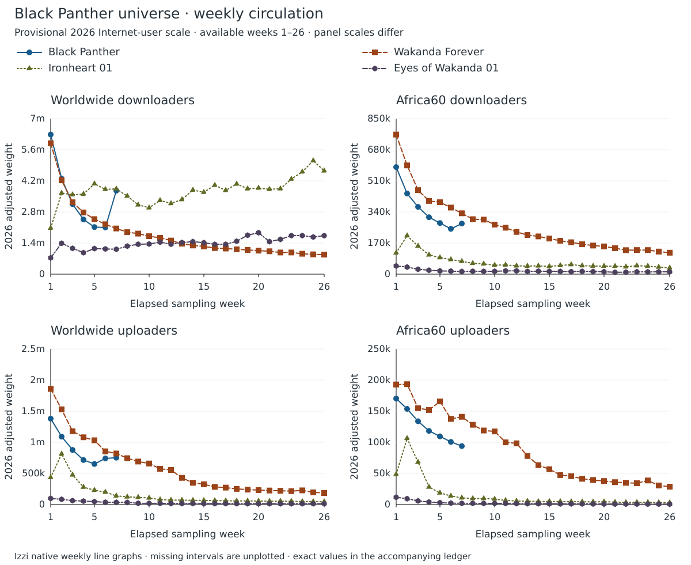
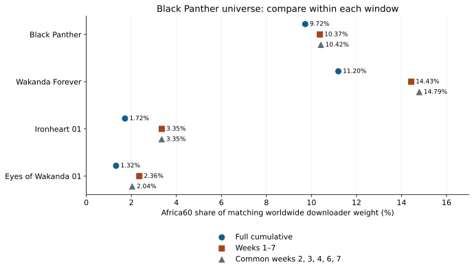

{::nomarkdown}

<link rel="stylesheet" href="../resources/mellon-7.7-analysis.css">
{:/}

[Black-led results](../index.html) · [M1](francophone.html) · [M2](anglophone.html) · [M3](romance-genre.html) · [M4](wakanda-forever.html)

# Black Panther, Ironheart and Eyes of Wakanda in Africa60

Mellon 7.7 · Published 2026-09-24 · Round 3 slice definitions

**The sequel grows in Africa60 share; the two later serials have much lower shares.** Full-window share rises from **9.72% Black Panther to 11.20% Wakanda Forever**, then is **1.72% Ironheart and 1.32% Eyes of Wakanda**. The sequel's increase and the serials' lower shares persist in matched elapsed windows. These observations describe sampled swarm circulation; they cannot establish growth or loss of individual fans.

## Four objects, three forms, unequal full windows

The first two objects are live-action feature films, Ironheart is a live-action television season, and Eyes of Wakanda is an animated television season. All have reviewed USA production. The original film has 52 sampled days; the other three have 182. Treating those full cumulative counts as equal-exposure measurements would be misleading. First-seven-week checks below align the elapsed sample clock, with separate coverage checks.


{::nomarkdown}
<div class="analysis-table-scroll" role="region" aria-label="Full cumulative samples and export coverage" tabindex="0">
<table>
<caption>Full cumulative samples and export coverage</caption>
<thead><tr><th scope="col">Object / audit</th><th scope="col">Sample dates</th><th scope="col">Days</th><th scope="col">World export weight</th><th scope="col">World source total</th><th scope="col">Export / source</th></tr></thead>
<tbody>
<tr><th scope="row"><a href="https://alpha60-devops.github.io/alpha60-results-2018/docs/itemized/black-panther-sample-cache-audit.html">Black Panther</a><br><code>black-panther</code></th><td>2018-05-02 to 2018-06-22</td><td>52</td><td>13,639,096</td><td>13,948,331</td><td>97.78%</td></tr>
<tr><th scope="row"><a href="https://alpha60-devops.github.io/alpha60-results-2023/docs/itemized/black-panther-wakanda-forever-sample-cache-audit.html">Wakanda Forever</a><br><code>black-panther-wakanda-forever</code></th><td>2023-01-31 to 2023-07-31</td><td>182</td><td>30,413,565</td><td>30,455,955</td><td>99.86%</td></tr>
<tr><th scope="row"><a href="https://alpha60-devops.github.io/alpha60-results-2025/docs/itemized/ironheart-01-sample-cache-audit.html">Ironheart 01</a><br><code>ironheart-01</code></th><td>2025-06-25 to 2025-12-23</td><td>182</td><td>82,242,883</td><td>82,330,568</td><td>99.89%</td></tr>
<tr><th scope="row"><a href="https://alpha60-devops.github.io/alpha60-results-2025/docs/itemized/eyes-of-wakanda-01-sample-cache-audit.html">Eyes of Wakanda 01</a><br><code>eyes-of-wakanda-01</code></th><td>2025-08-01 to 2026-01-29</td><td>182</td><td>30,900,384</td><td>30,938,193</td><td>99.88%</td></tr>
</tbody></table>
</div>
{:/}


{::nomarkdown}
<div class="analysis-table-scroll" role="region" aria-label="Africa60 circulation in the full cumulative exports" tabindex="0">
<table>
<caption>Africa60 circulation in the full cumulative exports</caption>
<thead><tr><th scope="col">Object</th><th scope="col">Africa60 weight</th><th scope="col">Africa60 / world</th><th scope="col">Africa60 excluding hosting</th><th scope="col">Africa60 uploader share</th><th scope="col">Africa60 except South Africa</th></tr></thead>
<tbody>
<tr><th scope="row"><a href="https://alpha60-devops.github.io/alpha60-results-2018/docs/itemized/black-panther-sample-cache-audit.html">Black Panther</a><br><code>black-panther</code></th><td>1,326,273</td><td>9.72%</td><td>10.21%</td><td>14.35%</td><td>8.27%</td></tr>
<tr><th scope="row"><a href="https://alpha60-devops.github.io/alpha60-results-2023/docs/itemized/black-panther-wakanda-forever-sample-cache-audit.html">Wakanda Forever</a><br><code>black-panther-wakanda-forever</code></th><td>3,405,102</td><td>11.20%</td><td>12.47%</td><td>14.40%</td><td>7.21%</td></tr>
<tr><th scope="row"><a href="https://alpha60-devops.github.io/alpha60-results-2025/docs/itemized/ironheart-01-sample-cache-audit.html">Ironheart 01</a><br><code>ironheart-01</code></th><td>1,414,228</td><td>1.72%</td><td>1.86%</td><td>10.85%</td><td>1.40%</td></tr>
<tr><th scope="row"><a href="https://alpha60-devops.github.io/alpha60-results-2025/docs/itemized/eyes-of-wakanda-01-sample-cache-audit.html">Eyes of Wakanda 01</a><br><code>eyes-of-wakanda-01</code></th><td>408,881</td><td>1.32%</td><td>1.42%</td><td>8.64%</td><td>1.09%</td></tr>
</tbody></table>
</div>
{:/}

Wakanda Forever has 3,405,102 Africa60 weight versus 1,326,273 for Black Panther, but its window is 3.5 times as long. Ironheart's 1,414,228 is slightly above the original film's full count despite a far lower regional share and a much longer sample. This is why both count and share, with window length, are necessary.

## Weekly circulation at the 2026 scale

The graph uses **weeks 1–26**, plotting available complete seven-day calendar
bins. **Black Panther stops at week 7**: its 52-day sample has seven full weeks
and a three-day trailing bin, which is omitted. The other three objects have
26 full weeks. Lines stop at observed coverage; missing weeks are not zeros.
This available-coverage view does not extend the original film's matched window.

**2026 adjusted weight = raw weekly weight × 6.1 / sample-start-year global
Internet users (billions).** The **6.1-billion 2026 reference is a provisional
project estimate**, not an official ITU 2026 observation. Each object's factor
is constant across its intervals, including samples that cross a calendar year.
This adjusts global Internet-user growth; country penetration, media scope,
torrent inventory and missing collection hours remain unadjusted. Shares and
network-flag rates are unchanged by the multiplier.


{::nomarkdown}
<figure class="analysis-figure">
<div class="analysis-chart-scroll" role="region" aria-label="Four Izzi line panels: world and Africa60, downloaders and uploaders. Black Panther stops at week seven; no missing intervals are imputed." tabindex="0"></div>
<figcaption>Native Izzi weekly line graphs. Worldwide and Africa60 weights for downloaders and uploaders; each panel has its own vertical scale. Markers identify observed weeks. The 2026 reference is provisional. <a href="../resources/mellon-7.7-wakanda-weekly-itu-2026.svg">Download SVG</a>.</figcaption>
</figure>
{:/}


{::nomarkdown}
<div class="analysis-table-scroll" role="region" aria-label="Weekly coverage and ITU factors" tabindex="0">
<table>
<caption>Weekly coverage and ITU factors</caption>
<thead><tr><th scope="col">Object</th><th scope="col">Sample year</th><th scope="col">Internet users (billions)</th><th scope="col">2026 factor</th><th scope="col">Plotted weeks</th><th scope="col">Calendar extent</th><th scope="col">Partial export flags</th></tr></thead>
<tbody>
<tr><th scope="row">Black Panther</th><td>2018</td><td>3.9</td><td>1.564103</td><td>1–7</td><td>2018-05-02 to 2018-06-19</td><td>None</td></tr>
<tr><th scope="row">Wakanda Forever</th><td>2023</td><td>5.4</td><td>1.129630</td><td>1–26</td><td>2023-01-31 to 2023-07-31</td><td>5</td></tr>
<tr><th scope="row">Ironheart 01</th><td>2025</td><td>6.0</td><td>1.016667</td><td>1–26</td><td>2025-06-25 to 2025-12-23</td><td>1</td></tr>
<tr><th scope="row">Eyes of Wakanda 01</th><td>2025</td><td>6.0</td><td>1.016667</td><td>1–26</td><td>2025-08-01 to 2026-01-29</td><td>1</td></tr>
</tbody></table>
</div>
{:/}

Full-length calendar bins can carry partial export flags or contain
sampling gaps. The flags above are retained in the graph; they do not quantify
missing hours. The exact dates, source audit notes and source-file hashes are in
the weekly ledger. The earlier seven-week coverage sensitivity follows below.

Sources: [ITU 2018: 3.9 billion](https://www.itu.int/en/mediacentre/pages/2018-pr40.aspx),
[ITU 2023: 5.4 billion](https://www.itu.int/en/mediacentre/Pages/PR-2023-11-27-facts-and-figures-measuring-digital-development.aspx),
[ITU 2025: 6.0 billion](https://www.itu.int/en/mediacentre/Pages/PR-2025-11-17-Facts-and-Figures.aspx).
The [ITU publication index](https://www.itu.int/en/ITU-D/Statistics/pages/facts/default.aspx)
still lists 2025 as its latest release when checked on September 25, 2026.
Historical values retain their as-published vintages.


<details markdown="1"><summary>Weekly graph values: raw and 2026 adjusted</summary>


{::nomarkdown}
<div class="analysis-table-scroll" role="region" aria-label="Weekly weights underlying the Izzi graph" tabindex="0">
<table>
<caption>Weekly weights underlying the Izzi graph</caption>
<thead><tr><th scope="col">Object</th><th scope="col">Week</th><th scope="col">Dates</th><th scope="col">World downloaders raw</th><th scope="col">World downloaders adjusted</th><th scope="col">Africa60 downloaders raw</th><th scope="col">Africa60 downloaders adjusted</th><th scope="col">World uploaders raw</th><th scope="col">World uploaders adjusted</th><th scope="col">Africa60 uploaders raw</th><th scope="col">Africa60 uploaders adjusted</th></tr></thead>
<tbody>
<tr><th scope="row">Black Panther</th><td>1</td><td>2018-05-02-to-2018-05-08</td><td>4,018,183</td><td>6,284,850</td><td>374,180</td><td>585,256</td><td>882,965</td><td>1,381,048</td><td>108,943</td><td>170,398</td></tr>
<tr><th scope="row">Black Panther</th><td>2</td><td>2018-05-09-to-2018-05-15</td><td>2,750,068</td><td>4,301,388</td><td>281,747</td><td>440,681</td><td>698,261</td><td>1,092,152</td><td>98,284</td><td>153,726</td></tr>
<tr><th scope="row">Black Panther</th><td>3</td><td>2018-05-16-to-2018-05-22</td><td>2,015,815</td><td>3,152,941</td><td>235,107</td><td>367,731</td><td>561,140</td><td>877,681</td><td>85,589</td><td>133,870</td></tr>
<tr><th scope="row">Black Panther</th><td>4</td><td>2018-05-23-to-2018-05-29</td><td>1,573,923</td><td>2,461,777</td><td>198,858</td><td>311,034</td><td>457,523</td><td>715,613</td><td>75,667</td><td>118,351</td></tr>
<tr><th scope="row">Black Panther</th><td>5</td><td>2018-05-30-to-2018-06-05</td><td>1,354,448</td><td>2,118,496</td><td>178,635</td><td>279,403</td><td>416,938</td><td>652,134</td><td>70,058</td><td>109,578</td></tr>
<tr><th scope="row">Black Panther</th><td>6</td><td>2018-06-06-to-2018-06-12</td><td>1,343,577</td><td>2,101,492</td><td>158,245</td><td>247,511</td><td>473,964</td><td>741,328</td><td>64,371</td><td>100,683</td></tr>
<tr><th scope="row">Black Panther</th><td>7</td><td>2018-06-13-to-2018-06-19</td><td>2,402,348</td><td>3,757,519</td><td>176,878</td><td>276,655</td><td>481,208</td><td>752,659</td><td>60,081</td><td>93,973</td></tr>
<tr><th scope="row">Wakanda Forever</th><td>1</td><td>2023-01-31-to-2023-02-06</td><td>5,215,883</td><td>5,892,016</td><td>675,386</td><td>762,936</td><td>1,646,349</td><td>1,859,765</td><td>170,781</td><td>192,919</td></tr>
<tr><th scope="row">Wakanda Forever</th><td>2</td><td>2023-02-07-to-2023-02-13</td><td>3,740,236</td><td>4,225,081</td><td>526,178</td><td>594,386</td><td>1,355,176</td><td>1,530,847</td><td>171,193</td><td>193,385</td></tr>
<tr><th scope="row">Wakanda Forever</th><td>3</td><td>2023-02-14-to-2023-02-20</td><td>2,865,370</td><td>3,236,807</td><td>406,560</td><td>459,262</td><td>1,043,436</td><td>1,178,696</td><td>137,178</td><td>154,960</td></tr>
<tr><th scope="row">Wakanda Forever</th><td>4</td><td>2023-02-21-to-2023-02-27</td><td>2,458,745</td><td>2,777,471</td><td>354,296</td><td>400,223</td><td>956,875</td><td>1,080,914</td><td>134,521</td><td>151,959</td></tr>
<tr><th scope="row">Wakanda Forever</th><td>5</td><td>2023-02-28-to-2023-03-06-partial</td><td>2,192,053</td><td>2,476,208</td><td>347,992</td><td>393,102</td><td>913,970</td><td>1,032,448</td><td>146,714</td><td>165,732</td></tr>
<tr><th scope="row">Wakanda Forever</th><td>6</td><td>2023-03-07-to-2023-03-13</td><td>1,987,834</td><td>2,245,516</td><td>322,006</td><td>363,748</td><td>757,065</td><td>855,203</td><td>121,914</td><td>137,718</td></tr>
<tr><th scope="row">Wakanda Forever</th><td>7</td><td>2023-03-14-to-2023-03-20</td><td>1,819,612</td><td>2,055,488</td><td>294,483</td><td>332,657</td><td>725,958</td><td>820,064</td><td>124,847</td><td>141,031</td></tr>
<tr><th scope="row">Wakanda Forever</th><td>8</td><td>2023-03-21-to-2023-03-27</td><td>1,672,965</td><td>1,889,831</td><td>265,889</td><td>300,356</td><td>659,317</td><td>744,784</td><td>113,485</td><td>128,196</td></tr>
<tr><th scope="row">Wakanda Forever</th><td>9</td><td>2023-03-28-to-2023-04-03</td><td>1,615,864</td><td>1,825,328</td><td>264,010</td><td>298,234</td><td>611,688</td><td>690,981</td><td>105,332</td><td>118,986</td></tr>
<tr><th scope="row">Wakanda Forever</th><td>10</td><td>2023-04-04-to-2023-04-10</td><td>1,511,798</td><td>1,707,772</td><td>239,747</td><td>270,825</td><td>583,787</td><td>659,463</td><td>104,030</td><td>117,515</td></tr>
<tr><th scope="row">Wakanda Forever</th><td>11</td><td>2023-04-11-to-2023-04-17</td><td>1,446,769</td><td>1,634,313</td><td>224,694</td><td>253,821</td><td>508,690</td><td>574,631</td><td>88,495</td><td>99,967</td></tr>
<tr><th scope="row">Wakanda Forever</th><td>12</td><td>2023-04-18-to-2023-04-24</td><td>1,338,244</td><td>1,511,720</td><td>204,246</td><td>230,722</td><td>491,471</td><td>555,180</td><td>87,099</td><td>98,390</td></tr>
<tr><th scope="row">Wakanda Forever</th><td>13</td><td>2023-04-25-to-2023-05-01</td><td>1,215,912</td><td>1,373,530</td><td>189,389</td><td>213,939</td><td>379,431</td><td>428,616</td><td>69,070</td><td>78,024</td></tr>
<tr><th scope="row">Wakanda Forever</th><td>14</td><td>2023-05-02-to-2023-05-08</td><td>1,142,881</td><td>1,291,032</td><td>182,639</td><td>206,314</td><td>309,708</td><td>349,855</td><td>56,071</td><td>63,339</td></tr>
<tr><th scope="row">Wakanda Forever</th><td>15</td><td>2023-05-09-to-2023-05-15</td><td>1,104,795</td><td>1,248,009</td><td>172,296</td><td>194,631</td><td>288,067</td><td>325,409</td><td>50,259</td><td>56,774</td></tr>
<tr><th scope="row">Wakanda Forever</th><td>16</td><td>2023-05-16-to-2023-05-22</td><td>1,039,141</td><td>1,173,844</td><td>161,571</td><td>182,515</td><td>251,576</td><td>284,188</td><td>41,902</td><td>47,334</td></tr>
<tr><th scope="row">Wakanda Forever</th><td>17</td><td>2023-05-23-to-2023-05-29</td><td>1,021,848</td><td>1,154,310</td><td>154,266</td><td>174,263</td><td>240,689</td><td>271,889</td><td>40,360</td><td>45,592</td></tr>
<tr><th scope="row">Wakanda Forever</th><td>18</td><td>2023-05-30-to-2023-06-05</td><td>989,671</td><td>1,117,962</td><td>144,694</td><td>163,451</td><td>222,421</td><td>251,253</td><td>36,691</td><td>41,447</td></tr>
<tr><th scope="row">Wakanda Forever</th><td>19</td><td>2023-06-06-to-2023-06-12</td><td>963,920</td><td>1,088,873</td><td>138,397</td><td>156,337</td><td>212,325</td><td>239,849</td><td>34,912</td><td>39,438</td></tr>
<tr><th scope="row">Wakanda Forever</th><td>20</td><td>2023-06-13-to-2023-06-19</td><td>937,528</td><td>1,059,059</td><td>134,122</td><td>151,508</td><td>205,217</td><td>231,819</td><td>33,425</td><td>37,758</td></tr>
<tr><th scope="row">Wakanda Forever</th><td>21</td><td>2023-06-20-to-2023-06-26</td><td>911,472</td><td>1,029,626</td><td>125,496</td><td>141,764</td><td>199,343</td><td>225,184</td><td>31,780</td><td>35,900</td></tr>
<tr><th scope="row">Wakanda Forever</th><td>22</td><td>2023-06-27-to-2023-07-03</td><td>862,698</td><td>974,529</td><td>116,071</td><td>131,117</td><td>195,637</td><td>220,997</td><td>30,928</td><td>34,937</td></tr>
<tr><th scope="row">Wakanda Forever</th><td>23</td><td>2023-07-04-to-2023-07-10</td><td>863,667</td><td>975,624</td><td>116,557</td><td>131,666</td><td>190,249</td><td>214,911</td><td>30,346</td><td>34,280</td></tr>
<tr><th scope="row">Wakanda Forever</th><td>24</td><td>2023-07-11-to-2023-07-17</td><td>813,025</td><td>918,417</td><td>116,462</td><td>131,559</td><td>201,386</td><td>227,492</td><td>34,221</td><td>38,657</td></tr>
<tr><th scope="row">Wakanda Forever</th><td>25</td><td>2023-07-18-to-2023-07-24</td><td>787,850</td><td>889,979</td><td>109,191</td><td>123,345</td><td>173,656</td><td>196,167</td><td>27,110</td><td>30,624</td></tr>
<tr><th scope="row">Wakanda Forever</th><td>26</td><td>2023-07-25-to-2023-07-31</td><td>777,995</td><td>878,846</td><td>103,707</td><td>117,150</td><td>163,842</td><td>185,081</td><td>25,412</td><td>28,706</td></tr>
<tr><th scope="row">Ironheart 01</th><td>1</td><td>2025-06-25-to-2025-07-01-partial</td><td>2,038,429</td><td>2,072,403</td><td>114,317</td><td>116,222</td><td>427,595</td><td>434,722</td><td>47,717</td><td>48,512</td></tr>
<tr><th scope="row">Ironheart 01</th><td>2</td><td>2025-07-02-to-2025-07-08</td><td>3,589,563</td><td>3,649,389</td><td>206,860</td><td>210,308</td><td>799,773</td><td>813,103</td><td>104,639</td><td>106,383</td></tr>
<tr><th scope="row">Ironheart 01</th><td>3</td><td>2025-07-09-to-2025-07-15</td><td>3,518,270</td><td>3,576,908</td><td>151,098</td><td>153,616</td><td>468,822</td><td>476,636</td><td>67,042</td><td>68,159</td></tr>
<tr><th scope="row">Ironheart 01</th><td>4</td><td>2025-07-16-to-2025-07-22</td><td>3,543,228</td><td>3,602,282</td><td>103,611</td><td>105,338</td><td>274,924</td><td>279,506</td><td>27,694</td><td>28,156</td></tr>
<tr><th scope="row">Ironheart 01</th><td>5</td><td>2025-07-23-to-2025-07-29</td><td>4,002,778</td><td>4,069,491</td><td>88,998</td><td>90,481</td><td>225,693</td><td>229,455</td><td>18,405</td><td>18,712</td></tr>
<tr><th scope="row">Ironheart 01</th><td>6</td><td>2025-07-30-to-2025-08-05</td><td>3,754,564</td><td>3,817,140</td><td>78,561</td><td>79,870</td><td>196,049</td><td>199,316</td><td>13,521</td><td>13,746</td></tr>
<tr><th scope="row">Ironheart 01</th><td>7</td><td>2025-08-06-to-2025-08-12</td><td>3,775,131</td><td>3,838,050</td><td>68,818</td><td>69,965</td><td>136,863</td><td>139,144</td><td>10,556</td><td>10,732</td></tr>
<tr><th scope="row">Ironheart 01</th><td>8</td><td>2025-08-13-to-2025-08-19</td><td>3,458,041</td><td>3,515,675</td><td>58,129</td><td>59,098</td><td>121,031</td><td>123,048</td><td>9,435</td><td>9,592</td></tr>
<tr><th scope="row">Ironheart 01</th><td>9</td><td>2025-08-20-to-2025-08-26</td><td>3,067,957</td><td>3,119,090</td><td>55,312</td><td>56,234</td><td>114,573</td><td>116,483</td><td>9,483</td><td>9,641</td></tr>
<tr><th scope="row">Ironheart 01</th><td>10</td><td>2025-08-27-to-2025-09-02</td><td>2,939,989</td><td>2,988,989</td><td>48,055</td><td>48,856</td><td>103,578</td><td>105,304</td><td>8,649</td><td>8,793</td></tr>
<tr><th scope="row">Ironheart 01</th><td>11</td><td>2025-09-03-to-2025-09-09</td><td>3,264,816</td><td>3,319,230</td><td>49,630</td><td>50,457</td><td>77,217</td><td>78,504</td><td>6,528</td><td>6,637</td></tr>
<tr><th scope="row">Ironheart 01</th><td>12</td><td>2025-09-10-to-2025-09-16</td><td>3,129,742</td><td>3,181,904</td><td>44,580</td><td>45,323</td><td>70,750</td><td>71,929</td><td>5,546</td><td>5,638</td></tr>
<tr><th scope="row">Ironheart 01</th><td>13</td><td>2025-09-17-to-2025-09-23</td><td>3,304,358</td><td>3,359,431</td><td>43,455</td><td>44,179</td><td>69,773</td><td>70,936</td><td>5,246</td><td>5,333</td></tr>
<tr><th scope="row">Ironheart 01</th><td>14</td><td>2025-09-24-to-2025-09-30</td><td>3,723,455</td><td>3,785,513</td><td>44,501</td><td>45,243</td><td>66,849</td><td>67,963</td><td>4,772</td><td>4,852</td></tr>
<tr><th scope="row">Ironheart 01</th><td>15</td><td>2025-10-01-to-2025-10-07</td><td>3,627,874</td><td>3,688,339</td><td>41,807</td><td>42,504</td><td>64,824</td><td>65,904</td><td>4,981</td><td>5,064</td></tr>
<tr><th scope="row">Ironheart 01</th><td>16</td><td>2025-10-08-to-2025-10-14</td><td>3,937,566</td><td>4,003,192</td><td>46,640</td><td>47,417</td><td>61,929</td><td>62,961</td><td>4,767</td><td>4,846</td></tr>
<tr><th scope="row">Ironheart 01</th><td>17</td><td>2025-10-15-to-2025-10-21</td><td>3,710,037</td><td>3,771,871</td><td>51,405</td><td>52,262</td><td>59,417</td><td>60,407</td><td>4,473</td><td>4,548</td></tr>
<tr><th scope="row">Ironheart 01</th><td>18</td><td>2025-10-22-to-2025-10-28</td><td>3,992,336</td><td>4,058,875</td><td>45,581</td><td>46,341</td><td>56,265</td><td>57,203</td><td>4,366</td><td>4,439</td></tr>
<tr><th scope="row">Ironheart 01</th><td>19</td><td>2025-10-29-to-2025-11-04</td><td>3,781,222</td><td>3,844,242</td><td>43,655</td><td>44,383</td><td>57,242</td><td>58,196</td><td>4,200</td><td>4,270</td></tr>
<tr><th scope="row">Ironheart 01</th><td>20</td><td>2025-11-05-to-2025-11-11</td><td>3,811,895</td><td>3,875,427</td><td>43,216</td><td>43,936</td><td>55,424</td><td>56,348</td><td>4,470</td><td>4,544</td></tr>
<tr><th scope="row">Ironheart 01</th><td>21</td><td>2025-11-12-to-2025-11-18</td><td>3,759,159</td><td>3,821,812</td><td>42,433</td><td>43,140</td><td>53,154</td><td>54,040</td><td>3,767</td><td>3,830</td></tr>
<tr><th scope="row">Ironheart 01</th><td>22</td><td>2025-11-19-to-2025-11-25</td><td>3,782,101</td><td>3,845,136</td><td>39,486</td><td>40,144</td><td>52,833</td><td>53,714</td><td>3,337</td><td>3,393</td></tr>
<tr><th scope="row">Ironheart 01</th><td>23</td><td>2025-11-26-to-2025-12-02</td><td>4,211,024</td><td>4,281,208</td><td>45,275</td><td>46,030</td><td>52,189</td><td>53,059</td><td>3,498</td><td>3,556</td></tr>
<tr><th scope="row">Ironheart 01</th><td>24</td><td>2025-12-03-to-2025-12-09</td><td>4,530,377</td><td>4,605,883</td><td>42,980</td><td>43,696</td><td>47,672</td><td>48,467</td><td>3,449</td><td>3,506</td></tr>
<tr><th scope="row">Ironheart 01</th><td>25</td><td>2025-12-10-to-2025-12-16</td><td>5,024,066</td><td>5,107,800</td><td>38,153</td><td>38,789</td><td>47,002</td><td>47,785</td><td>3,202</td><td>3,255</td></tr>
<tr><th scope="row">Ironheart 01</th><td>26</td><td>2025-12-17-to-2025-12-23</td><td>4,575,634</td><td>4,651,895</td><td>33,593</td><td>34,153</td><td>45,602</td><td>46,362</td><td>2,988</td><td>3,038</td></tr>
<tr><th scope="row">Eyes of Wakanda 01</th><td>1</td><td>2025-08-01-to-2025-08-07-partial</td><td>721,818</td><td>733,848</td><td>44,203</td><td>44,940</td><td>96,758</td><td>98,371</td><td>11,469</td><td>11,660</td></tr>
<tr><th scope="row">Eyes of Wakanda 01</th><td>2</td><td>2025-08-08-to-2025-08-14</td><td>1,367,730</td><td>1,390,526</td><td>38,135</td><td>38,771</td><td>82,416</td><td>83,790</td><td>9,223</td><td>9,377</td></tr>
<tr><th scope="row">Eyes of Wakanda 01</th><td>3</td><td>2025-08-15-to-2025-08-21</td><td>1,142,671</td><td>1,161,716</td><td>26,223</td><td>26,660</td><td>61,560</td><td>62,586</td><td>5,775</td><td>5,871</td></tr>
<tr><th scope="row">Eyes of Wakanda 01</th><td>4</td><td>2025-08-22-to-2025-08-28</td><td>951,140</td><td>966,992</td><td>20,941</td><td>21,290</td><td>54,027</td><td>54,927</td><td>3,945</td><td>4,011</td></tr>
<tr><th scope="row">Eyes of Wakanda 01</th><td>5</td><td>2025-08-29-to-2025-09-04</td><td>1,132,051</td><td>1,150,919</td><td>17,417</td><td>17,707</td><td>46,201</td><td>46,971</td><td>2,915</td><td>2,964</td></tr>
<tr><th scope="row">Eyes of Wakanda 01</th><td>6</td><td>2025-09-05-to-2025-09-11</td><td>1,116,413</td><td>1,135,020</td><td>16,250</td><td>16,521</td><td>36,126</td><td>36,728</td><td>2,212</td><td>2,249</td></tr>
<tr><th scope="row">Eyes of Wakanda 01</th><td>7</td><td>2025-09-12-to-2025-09-18</td><td>1,101,751</td><td>1,120,114</td><td>14,284</td><td>14,522</td><td>35,195</td><td>35,782</td><td>1,895</td><td>1,927</td></tr>
<tr><th scope="row">Eyes of Wakanda 01</th><td>8</td><td>2025-09-19-to-2025-09-25</td><td>1,240,462</td><td>1,261,136</td><td>15,480</td><td>15,738</td><td>33,462</td><td>34,020</td><td>1,903</td><td>1,935</td></tr>
<tr><th scope="row">Eyes of Wakanda 01</th><td>9</td><td>2025-09-26-to-2025-10-02</td><td>1,324,434</td><td>1,346,508</td><td>15,136</td><td>15,388</td><td>19,748</td><td>20,077</td><td>1,750</td><td>1,779</td></tr>
<tr><th scope="row">Eyes of Wakanda 01</th><td>10</td><td>2025-10-03-to-2025-10-09</td><td>1,335,023</td><td>1,357,273</td><td>15,346</td><td>15,602</td><td>19,132</td><td>19,451</td><td>1,820</td><td>1,850</td></tr>
<tr><th scope="row">Eyes of Wakanda 01</th><td>11</td><td>2025-10-10-to-2025-10-16</td><td>1,416,056</td><td>1,439,657</td><td>17,576</td><td>17,869</td><td>18,516</td><td>18,825</td><td>1,706</td><td>1,734</td></tr>
<tr><th scope="row">Eyes of Wakanda 01</th><td>12</td><td>2025-10-17-to-2025-10-23</td><td>1,325,860</td><td>1,347,958</td><td>17,694</td><td>17,989</td><td>16,517</td><td>16,792</td><td>1,521</td><td>1,546</td></tr>
<tr><th scope="row">Eyes of Wakanda 01</th><td>13</td><td>2025-10-24-to-2025-10-30</td><td>1,399,668</td><td>1,422,996</td><td>14,628</td><td>14,872</td><td>16,057</td><td>16,325</td><td>1,368</td><td>1,391</td></tr>
<tr><th scope="row">Eyes of Wakanda 01</th><td>14</td><td>2025-10-31-to-2025-11-06</td><td>1,439,699</td><td>1,463,694</td><td>16,041</td><td>16,308</td><td>16,163</td><td>16,432</td><td>1,259</td><td>1,280</td></tr>
<tr><th scope="row">Eyes of Wakanda 01</th><td>15</td><td>2025-11-07-to-2025-11-13</td><td>1,393,872</td><td>1,417,103</td><td>15,050</td><td>15,301</td><td>14,729</td><td>14,974</td><td>1,220</td><td>1,240</td></tr>
<tr><th scope="row">Eyes of Wakanda 01</th><td>16</td><td>2025-11-14-to-2025-11-20</td><td>1,319,658</td><td>1,341,652</td><td>14,709</td><td>14,954</td><td>14,786</td><td>15,032</td><td>1,044</td><td>1,061</td></tr>
<tr><th scope="row">Eyes of Wakanda 01</th><td>17</td><td>2025-11-21-to-2025-11-27</td><td>1,321,669</td><td>1,343,697</td><td>13,536</td><td>13,762</td><td>14,643</td><td>14,887</td><td>1,069</td><td>1,087</td></tr>
<tr><th scope="row">Eyes of Wakanda 01</th><td>18</td><td>2025-11-28-to-2025-12-04</td><td>1,455,758</td><td>1,480,021</td><td>15,066</td><td>15,317</td><td>14,182</td><td>14,418</td><td>1,015</td><td>1,032</td></tr>
<tr><th scope="row">Eyes of Wakanda 01</th><td>19</td><td>2025-12-05-to-2025-12-11</td><td>1,723,511</td><td>1,752,236</td><td>14,145</td><td>14,381</td><td>13,268</td><td>13,489</td><td>898</td><td>913</td></tr>
<tr><th scope="row">Eyes of Wakanda 01</th><td>20</td><td>2025-12-12-to-2025-12-18</td><td>1,835,427</td><td>1,866,017</td><td>13,223</td><td>13,443</td><td>12,948</td><td>13,164</td><td>853</td><td>867</td></tr>
<tr><th scope="row">Eyes of Wakanda 01</th><td>21</td><td>2025-12-19-to-2025-12-25</td><td>1,439,398</td><td>1,463,388</td><td>9,841</td><td>10,005</td><td>13,086</td><td>13,304</td><td>729</td><td>741</td></tr>
<tr><th scope="row">Eyes of Wakanda 01</th><td>22</td><td>2025-12-26-to-2026-01-01</td><td>1,540,446</td><td>1,566,120</td><td>10,664</td><td>10,842</td><td>12,743</td><td>12,955</td><td>708</td><td>720</td></tr>
<tr><th scope="row">Eyes of Wakanda 01</th><td>23</td><td>2026-01-02-to-2026-01-08</td><td>1,706,663</td><td>1,735,107</td><td>12,688</td><td>12,899</td><td>12,635</td><td>12,846</td><td>711</td><td>723</td></tr>
<tr><th scope="row">Eyes of Wakanda 01</th><td>24</td><td>2026-01-09-to-2026-01-15</td><td>1,707,444</td><td>1,735,901</td><td>12,065</td><td>12,266</td><td>13,095</td><td>13,313</td><td>658</td><td>669</td></tr>
<tr><th scope="row">Eyes of Wakanda 01</th><td>25</td><td>2026-01-16-to-2026-01-22</td><td>1,643,920</td><td>1,671,319</td><td>12,523</td><td>12,732</td><td>13,150</td><td>13,369</td><td>678</td><td>689</td></tr>
<tr><th scope="row">Eyes of Wakanda 01</th><td>26</td><td>2026-01-23-to-2026-01-29</td><td>1,705,367</td><td>1,733,790</td><td>12,606</td><td>12,816</td><td>13,008</td><td>13,225</td><td>611</td><td>621</td></tr>
</tbody></table>
</div>
{:/}


</details>

The graph reads top-level weekly aggregate GeoJSON interval features,
with H3 resolution 5 and minimum swarm size 3. Nested by-BTIH features and
companion weekly JSON cumulative prefixes are not added again. Repeated weekly
swarm weights are not unique people, viewers or completed downloads.

Download the [weekly numeric ledger](../data/mellon-7.7-wakanda-weekly.json),
[graph inputs and Izzi provenance](../data/mellon-7.7-weekly-graphs.json),
[ITU policy](../data/itu-2026-provisional-7.7.json) and
[weekly reducer](../resources/extend-mellon-7-7-weekly.py).
The [C++ graph renderer](../resources/izzi-weekly-graphs.cc) and
[Python wrapper](../resources/izzi_weekly_graphs.py) are also available.
Run the reducer beside the existing collector with `--input mellon-7.7-analysis.json.gz
--source-root /path/to/checkouts --itu-config itu-2026-provisional-7.7.json
--output weekly.json --weeks 26`. The report renderer accepts `--weekly-m4 weekly.json
--izzi /path/to/izzi`; the graph ledger pins the Izzi revision and renderer digest.

## Matching the elapsed observation window


{::nomarkdown}
<figure class="analysis-figure">
<div class="analysis-chart-scroll" role="region" aria-label="Wakanda Forever exceeds Black Panther in Africa60 share in all three windows; Ironheart and Eyes of Wakanda are lower." tabindex="0"></div>
<figcaption>Full cumulative share, summed weeks 1–7 share, and common unflagged weeks 2, 3, 4, 6, 7. Each uses its own matching world denominator; counts across window types are not interchangeable. <a href="../resources/mellon-7.7-wakanda-forever.svg">Download SVG</a>.</figcaption>
</figure>
{:/}


{::nomarkdown}
<div class="analysis-table-scroll" role="region" aria-label="Equal elapsed windows: sums of interval observations" tabindex="0">
<table>
<caption>Equal elapsed windows: sums of interval observations</caption>
<thead><tr><th scope="col">Object</th><th scope="col">Window</th><th scope="col">Africa60 interval weight</th><th scope="col">World interval weight</th><th scope="col">Africa60 share</th><th scope="col">Excluding hosting</th><th scope="col">Uploader share</th></tr></thead>
<tbody>
<tr><th scope="row"><a href="https://alpha60-devops.github.io/alpha60-results-2018/docs/itemized/black-panther-sample-cache-audit.html">Black Panther</a><br><code>black-panther</code></th><td>Weeks 1–7</td><td>1,603,650</td><td>15,458,362</td><td>10.37%</td><td>11.01%</td><td>14.17%</td></tr>
<tr><th scope="row"><a href="https://alpha60-devops.github.io/alpha60-results-2018/docs/itemized/black-panther-sample-cache-audit.html">Black Panther</a><br><code>black-panther</code></th><td>Common weeks 2, 3, 4, 6, 7</td><td>1,050,835</td><td>10,085,731</td><td>10.42%</td><td>11.15%</td><td>14.37%</td></tr>
<tr><th scope="row"><a href="https://alpha60-devops.github.io/alpha60-results-2023/docs/itemized/black-panther-wakanda-forever-sample-cache-audit.html">Wakanda Forever</a><br><code>black-panther-wakanda-forever</code></th><td>Weeks 1–7</td><td>2,926,901</td><td>20,279,733</td><td>14.43%</td><td>15.95%</td><td>13.61%</td></tr>
<tr><th scope="row"><a href="https://alpha60-devops.github.io/alpha60-results-2023/docs/itemized/black-panther-wakanda-forever-sample-cache-audit.html">Wakanda Forever</a><br><code>black-panther-wakanda-forever</code></th><td>Common weeks 2, 3, 4, 6, 7</td><td>1,903,523</td><td>12,871,797</td><td>14.79%</td><td>16.38%</td><td>14.25%</td></tr>
<tr><th scope="row"><a href="https://alpha60-devops.github.io/alpha60-results-2025/docs/itemized/ironheart-01-sample-cache-audit.html">Ironheart 01</a><br><code>ironheart-01</code></th><td>Weeks 1–7</td><td>812,263</td><td>24,221,963</td><td>3.35%</td><td>3.92%</td><td>11.45%</td></tr>
<tr><th scope="row"><a href="https://alpha60-devops.github.io/alpha60-results-2025/docs/itemized/ironheart-01-sample-cache-audit.html">Ironheart 01</a><br><code>ironheart-01</code></th><td>Common weeks 2, 3, 4, 6, 7</td><td>608,948</td><td>18,180,756</td><td>3.35%</td><td>3.91%</td><td>11.91%</td></tr>
<tr><th scope="row"><a href="https://alpha60-devops.github.io/alpha60-results-2025/docs/itemized/eyes-of-wakanda-01-sample-cache-audit.html">Eyes of Wakanda 01</a><br><code>eyes-of-wakanda-01</code></th><td>Weeks 1–7</td><td>177,453</td><td>7,533,574</td><td>2.36%</td><td>2.73%</td><td>9.08%</td></tr>
<tr><th scope="row"><a href="https://alpha60-devops.github.io/alpha60-results-2025/docs/itemized/eyes-of-wakanda-01-sample-cache-audit.html">Eyes of Wakanda 01</a><br><code>eyes-of-wakanda-01</code></th><td>Common weeks 2, 3, 4, 6, 7</td><td>115,833</td><td>5,679,705</td><td>2.04%</td><td>2.36%</td><td>8.56%</td></tr>
</tbody></table>
</div>
{:/}

Over weeks 1–7, Africa60 share rises **10.37% → 14.43%** from the first film to the sequel. Africa60 interval weight rises **1,603,650 → 2,926,901**. In common unflagged weeks 2, 3, 4, 6 and 7, shares are **10.42%, 14.79%, 3.35% and 2.04%**, respectively. Removing hosting leaves the same ordering. Uploader shares show a much smaller separation and do not reproduce the downloader sequel increase in every window; the “growth” finding is specific to the downloader measure.


<details markdown="1"><summary>Coverage flags and source-audit limits</summary>


{::nomarkdown}
<div class="analysis-table-scroll" role="region" aria-label="Coverage relevant to window checks" tabindex="0">
<table>
<caption>Coverage relevant to window checks</caption>
<thead><tr><th scope="col">Object</th><th scope="col">Partial week flags in 1–7</th><th scope="col">Audit evidence</th></tr></thead>
<tbody>
<tr><th scope="row"><a href="https://alpha60-devops.github.io/alpha60-results-2018/docs/itemized/black-panther-sample-cache-audit.html">Black Panther</a><br><code>black-panther</code></th><td>None</td><td>Day-product or release evidence; no separate hourly completeness claim</td></tr>
<tr><th scope="row"><a href="https://alpha60-devops.github.io/alpha60-results-2023/docs/itemized/black-panther-wakanda-forever-sample-cache-audit.html">Wakanda Forever</a><br><code>black-panther-wakanda-forever</code></th><td>5</td><td>No hourly discontinuity reported in source audit</td></tr>
<tr><th scope="row"><a href="https://alpha60-devops.github.io/alpha60-results-2025/docs/itemized/ironheart-01-sample-cache-audit.html">Ironheart 01</a><br><code>ironheart-01</code></th><td>1</td><td>Day-product or release evidence; no separate hourly completeness claim</td></tr>
<tr><th scope="row"><a href="https://alpha60-devops.github.io/alpha60-results-2025/docs/itemized/eyes-of-wakanda-01-sample-cache-audit.html">Eyes of Wakanda 01</a><br><code>eyes-of-wakanda-01</code></th><td>1</td><td>Day-product or release evidence; no separate hourly completeness claim</td></tr>
</tbody></table>
</div>
{:/}


</details>

## Which countries gained?

Changes below are **percentage points of worldwide downloader weight**, not percent growth within a country. Ranking requires both objects to have an emitted country observation; no unreported country is treated as zero.


{::nomarkdown}
<div class="analysis-table-scroll" role="region" aria-label="Largest first-seven-week share gains: Black Panther to Wakanda Forever" tabindex="0">
<table>
<caption>Largest first-seven-week share gains: Black Panther to Wakanda Forever</caption>
<thead><tr><th scope="col">Country</th><th scope="col">Black Panther share</th><th scope="col">Wakanda Forever share</th><th scope="col">Change (pp)</th><th scope="col">Interval weight change</th><th scope="col">Full-window change (pp)</th></tr></thead>
<tbody>
<tr><th scope="row">South Africa (ZAF)</th><td>1.41%</td><td>5.60%</td><td>+4.187</td><td>917,062</td><td>+2.537</td></tr>
<tr><th scope="row">Nigeria (NGA)</th><td>0.29%</td><td>1.33%</td><td>+1.034</td><td>223,819</td><td>+0.705</td></tr>
<tr><th scope="row">Kenya (KEN)</th><td>0.42%</td><td>0.86%</td><td>+0.431</td><td>107,847</td><td>+0.299</td></tr>
<tr><th scope="row">Botswana (BWA)</th><td>0.05%</td><td>0.47%</td><td>+0.422</td><td>87,798</td><td>+0.148</td></tr>
<tr><th scope="row">Ghana (GHA)</th><td>0.33%</td><td>0.72%</td><td>+0.383</td><td>93,666</td><td>+0.111</td></tr>
<tr><th scope="row">Ethiopia (ETH)</th><td>0.07%</td><td>0.39%</td><td>+0.312</td><td>66,846</td><td>+0.223</td></tr>
<tr><th scope="row">Zambia (ZMB)</th><td>0.06%</td><td>0.28%</td><td>+0.223</td><td>47,846</td><td>+0.159</td></tr>
<tr><th scope="row">Mozambique (MOZ)</th><td>0.12%</td><td>0.32%</td><td>+0.204</td><td>46,951</td><td>+0.190</td></tr>
</tbody></table>
</div>
{:/}

South Africa leads the matched-window increase (**+4.19 percentage points**), followed by Nigeria (+1.03), Kenya (+0.43), Botswana (+0.42) and Ghana (+0.38). In full-window shares, South Africa and Nigeria still lead, while Ethiopia and Mozambique move higher in the gain ranking. The result depends partly on when circulation is observed.

The full-window Africa60 share **outside South Africa falls from 8.27% to 7.21%** between the films, even as the Africa60 total rises. A claim of uniform continental expansion would conceal this concentration. Algeria, Morocco, Côte d'Ivoire and Senegal lose world share between the films; see the Francophone comparison for those values.

Relative to Wakanda Forever, Ironheart's largest shared-country full-window share gain is a small **+0.006 pp in DR Congo**, while its largest raw full-count gain is in Morocco (+47,358), where world share falls. In weeks 1–7, Republic of the Congo instead leads the positive differences (+0.061 pp, +16,642 interval weight). **DR Congo (COD) and Republic of the Congo (COG) are different countries.** No shared Africa60 country gains world share from Wakanda Forever to Eyes of Wakanda in either the full or first-seven-week view.


<details markdown="1"><summary>All shared-country changes from Wakanda Forever to each serial</summary>


{::nomarkdown}
<div class="analysis-table-scroll" role="region" aria-label="First-seven-week changes from Wakanda Forever" tabindex="0">
<table>
<caption>First-seven-week changes from Wakanda Forever</caption>
<thead><tr><th scope="col">Later object</th><th scope="col">Country</th><th scope="col">Wakanda Forever share</th><th scope="col">Later share</th><th scope="col">Change (pp)</th><th scope="col">Interval weight change</th></tr></thead>
<tbody>
<tr><th scope="row"><a href="https://alpha60-devops.github.io/alpha60-results-2025/docs/itemized/ironheart-01-sample-cache-audit.html">Ironheart 01</a><br><code>ironheart-01</code></th><td>Congo (COG)</td><td>0.05%</td><td>0.11%</td><td>+0.0611</td><td>16,642</td></tr>
<tr><th scope="row"><a href="https://alpha60-devops.github.io/alpha60-results-2025/docs/itemized/ironheart-01-sample-cache-audit.html">Ironheart 01</a><br><code>ironheart-01</code></th><td>Guinea (GIN)</td><td>0.01%</td><td>0.02%</td><td>+0.0050</td><td>1,712</td></tr>
<tr><th scope="row"><a href="https://alpha60-devops.github.io/alpha60-results-2025/docs/itemized/ironheart-01-sample-cache-audit.html">Ironheart 01</a><br><code>ironheart-01</code></th><td>Mauritania (MRT)</td><td>0.02%</td><td>0.02%</td><td>+0.0009</td><td>920</td></tr>
<tr><th scope="row"><a href="https://alpha60-devops.github.io/alpha60-results-2025/docs/itemized/ironheart-01-sample-cache-audit.html">Ironheart 01</a><br><code>ironheart-01</code></th><td>Chad (TCD)</td><td>0.00%</td><td>0.01%</td><td>+0.0004</td><td>294</td></tr>
<tr><th scope="row"><a href="https://alpha60-devops.github.io/alpha60-results-2025/docs/itemized/ironheart-01-sample-cache-audit.html">Ironheart 01</a><br><code>ironheart-01</code></th><td>Central African Republic (CAF)</td><td>0.00%</td><td>0.00%</td><td>+0.0003</td><td>107</td></tr>
<tr><th scope="row"><a href="https://alpha60-devops.github.io/alpha60-results-2025/docs/itemized/ironheart-01-sample-cache-audit.html">Ironheart 01</a><br><code>ironheart-01</code></th><td>Comoros (COM)</td><td>0.00%</td><td>0.00%</td><td>+0.0001</td><td>154</td></tr>
<tr><th scope="row"><a href="https://alpha60-devops.github.io/alpha60-results-2025/docs/itemized/ironheart-01-sample-cache-audit.html">Ironheart 01</a><br><code>ironheart-01</code></th><td>Eritrea (ERI)</td><td>0.00%</td><td>0.00%</td><td>-0.0001</td><td>-21</td></tr>
<tr><th scope="row"><a href="https://alpha60-devops.github.io/alpha60-results-2025/docs/itemized/ironheart-01-sample-cache-audit.html">Ironheart 01</a><br><code>ironheart-01</code></th><td>Mayotte (MYT)</td><td>0.00%</td><td>0.00%</td><td>-0.0007</td><td>-116</td></tr>
<tr><th scope="row"><a href="https://alpha60-devops.github.io/alpha60-results-2025/docs/itemized/ironheart-01-sample-cache-audit.html">Ironheart 01</a><br><code>ironheart-01</code></th><td>Djibouti (DJI)</td><td>0.00%</td><td>0.00%</td><td>-0.0016</td><td>-292</td></tr>
<tr><th scope="row"><a href="https://alpha60-devops.github.io/alpha60-results-2025/docs/itemized/ironheart-01-sample-cache-audit.html">Ironheart 01</a><br><code>ironheart-01</code></th><td>Equatorial Guinea (GNQ)</td><td>0.01%</td><td>0.00%</td><td>-0.0026</td><td>-326</td></tr>
<tr><th scope="row"><a href="https://alpha60-devops.github.io/alpha60-results-2025/docs/itemized/ironheart-01-sample-cache-audit.html">Ironheart 01</a><br><code>ironheart-01</code></th><td>South Sudan (SSD)</td><td>0.00%</td><td>0.00%</td><td>-0.0036</td><td>-690</td></tr>
<tr><th scope="row"><a href="https://alpha60-devops.github.io/alpha60-results-2025/docs/itemized/ironheart-01-sample-cache-audit.html">Ironheart 01</a><br><code>ironheart-01</code></th><td>Sao Tome and Principe (STP)</td><td>0.01%</td><td>0.00%</td><td>-0.0036</td><td>-671</td></tr>
<tr><th scope="row"><a href="https://alpha60-devops.github.io/alpha60-results-2025/docs/itemized/ironheart-01-sample-cache-audit.html">Ironheart 01</a><br><code>ironheart-01</code></th><td>Burundi (BDI)</td><td>0.02%</td><td>0.01%</td><td>-0.0077</td><td>-1,112</td></tr>
<tr><th scope="row"><a href="https://alpha60-devops.github.io/alpha60-results-2025/docs/itemized/ironheart-01-sample-cache-audit.html">Ironheart 01</a><br><code>ironheart-01</code></th><td>Guinea-Bissau (GNB)</td><td>0.01%</td><td>0.00%</td><td>-0.0080</td><td>-1,524</td></tr>
<tr><th scope="row"><a href="https://alpha60-devops.github.io/alpha60-results-2025/docs/itemized/ironheart-01-sample-cache-audit.html">Ironheart 01</a><br><code>ironheart-01</code></th><td>Niger (NER)</td><td>0.05%</td><td>0.04%</td><td>-0.0136</td><td>-1,316</td></tr>
<tr><th scope="row"><a href="https://alpha60-devops.github.io/alpha60-results-2025/docs/itemized/ironheart-01-sample-cache-audit.html">Ironheart 01</a><br><code>ironheart-01</code></th><td>Burkina Faso (BFA)</td><td>0.05%</td><td>0.03%</td><td>-0.0149</td><td>-1,700</td></tr>
<tr><th scope="row"><a href="https://alpha60-devops.github.io/alpha60-results-2025/docs/itemized/ironheart-01-sample-cache-audit.html">Ironheart 01</a><br><code>ironheart-01</code></th><td>Réunion (REU)</td><td>0.03%</td><td>0.01%</td><td>-0.0157</td><td>-2,668</td></tr>
<tr><th scope="row"><a href="https://alpha60-devops.github.io/alpha60-results-2025/docs/itemized/ironheart-01-sample-cache-audit.html">Ironheart 01</a><br><code>ironheart-01</code></th><td>Togo (TGO)</td><td>0.07%</td><td>0.05%</td><td>-0.0195</td><td>-2,012</td></tr>
<tr><th scope="row"><a href="https://alpha60-devops.github.io/alpha60-results-2025/docs/itemized/ironheart-01-sample-cache-audit.html">Ironheart 01</a><br><code>ironheart-01</code></th><td>Liberia (LBR)</td><td>0.02%</td><td>0.00%</td><td>-0.0217</td><td>-4,346</td></tr>
<tr><th scope="row"><a href="https://alpha60-devops.github.io/alpha60-results-2025/docs/itemized/ironheart-01-sample-cache-audit.html">Ironheart 01</a><br><code>ironheart-01</code></th><td>Lesotho (LSO)</td><td>0.03%</td><td>0.00%</td><td>-0.0224</td><td>-4,412</td></tr>
<tr><th scope="row"><a href="https://alpha60-devops.github.io/alpha60-results-2025/docs/itemized/ironheart-01-sample-cache-audit.html">Ironheart 01</a><br><code>ironheart-01</code></th><td>Somalia (SOM)</td><td>0.03%</td><td>0.00%</td><td>-0.0225</td><td>-4,417</td></tr>
<tr><th scope="row"><a href="https://alpha60-devops.github.io/alpha60-results-2025/docs/itemized/ironheart-01-sample-cache-audit.html">Ironheart 01</a><br><code>ironheart-01</code></th><td>Benin (BEN)</td><td>0.06%</td><td>0.03%</td><td>-0.0281</td><td>-4,514</td></tr>
<tr><th scope="row"><a href="https://alpha60-devops.github.io/alpha60-results-2025/docs/itemized/ironheart-01-sample-cache-audit.html">Ironheart 01</a><br><code>ironheart-01</code></th><td>Mali (MLI)</td><td>0.07%</td><td>0.04%</td><td>-0.0282</td><td>-3,978</td></tr>
<tr><th scope="row"><a href="https://alpha60-devops.github.io/alpha60-results-2025/docs/itemized/ironheart-01-sample-cache-audit.html">Ironheart 01</a><br><code>ironheart-01</code></th><td>Tunisia (TUN)</td><td>0.07%</td><td>0.04%</td><td>-0.0315</td><td>-4,688</td></tr>
<tr><th scope="row"><a href="https://alpha60-devops.github.io/alpha60-results-2025/docs/itemized/ironheart-01-sample-cache-audit.html">Ironheart 01</a><br><code>ironheart-01</code></th><td>Gabon (GAB)</td><td>0.07%</td><td>0.04%</td><td>-0.0340</td><td>-5,381</td></tr>
<tr><th scope="row"><a href="https://alpha60-devops.github.io/alpha60-results-2025/docs/itemized/ironheart-01-sample-cache-audit.html">Ironheart 01</a><br><code>ironheart-01</code></th><td>Sudan (SDN)</td><td>0.04%</td><td>0.00%</td><td>-0.0375</td><td>-7,536</td></tr>
<tr><th scope="row"><a href="https://alpha60-devops.github.io/alpha60-results-2025/docs/itemized/ironheart-01-sample-cache-audit.html">Ironheart 01</a><br><code>ironheart-01</code></th><td>Libya (LBY)</td><td>0.05%</td><td>0.01%</td><td>-0.0381</td><td>-7,329</td></tr>
<tr><th scope="row"><a href="https://alpha60-devops.github.io/alpha60-results-2025/docs/itemized/ironheart-01-sample-cache-audit.html">Ironheart 01</a><br><code>ironheart-01</code></th><td>Madagascar (MDG)</td><td>0.07%</td><td>0.03%</td><td>-0.0396</td><td>-7,024</td></tr>
<tr><th scope="row"><a href="https://alpha60-devops.github.io/alpha60-results-2025/docs/itemized/ironheart-01-sample-cache-audit.html">Ironheart 01</a><br><code>ironheart-01</code></th><td>Cabo Verde (CPV)</td><td>0.05%</td><td>0.01%</td><td>-0.0400</td><td>-7,883</td></tr>
<tr><th scope="row"><a href="https://alpha60-devops.github.io/alpha60-results-2025/docs/itemized/ironheart-01-sample-cache-audit.html">Ironheart 01</a><br><code>ironheart-01</code></th><td>Eswatini (SWZ)</td><td>0.05%</td><td>0.01%</td><td>-0.0440</td><td>-8,500</td></tr>
<tr><th scope="row"><a href="https://alpha60-devops.github.io/alpha60-results-2025/docs/itemized/ironheart-01-sample-cache-audit.html">Ironheart 01</a><br><code>ironheart-01</code></th><td>Gambia (GMB)</td><td>0.06%</td><td>0.01%</td><td>-0.0470</td><td>-9,113</td></tr>
<tr><th scope="row"><a href="https://alpha60-devops.github.io/alpha60-results-2025/docs/itemized/ironheart-01-sample-cache-audit.html">Ironheart 01</a><br><code>ironheart-01</code></th><td>Sierra Leone (SLE)</td><td>0.05%</td><td>0.01%</td><td>-0.0488</td><td>-9,656</td></tr>
<tr><th scope="row"><a href="https://alpha60-devops.github.io/alpha60-results-2025/docs/itemized/ironheart-01-sample-cache-audit.html">Ironheart 01</a><br><code>ironheart-01</code></th><td>Seychelles (SYC)</td><td>0.07%</td><td>0.02%</td><td>-0.0583</td><td>-11,210</td></tr>
<tr><th scope="row"><a href="https://alpha60-devops.github.io/alpha60-results-2025/docs/itemized/ironheart-01-sample-cache-audit.html">Ironheart 01</a><br><code>ironheart-01</code></th><td>Rwanda (RWA)</td><td>0.09%</td><td>0.03%</td><td>-0.0621</td><td>-11,516</td></tr>
<tr><th scope="row"><a href="https://alpha60-devops.github.io/alpha60-results-2025/docs/itemized/ironheart-01-sample-cache-audit.html">Ironheart 01</a><br><code>ironheart-01</code></th><td>Congo, Democratic Republic of the (COD)</td><td>0.15%</td><td>0.09%</td><td>-0.0634</td><td>-9,416</td></tr>
<tr><th scope="row"><a href="https://alpha60-devops.github.io/alpha60-results-2025/docs/itemized/ironheart-01-sample-cache-audit.html">Ironheart 01</a><br><code>ironheart-01</code></th><td>Senegal (SEN)</td><td>0.12%</td><td>0.05%</td><td>-0.0692</td><td>-11,932</td></tr>
<tr><th scope="row"><a href="https://alpha60-devops.github.io/alpha60-results-2025/docs/itemized/ironheart-01-sample-cache-audit.html">Ironheart 01</a><br><code>ironheart-01</code></th><td>Malawi (MWI)</td><td>0.11%</td><td>0.02%</td><td>-0.0874</td><td>-16,790</td></tr>
<tr><th scope="row"><a href="https://alpha60-devops.github.io/alpha60-results-2025/docs/itemized/ironheart-01-sample-cache-audit.html">Ironheart 01</a><br><code>ironheart-01</code></th><td>Côte d&#x27;Ivoire (CIV)</td><td>0.17%</td><td>0.08%</td><td>-0.0916</td><td>-15,472</td></tr>
<tr><th scope="row"><a href="https://alpha60-devops.github.io/alpha60-results-2025/docs/itemized/ironheart-01-sample-cache-audit.html">Ironheart 01</a><br><code>ironheart-01</code></th><td>Cameroon (CMR)</td><td>0.25%</td><td>0.16%</td><td>-0.0948</td><td>-13,105</td></tr>
<tr><th scope="row"><a href="https://alpha60-devops.github.io/alpha60-results-2025/docs/itemized/ironheart-01-sample-cache-audit.html">Ironheart 01</a><br><code>ironheart-01</code></th><td>Morocco (MAR)</td><td>0.24%</td><td>0.13%</td><td>-0.1060</td><td>-16,230</td></tr>
<tr><th scope="row"><a href="https://alpha60-devops.github.io/alpha60-results-2025/docs/itemized/ironheart-01-sample-cache-audit.html">Ironheart 01</a><br><code>ironheart-01</code></th><td>Uganda (UGA)</td><td>0.17%</td><td>0.05%</td><td>-0.1222</td><td>-22,980</td></tr>
<tr><th scope="row"><a href="https://alpha60-devops.github.io/alpha60-results-2025/docs/itemized/ironheart-01-sample-cache-audit.html">Ironheart 01</a><br><code>ironheart-01</code></th><td>Mauritius (MUS)</td><td>0.17%</td><td>0.04%</td><td>-0.1338</td><td>-25,700</td></tr>
<tr><th scope="row"><a href="https://alpha60-devops.github.io/alpha60-results-2025/docs/itemized/ironheart-01-sample-cache-audit.html">Ironheart 01</a><br><code>ironheart-01</code></th><td>Tanzania, United Republic of (TZA)</td><td>0.36%</td><td>0.21%</td><td>-0.1471</td><td>-21,485</td></tr>
<tr><th scope="row"><a href="https://alpha60-devops.github.io/alpha60-results-2025/docs/itemized/ironheart-01-sample-cache-audit.html">Ironheart 01</a><br><code>ironheart-01</code></th><td>Angola (AGO)</td><td>0.22%</td><td>0.07%</td><td>-0.1521</td><td>-28,003</td></tr>
<tr><th scope="row"><a href="https://alpha60-devops.github.io/alpha60-results-2025/docs/itemized/ironheart-01-sample-cache-audit.html">Ironheart 01</a><br><code>ironheart-01</code></th><td>Algeria (DZA)</td><td>0.33%</td><td>0.16%</td><td>-0.1672</td><td>-27,607</td></tr>
<tr><th scope="row"><a href="https://alpha60-devops.github.io/alpha60-results-2025/docs/itemized/ironheart-01-sample-cache-audit.html">Ironheart 01</a><br><code>ironheart-01</code></th><td>Zambia (ZMB)</td><td>0.28%</td><td>0.06%</td><td>-0.2183</td><td>-41,907</td></tr>
<tr><th scope="row"><a href="https://alpha60-devops.github.io/alpha60-results-2025/docs/itemized/ironheart-01-sample-cache-audit.html">Ironheart 01</a><br><code>ironheart-01</code></th><td>Zimbabwe (ZWE)</td><td>0.28%</td><td>0.05%</td><td>-0.2304</td><td>-44,811</td></tr>
<tr><th scope="row"><a href="https://alpha60-devops.github.io/alpha60-results-2025/docs/itemized/ironheart-01-sample-cache-audit.html">Ironheart 01</a><br><code>ironheart-01</code></th><td>Mozambique (MOZ)</td><td>0.32%</td><td>0.08%</td><td>-0.2430</td><td>-46,223</td></tr>
<tr><th scope="row"><a href="https://alpha60-devops.github.io/alpha60-results-2025/docs/itemized/ironheart-01-sample-cache-audit.html">Ironheart 01</a><br><code>ironheart-01</code></th><td>Egypt (EGY)</td><td>0.38%</td><td>0.12%</td><td>-0.2541</td><td>-46,700</td></tr>
<tr><th scope="row"><a href="https://alpha60-devops.github.io/alpha60-results-2025/docs/itemized/ironheart-01-sample-cache-audit.html">Ironheart 01</a><br><code>ironheart-01</code></th><td>Namibia (NAM)</td><td>0.32%</td><td>0.05%</td><td>-0.2725</td><td>-53,422</td></tr>
<tr><th scope="row"><a href="https://alpha60-devops.github.io/alpha60-results-2025/docs/itemized/ironheart-01-sample-cache-audit.html">Ironheart 01</a><br><code>ironheart-01</code></th><td>Ethiopia (ETH)</td><td>0.39%</td><td>0.06%</td><td>-0.3252</td><td>-63,571</td></tr>
<tr><th scope="row"><a href="https://alpha60-devops.github.io/alpha60-results-2025/docs/itemized/ironheart-01-sample-cache-audit.html">Ironheart 01</a><br><code>ironheart-01</code></th><td>Botswana (BWA)</td><td>0.47%</td><td>0.10%</td><td>-0.3656</td><td>-70,041</td></tr>
<tr><th scope="row"><a href="https://alpha60-devops.github.io/alpha60-results-2025/docs/itemized/ironheart-01-sample-cache-audit.html">Ironheart 01</a><br><code>ironheart-01</code></th><td>Ghana (GHA)</td><td>0.72%</td><td>0.14%</td><td>-0.5804</td><td>-112,357</td></tr>
<tr><th scope="row"><a href="https://alpha60-devops.github.io/alpha60-results-2025/docs/itemized/ironheart-01-sample-cache-audit.html">Ironheart 01</a><br><code>ironheart-01</code></th><td>Kenya (KEN)</td><td>0.86%</td><td>0.23%</td><td>-0.6222</td><td>-117,010</td></tr>
<tr><th scope="row"><a href="https://alpha60-devops.github.io/alpha60-results-2025/docs/itemized/ironheart-01-sample-cache-audit.html">Ironheart 01</a><br><code>ironheart-01</code></th><td>Nigeria (NGA)</td><td>1.33%</td><td>0.17%</td><td>-1.1549</td><td>-227,402</td></tr>
<tr><th scope="row"><a href="https://alpha60-devops.github.io/alpha60-results-2025/docs/itemized/ironheart-01-sample-cache-audit.html">Ironheart 01</a><br><code>ironheart-01</code></th><td>South Africa (ZAF)</td><td>5.60%</td><td>0.65%</td><td>-4.9499</td><td>-978,292</td></tr>
<tr><th scope="row"><a href="https://alpha60-devops.github.io/alpha60-results-2025/docs/itemized/eyes-of-wakanda-01-sample-cache-audit.html">Eyes of Wakanda 01</a><br><code>eyes-of-wakanda-01</code></th><td>Mayotte (MYT)</td><td>0.00%</td><td>0.00%</td><td>-0.0012</td><td>-268</td></tr>
<tr><th scope="row"><a href="https://alpha60-devops.github.io/alpha60-results-2025/docs/itemized/eyes-of-wakanda-01-sample-cache-audit.html">Eyes of Wakanda 01</a><br><code>eyes-of-wakanda-01</code></th><td>Djibouti (DJI)</td><td>0.00%</td><td>0.00%</td><td>-0.0017</td><td>-403</td></tr>
<tr><th scope="row"><a href="https://alpha60-devops.github.io/alpha60-results-2025/docs/itemized/eyes-of-wakanda-01-sample-cache-audit.html">Eyes of Wakanda 01</a><br><code>eyes-of-wakanda-01</code></th><td>Comoros (COM)</td><td>0.00%</td><td>0.00%</td><td>-0.0029</td><td>-618</td></tr>
<tr><th scope="row"><a href="https://alpha60-devops.github.io/alpha60-results-2025/docs/itemized/eyes-of-wakanda-01-sample-cache-audit.html">Eyes of Wakanda 01</a><br><code>eyes-of-wakanda-01</code></th><td>Sao Tome and Principe (STP)</td><td>0.01%</td><td>0.00%</td><td>-0.0029</td><td>-904</td></tr>
<tr><th scope="row"><a href="https://alpha60-devops.github.io/alpha60-results-2025/docs/itemized/eyes-of-wakanda-01-sample-cache-audit.html">Eyes of Wakanda 01</a><br><code>eyes-of-wakanda-01</code></th><td>South Sudan (SSD)</td><td>0.00%</td><td>0.00%</td><td>-0.0034</td><td>-850</td></tr>
<tr><th scope="row"><a href="https://alpha60-devops.github.io/alpha60-results-2025/docs/itemized/eyes-of-wakanda-01-sample-cache-audit.html">Eyes of Wakanda 01</a><br><code>eyes-of-wakanda-01</code></th><td>Chad (TCD)</td><td>0.00%</td><td>0.00%</td><td>-0.0046</td><td>-961</td></tr>
<tr><th scope="row"><a href="https://alpha60-devops.github.io/alpha60-results-2025/docs/itemized/eyes-of-wakanda-01-sample-cache-audit.html">Eyes of Wakanda 01</a><br><code>eyes-of-wakanda-01</code></th><td>Equatorial Guinea (GNQ)</td><td>0.01%</td><td>0.00%</td><td>-0.0064</td><td>-1,443</td></tr>
<tr><th scope="row"><a href="https://alpha60-devops.github.io/alpha60-results-2025/docs/itemized/eyes-of-wakanda-01-sample-cache-audit.html">Eyes of Wakanda 01</a><br><code>eyes-of-wakanda-01</code></th><td>Guinea-Bissau (GNB)</td><td>0.01%</td><td>0.00%</td><td>-0.0071</td><td>-1,857</td></tr>
<tr><th scope="row"><a href="https://alpha60-devops.github.io/alpha60-results-2025/docs/itemized/eyes-of-wakanda-01-sample-cache-audit.html">Eyes of Wakanda 01</a><br><code>eyes-of-wakanda-01</code></th><td>Guinea (GIN)</td><td>0.01%</td><td>0.00%</td><td>-0.0095</td><td>-2,349</td></tr>
<tr><th scope="row"><a href="https://alpha60-devops.github.io/alpha60-results-2025/docs/itemized/eyes-of-wakanda-01-sample-cache-audit.html">Eyes of Wakanda 01</a><br><code>eyes-of-wakanda-01</code></th><td>Mauritania (MRT)</td><td>0.02%</td><td>0.00%</td><td>-0.0172</td><td>-3,549</td></tr>
<tr><th scope="row"><a href="https://alpha60-devops.github.io/alpha60-results-2025/docs/itemized/eyes-of-wakanda-01-sample-cache-audit.html">Eyes of Wakanda 01</a><br><code>eyes-of-wakanda-01</code></th><td>Burundi (BDI)</td><td>0.02%</td><td>0.00%</td><td>-0.0178</td><td>-3,809</td></tr>
<tr><th scope="row"><a href="https://alpha60-devops.github.io/alpha60-results-2025/docs/itemized/eyes-of-wakanda-01-sample-cache-audit.html">Eyes of Wakanda 01</a><br><code>eyes-of-wakanda-01</code></th><td>Liberia (LBR)</td><td>0.02%</td><td>0.00%</td><td>-0.0191</td><td>-4,362</td></tr>
<tr><th scope="row"><a href="https://alpha60-devops.github.io/alpha60-results-2025/docs/itemized/eyes-of-wakanda-01-sample-cache-audit.html">Eyes of Wakanda 01</a><br><code>eyes-of-wakanda-01</code></th><td>Réunion (REU)</td><td>0.03%</td><td>0.01%</td><td>-0.0215</td><td>-5,289</td></tr>
<tr><th scope="row"><a href="https://alpha60-devops.github.io/alpha60-results-2025/docs/itemized/eyes-of-wakanda-01-sample-cache-audit.html">Eyes of Wakanda 01</a><br><code>eyes-of-wakanda-01</code></th><td>Lesotho (LSO)</td><td>0.03%</td><td>0.00%</td><td>-0.0227</td><td>-4,957</td></tr>
<tr><th scope="row"><a href="https://alpha60-devops.github.io/alpha60-results-2025/docs/itemized/eyes-of-wakanda-01-sample-cache-audit.html">Eyes of Wakanda 01</a><br><code>eyes-of-wakanda-01</code></th><td>Somalia (SOM)</td><td>0.03%</td><td>0.00%</td><td>-0.0256</td><td>-5,280</td></tr>
<tr><th scope="row"><a href="https://alpha60-devops.github.io/alpha60-results-2025/docs/itemized/eyes-of-wakanda-01-sample-cache-audit.html">Eyes of Wakanda 01</a><br><code>eyes-of-wakanda-01</code></th><td>Cabo Verde (CPV)</td><td>0.05%</td><td>0.01%</td><td>-0.0375</td><td>-8,669</td></tr>
<tr><th scope="row"><a href="https://alpha60-devops.github.io/alpha60-results-2025/docs/itemized/eyes-of-wakanda-01-sample-cache-audit.html">Eyes of Wakanda 01</a><br><code>eyes-of-wakanda-01</code></th><td>Sudan (SDN)</td><td>0.04%</td><td>0.00%</td><td>-0.0376</td><td>-7,827</td></tr>
<tr><th scope="row"><a href="https://alpha60-devops.github.io/alpha60-results-2025/docs/itemized/eyes-of-wakanda-01-sample-cache-audit.html">Eyes of Wakanda 01</a><br><code>eyes-of-wakanda-01</code></th><td>Tunisia (TUN)</td><td>0.07%</td><td>0.03%</td><td>-0.0397</td><td>-12,469</td></tr>
<tr><th scope="row"><a href="https://alpha60-devops.github.io/alpha60-results-2025/docs/itemized/eyes-of-wakanda-01-sample-cache-audit.html">Eyes of Wakanda 01</a><br><code>eyes-of-wakanda-01</code></th><td>Sierra Leone (SLE)</td><td>0.05%</td><td>0.01%</td><td>-0.0401</td><td>-10,008</td></tr>
<tr><th scope="row"><a href="https://alpha60-devops.github.io/alpha60-results-2025/docs/itemized/eyes-of-wakanda-01-sample-cache-audit.html">Eyes of Wakanda 01</a><br><code>eyes-of-wakanda-01</code></th><td>Congo (COG)</td><td>0.05%</td><td>0.00%</td><td>-0.0416</td><td>-9,056</td></tr>
<tr><th scope="row"><a href="https://alpha60-devops.github.io/alpha60-results-2025/docs/itemized/eyes-of-wakanda-01-sample-cache-audit.html">Eyes of Wakanda 01</a><br><code>eyes-of-wakanda-01</code></th><td>Libya (LBY)</td><td>0.05%</td><td>0.00%</td><td>-0.0444</td><td>-9,501</td></tr>
<tr><th scope="row"><a href="https://alpha60-devops.github.io/alpha60-results-2025/docs/itemized/eyes-of-wakanda-01-sample-cache-audit.html">Eyes of Wakanda 01</a><br><code>eyes-of-wakanda-01</code></th><td>Burkina Faso (BFA)</td><td>0.05%</td><td>0.00%</td><td>-0.0446</td><td>-9,556</td></tr>
<tr><th scope="row"><a href="https://alpha60-devops.github.io/alpha60-results-2025/docs/itemized/eyes-of-wakanda-01-sample-cache-audit.html">Eyes of Wakanda 01</a><br><code>eyes-of-wakanda-01</code></th><td>Eswatini (SWZ)</td><td>0.05%</td><td>0.01%</td><td>-0.0472</td><td>-10,531</td></tr>
<tr><th scope="row"><a href="https://alpha60-devops.github.io/alpha60-results-2025/docs/itemized/eyes-of-wakanda-01-sample-cache-audit.html">Eyes of Wakanda 01</a><br><code>eyes-of-wakanda-01</code></th><td>Niger (NER)</td><td>0.05%</td><td>0.00%</td><td>-0.0483</td><td>-10,069</td></tr>
<tr><th scope="row"><a href="https://alpha60-devops.github.io/alpha60-results-2025/docs/itemized/eyes-of-wakanda-01-sample-cache-audit.html">Eyes of Wakanda 01</a><br><code>eyes-of-wakanda-01</code></th><td>Gambia (GMB)</td><td>0.06%</td><td>0.01%</td><td>-0.0509</td><td>-11,151</td></tr>
<tr><th scope="row"><a href="https://alpha60-devops.github.io/alpha60-results-2025/docs/itemized/eyes-of-wakanda-01-sample-cache-audit.html">Eyes of Wakanda 01</a><br><code>eyes-of-wakanda-01</code></th><td>Benin (BEN)</td><td>0.06%</td><td>0.01%</td><td>-0.0517</td><td>-11,312</td></tr>
<tr><th scope="row"><a href="https://alpha60-devops.github.io/alpha60-results-2025/docs/itemized/eyes-of-wakanda-01-sample-cache-audit.html">Eyes of Wakanda 01</a><br><code>eyes-of-wakanda-01</code></th><td>Seychelles (SYC)</td><td>0.07%</td><td>0.02%</td><td>-0.0524</td><td>-13,358</td></tr>
<tr><th scope="row"><a href="https://alpha60-devops.github.io/alpha60-results-2025/docs/itemized/eyes-of-wakanda-01-sample-cache-audit.html">Eyes of Wakanda 01</a><br><code>eyes-of-wakanda-01</code></th><td>Togo (TGO)</td><td>0.07%</td><td>0.01%</td><td>-0.0607</td><td>-13,368</td></tr>
<tr><th scope="row"><a href="https://alpha60-devops.github.io/alpha60-results-2025/docs/itemized/eyes-of-wakanda-01-sample-cache-audit.html">Eyes of Wakanda 01</a><br><code>eyes-of-wakanda-01</code></th><td>Madagascar (MDG)</td><td>0.07%</td><td>0.00%</td><td>-0.0623</td><td>-13,007</td></tr>
<tr><th scope="row"><a href="https://alpha60-devops.github.io/alpha60-results-2025/docs/itemized/eyes-of-wakanda-01-sample-cache-audit.html">Eyes of Wakanda 01</a><br><code>eyes-of-wakanda-01</code></th><td>Gabon (GAB)</td><td>0.07%</td><td>0.01%</td><td>-0.0657</td><td>-14,186</td></tr>
<tr><th scope="row"><a href="https://alpha60-devops.github.io/alpha60-results-2025/docs/itemized/eyes-of-wakanda-01-sample-cache-audit.html">Eyes of Wakanda 01</a><br><code>eyes-of-wakanda-01</code></th><td>Mali (MLI)</td><td>0.07%</td><td>0.00%</td><td>-0.0688</td><td>-14,421</td></tr>
<tr><th scope="row"><a href="https://alpha60-devops.github.io/alpha60-results-2025/docs/itemized/eyes-of-wakanda-01-sample-cache-audit.html">Eyes of Wakanda 01</a><br><code>eyes-of-wakanda-01</code></th><td>Rwanda (RWA)</td><td>0.09%</td><td>0.01%</td><td>-0.0776</td><td>-17,277</td></tr>
<tr><th scope="row"><a href="https://alpha60-devops.github.io/alpha60-results-2025/docs/itemized/eyes-of-wakanda-01-sample-cache-audit.html">Eyes of Wakanda 01</a><br><code>eyes-of-wakanda-01</code></th><td>Malawi (MWI)</td><td>0.11%</td><td>0.03%</td><td>-0.0844</td><td>-20,524</td></tr>
<tr><th scope="row"><a href="https://alpha60-devops.github.io/alpha60-results-2025/docs/itemized/eyes-of-wakanda-01-sample-cache-audit.html">Eyes of Wakanda 01</a><br><code>eyes-of-wakanda-01</code></th><td>Senegal (SEN)</td><td>0.12%</td><td>0.02%</td><td>-0.1046</td><td>-23,515</td></tr>
<tr><th scope="row"><a href="https://alpha60-devops.github.io/alpha60-results-2025/docs/itemized/eyes-of-wakanda-01-sample-cache-audit.html">Eyes of Wakanda 01</a><br><code>eyes-of-wakanda-01</code></th><td>Uganda (UGA)</td><td>0.17%</td><td>0.06%</td><td>-0.1079</td><td>-29,489</td></tr>
<tr><th scope="row"><a href="https://alpha60-devops.github.io/alpha60-results-2025/docs/itemized/eyes-of-wakanda-01-sample-cache-audit.html">Eyes of Wakanda 01</a><br><code>eyes-of-wakanda-01</code></th><td>Morocco (MAR)</td><td>0.24%</td><td>0.12%</td><td>-0.1223</td><td>-39,731</td></tr>
<tr><th scope="row"><a href="https://alpha60-devops.github.io/alpha60-results-2025/docs/itemized/eyes-of-wakanda-01-sample-cache-audit.html">Eyes of Wakanda 01</a><br><code>eyes-of-wakanda-01</code></th><td>Tanzania, United Republic of (TZA)</td><td>0.36%</td><td>0.23%</td><td>-0.1296</td><td>-55,464</td></tr>
<tr><th scope="row"><a href="https://alpha60-devops.github.io/alpha60-results-2025/docs/itemized/eyes-of-wakanda-01-sample-cache-audit.html">Eyes of Wakanda 01</a><br><code>eyes-of-wakanda-01</code></th><td>Congo, Democratic Republic of the (COD)</td><td>0.15%</td><td>0.02%</td><td>-0.1300</td><td>-29,017</td></tr>
<tr><th scope="row"><a href="https://alpha60-devops.github.io/alpha60-results-2025/docs/itemized/eyes-of-wakanda-01-sample-cache-audit.html">Eyes of Wakanda 01</a><br><code>eyes-of-wakanda-01</code></th><td>Angola (AGO)</td><td>0.22%</td><td>0.09%</td><td>-0.1338</td><td>-38,675</td></tr>
<tr><th scope="row"><a href="https://alpha60-devops.github.io/alpha60-results-2025/docs/itemized/eyes-of-wakanda-01-sample-cache-audit.html">Eyes of Wakanda 01</a><br><code>eyes-of-wakanda-01</code></th><td>Mauritius (MUS)</td><td>0.17%</td><td>0.02%</td><td>-0.1508</td><td>-33,075</td></tr>
<tr><th scope="row"><a href="https://alpha60-devops.github.io/alpha60-results-2025/docs/itemized/eyes-of-wakanda-01-sample-cache-audit.html">Eyes of Wakanda 01</a><br><code>eyes-of-wakanda-01</code></th><td>Côte d&#x27;Ivoire (CIV)</td><td>0.17%</td><td>0.01%</td><td>-0.1568</td><td>-33,531</td></tr>
<tr><th scope="row"><a href="https://alpha60-devops.github.io/alpha60-results-2025/docs/itemized/eyes-of-wakanda-01-sample-cache-audit.html">Eyes of Wakanda 01</a><br><code>eyes-of-wakanda-01</code></th><td>Algeria (DZA)</td><td>0.33%</td><td>0.13%</td><td>-0.2004</td><td>-56,771</td></tr>
<tr><th scope="row"><a href="https://alpha60-devops.github.io/alpha60-results-2025/docs/itemized/eyes-of-wakanda-01-sample-cache-audit.html">Eyes of Wakanda 01</a><br><code>eyes-of-wakanda-01</code></th><td>Zambia (ZMB)</td><td>0.28%</td><td>0.07%</td><td>-0.2078</td><td>-51,101</td></tr>
<tr><th scope="row"><a href="https://alpha60-devops.github.io/alpha60-results-2025/docs/itemized/eyes-of-wakanda-01-sample-cache-audit.html">Eyes of Wakanda 01</a><br><code>eyes-of-wakanda-01</code></th><td>Mozambique (MOZ)</td><td>0.32%</td><td>0.09%</td><td>-0.2295</td><td>-58,144</td></tr>
<tr><th scope="row"><a href="https://alpha60-devops.github.io/alpha60-results-2025/docs/itemized/eyes-of-wakanda-01-sample-cache-audit.html">Eyes of Wakanda 01</a><br><code>eyes-of-wakanda-01</code></th><td>Cameroon (CMR)</td><td>0.25%</td><td>0.02%</td><td>-0.2319</td><td>-49,308</td></tr>
<tr><th scope="row"><a href="https://alpha60-devops.github.io/alpha60-results-2025/docs/itemized/eyes-of-wakanda-01-sample-cache-audit.html">Eyes of Wakanda 01</a><br><code>eyes-of-wakanda-01</code></th><td>Zimbabwe (ZWE)</td><td>0.28%</td><td>0.04%</td><td>-0.2348</td><td>-53,284</td></tr>
<tr><th scope="row"><a href="https://alpha60-devops.github.io/alpha60-results-2025/docs/itemized/eyes-of-wakanda-01-sample-cache-audit.html">Eyes of Wakanda 01</a><br><code>eyes-of-wakanda-01</code></th><td>Egypt (EGY)</td><td>0.38%</td><td>0.11%</td><td>-0.2636</td><td>-67,883</td></tr>
<tr><th scope="row"><a href="https://alpha60-devops.github.io/alpha60-results-2025/docs/itemized/eyes-of-wakanda-01-sample-cache-audit.html">Eyes of Wakanda 01</a><br><code>eyes-of-wakanda-01</code></th><td>Namibia (NAM)</td><td>0.32%</td><td>0.03%</td><td>-0.2932</td><td>-62,799</td></tr>
<tr><th scope="row"><a href="https://alpha60-devops.github.io/alpha60-results-2025/docs/itemized/eyes-of-wakanda-01-sample-cache-audit.html">Eyes of Wakanda 01</a><br><code>eyes-of-wakanda-01</code></th><td>Ethiopia (ETH)</td><td>0.39%</td><td>0.05%</td><td>-0.3349</td><td>-74,340</td></tr>
<tr><th scope="row"><a href="https://alpha60-devops.github.io/alpha60-results-2025/docs/itemized/eyes-of-wakanda-01-sample-cache-audit.html">Eyes of Wakanda 01</a><br><code>eyes-of-wakanda-01</code></th><td>Botswana (BWA)</td><td>0.47%</td><td>0.08%</td><td>-0.3935</td><td>-89,495</td></tr>
<tr><th scope="row"><a href="https://alpha60-devops.github.io/alpha60-results-2025/docs/itemized/eyes-of-wakanda-01-sample-cache-audit.html">Eyes of Wakanda 01</a><br><code>eyes-of-wakanda-01</code></th><td>Ghana (GHA)</td><td>0.72%</td><td>0.15%</td><td>-0.5704</td><td>-134,207</td></tr>
<tr><th scope="row"><a href="https://alpha60-devops.github.io/alpha60-results-2025/docs/itemized/eyes-of-wakanda-01-sample-cache-audit.html">Eyes of Wakanda 01</a><br><code>eyes-of-wakanda-01</code></th><td>Kenya (KEN)</td><td>0.86%</td><td>0.21%</td><td>-0.6448</td><td>-157,568</td></tr>
<tr><th scope="row"><a href="https://alpha60-devops.github.io/alpha60-results-2025/docs/itemized/eyes-of-wakanda-01-sample-cache-audit.html">Eyes of Wakanda 01</a><br><code>eyes-of-wakanda-01</code></th><td>Nigeria (NGA)</td><td>1.33%</td><td>0.20%</td><td>-1.1287</td><td>-254,237</td></tr>
<tr><th scope="row"><a href="https://alpha60-devops.github.io/alpha60-results-2025/docs/itemized/eyes-of-wakanda-01-sample-cache-audit.html">Eyes of Wakanda 01</a><br><code>eyes-of-wakanda-01</code></th><td>South Africa (ZAF)</td><td>5.60%</td><td>0.41%</td><td>-5.1875</td><td>-1,104,321</td></tr>
</tbody></table>
</div>
{:/}


</details>

## Observations and next questions

1. Wakanda Forever's Africa60 downloader expansion is geographically concentrated, especially in South Africa and Nigeria. Track those countries separately from Francophone Africa and compare edition/torrent inventories.
2. Film, live-action serial and animation differ here, but format is confounded with title, year, release pattern and sampling. One animated season cannot identify an animation effect. A wider matched franchise study would be needed.
3. Use “circulation share increased” rather than “the fandom grew.” Repeated torrent participation, network location, platform availability and differing observation stages prevent an inference about unique fans or their retention across releases.


## Methods and reproducibility

**Cohort.** These studies use the [published Round 3 slices](https://alpha60-devops.github.io/alpha60-results/docs/slices.html), definition `h15-round3-20260923-v3`: 382 confirmed Black-led media objects and its 216-object African-led-global subset. African-led-global uses reviewed African identity or named African origin/descent; Black-led also includes reviewed Black/African-American/diaspora evidence. The geographic qualification branch does not assert that every qualifying person identifies as Black. Candidate-only rows are excluded. These analyses use the annual exports for that cohort; the site's earlier curated roster has a different scope.

**Measurement.** “Downloader weight” is the sum of published geographic swarm weights. It is not a count of viewers, completed downloads, citizens, or distinct people. Regional share = 100 × regional downloader weight / worldwide downloader weight **from the same export and window**. Unknown-country weights stay in the denominator. Uploaders have their own denominator. Percentages are not population or Internet-penetration adjusted. Hosting exclusion subtracts the hosting field from numerator and denominator only; overlapping network flags are never summed, and this does not identify residential people or remove all VPNs.

**Source boundary.** Read top-level features from the annual cumulative aggregate GeoJSON once. Do not add its nested torrent features again. Exports use H3 resolution 5, publication minimum 3, and data version `20260701`. Values omitted by publication filtering are not imputed; a missing country is shown as “not reported” in country tables. This analysis uses published GeoJSON, not newly regenerated raw sample-cache counts. The source total and export coverage are recorded separately. All ten fields for both downloader/uploader roles are retained in the ledger.

**Time checks.** Numbered weekly GeoJSON top-level features are interval observations. Weeks 1–7 are the first seven bins from each sample's start, not necessarily from its release date. Their sums can exceed the full cumulative weight because observations recur across weeks. Never compare a weekly sum with a cumulative count as if both were unique totals. The “common unflagged” check removes a week from all compared objects when any has a partial flag, a short bin, or an overlapping dated audit gap. Unflagged bins do not certify complete raw hourly sampling. No missing hours or days are rescaled.

[Pinned slice evidence](https://github.com/alpha60-devops/alpha60-results/blob/07a65daadeac05aecfb46282094617a2f958f8cf/resources/h15-v3/h15-v3.generated.json); SHA-256 `234a8dc91edf4c61948ebd4702061b12680639f95622febd32a4af76a1a64ef3`. Each object and weekly file has its own repository revision, hash and source link in the ledger.

- [Full calculation ledger, compressed JSON](../data/mellon-7.7-analysis.json.gz).
- [Compact object metrics and all 382 ranks, JSON](../data/mellon-7.7-summary.json).
- [Language sets and references](../data/black-led-7.7-language-groups.json); [genre annotations and evidence](../data/black-led-7.7-genres.json).
- Download the [collector](../resources/analyze-mellon-7-7-black.py), [calculator](../resources/calculate-mellon-7-7-black.py), [report/figure renderer](../resources/render-mellon-7-7-black.py) and [validation script](../resources/check-mellon-7-7-black.py) into one directory. The collector and calculator use Python's standard library; the renderer also requires matplotlib.

With the source repositories checked out at the ledger's recorded commits:

```sh
python3 analyze-mellon-7-7-black.py --source-root /path/to/checkouts --output calculations
python3 calculate-mellon-7-7-black.py --input calculations/cumulative.json --source-root /path/to/checkouts --language-config black-led-7.7-language-groups.json --genre-config black-led-7.7-genres.json --output calculations/analysis.json
```


<details markdown="1"><summary>Pinned measurement sources</summary>

- [black-panther: cumulative aggregate GeoJSON](https://github.com/alpha60-devops/alpha60-results-2018/blob/21b1d77fd7367f5ef6df7d4088632c0b837063a2/data/geojson.cumulative/black-panther-cumulative-aggregate.geojson.gz); [sample audit](https://alpha60-devops.github.io/alpha60-results-2018/docs/itemized/black-panther-sample-cache-audit.html).
- [black-panther-wakanda-forever: cumulative aggregate GeoJSON](https://github.com/alpha60-devops/alpha60-results-2023/blob/188eac9b11645cc48caa174c7785c554bf972402/data/geojson.cumulative/black-panther-wakanda-forever-cumulative-aggregate.geojson.gz); [sample audit](https://alpha60-devops.github.io/alpha60-results-2023/docs/itemized/black-panther-wakanda-forever-sample-cache-audit.html).
- [ironheart-01: cumulative aggregate GeoJSON](https://github.com/alpha60-devops/alpha60-results-2025/blob/3f07b93850efbd8bd77d9bdf020ec04401bf4ac5/data/geojson.cumulative/ironheart-01-cumulative-aggregate.geojson.gz); [sample audit](https://alpha60-devops.github.io/alpha60-results-2025/docs/itemized/ironheart-01-sample-cache-audit.html).
- [eyes-of-wakanda-01: cumulative aggregate GeoJSON](https://github.com/alpha60-devops/alpha60-results-2025/blob/3f07b93850efbd8bd77d9bdf020ec04401bf4ac5/data/geojson.cumulative/eyes-of-wakanda-01-cumulative-aggregate.geojson.gz); [sample audit](https://alpha60-devops.github.io/alpha60-results-2025/docs/itemized/eyes-of-wakanda-01-sample-cache-audit.html).

</details>
